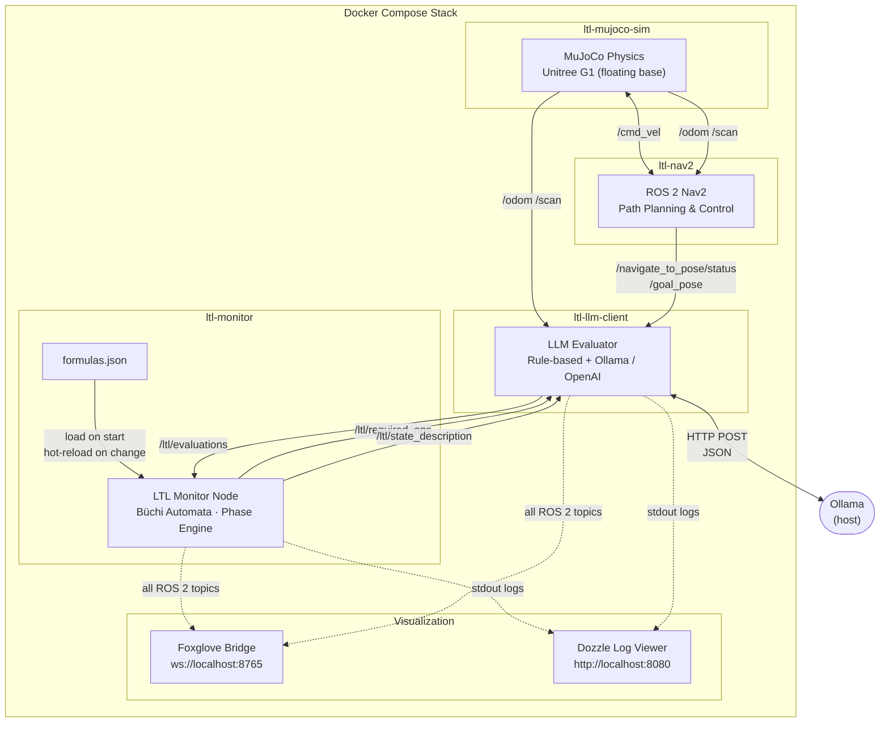
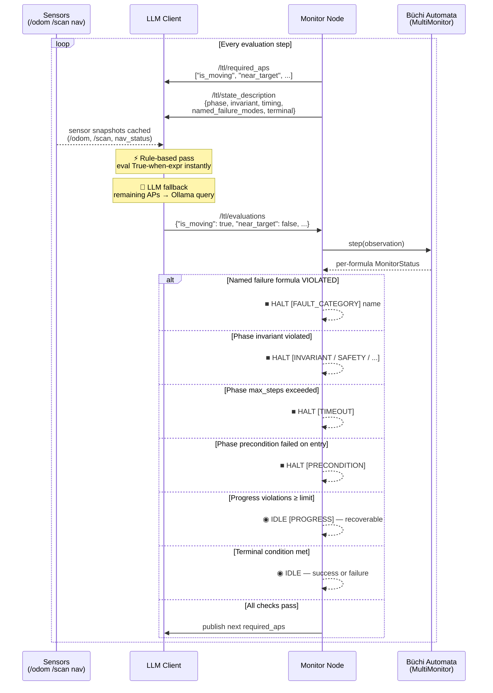
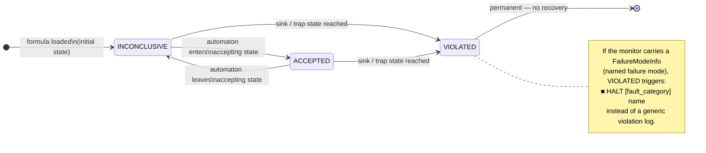
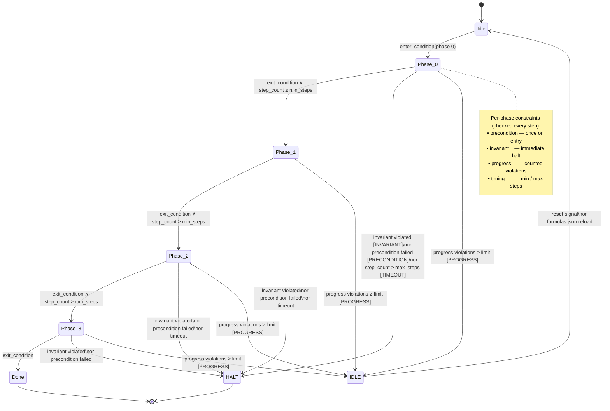
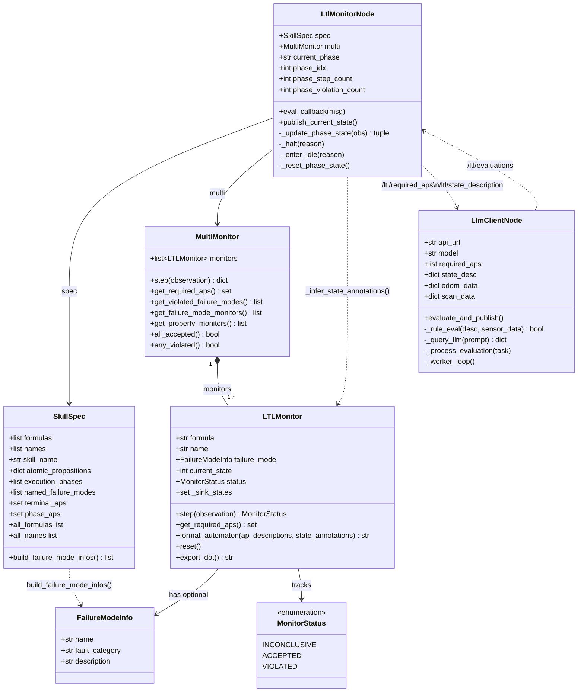

# LTL Büchi Monitor

A runtime monitoring tool that verifies **Linear Temporal Logic (LTL)** properties over a stream of observations using **ROS 2 topics**. Built on the [Spot](https://spot.lrde.epita.fr/) library and containerized with Docker.

The monitor **publishes which atomic propositions to evaluate** to a ROS 2 topic, and an LLM evaluator node **subscribes, evaluates them against live sensor data, and publishes boolean results back**. This separates **state progression monitoring** (monitor side) from **observation evaluation** (LLM/robot side).

---

## Table of Contents

- [Quick Start](#quick-start)
- [Architecture](#architecture)
- [System UML](#system-uml)
  - [Component Architecture](#1-component-architecture)
  - [Monitoring Loop Sequence](#2-monitoring-loop-sequence)
  - [Formula Monitor Status](#3-formula-monitor-status-state-machine)
  - [Phase State Machine](#4-phase-state-machine)
  - [Class Diagram](#5-class-diagram)
- [ROS 2 Topics Protocol](#ros-2-topics-protocol)
- [Project Structure](#project-structure)
- [Formulas Specification](#formulas-specification)
  - [Pipeline Script](#-pipeline-script-run_pipelinepy)
  - [LTL Formula Design](#ltl-formula-design-and-automaton-complexity)
  - [Phase Constraints](#phase-constraint-types)
  - [Named Failure Modes](#named-failure-modes)
  - [skill_description.md Format](#skill_descriptiontxt--structured-per-phase-reference)
- [LLM-Based Predicate Evaluation](#llm-based-predicate-evaluation)
- [CLI Reference](#cli-reference)
- [Monitor Status Model](#monitor-status-model)
- [Examples](#examples)
  - [Full Simulation Stack](#example-1-full-simulation-stack)
  - [Inline Formulas](#example-2-inline-formulas)
- [How It Works Internally](#how-it-works-internally)
- [API Reference](#api-reference)
  - [monitor.py](#monitorpy)
  - [main.py](#mainpy)
  - [llm_client.py](#llm_clientpy)
  - [generate_formulas.py](#generate_formulaspy)
  - [run_pipeline.py](#run_pipelinepy)

---

## Quick Start

### Prerequisites

- [Docker](https://docs.docker.com/get-docker/) (v20+) with Compose
- [Ollama](https://ollama.ai/) running locally (for the LLM evaluator)

### 🚀 Running the Integrated Pipeline (Recommended)

You can run the entire pipeline—from natural language skill specification to execution monitoring—using the `run_pipeline.py` script:

```bash
# Full pipeline: generate spec → validate → run stack (logs stream in the foreground)
python3 run_pipeline.py -d "An autonomous navigation skill where the robot receives a target location, plans a collision-free path, moves to the target while avoiding obstacles, and terminates when close to the target."

# Use existing formulas.json without regenerating (edit formulas.json manually first)
python3 run_pipeline.py --no-generate

# Just validate and print a summary of the current formulas.json, then exit
python3 run_pipeline.py --validate-only

# Skip Docker image rebuild (faster restart when only formulas.json changed)
python3 run_pipeline.py --no-generate --no-build
```

The script runs three steps:
1. **Generate** — calls the LLM to produce `formulas.json` (rich spec: phases, invariants, named failures, timing) and `skill_description.md` (structured per-phase reference document)
2. **Validate** — parses `formulas.json` and prints a color-coded summary: formula depth warning, named failure modes, per-phase constraint tags (`precondition`, `invariant`, `timing`), AP rule/LLM breakdown
3. **Run** — stops any running stack, then starts `docker compose up` in the **foreground** so all container logs stream directly to your terminal; `Ctrl+C` prompts whether to shut down

### Manual Build & Run (Full Stack)

```bash
# 1. Start the full simulation stack (first build takes ~12 min for Spot compilation)
cd sim/
docker compose -f docker-compose.sim.yml up --build

# 2. Check the monitor is running
docker logs ltl-monitor --tail 20

# 3. View all container logs via Dozzle
# Open browser → http://localhost:8080/dozzle

# 4. Visualize in Foxglove Studio
# Open Foxglove → Connect via WebSocket to ws://localhost:8765
```

The stack starts multiple containers (all named with the `ltl-` prefix for easy identification in Dozzle):
- **`ltl-mujoco-sim`** — MuJoCo physics sim with Unitree G1 (floating base)
- **`ltl-nav2`** — ROS 2 Navigation2 for path planning
- **`ltl-monitor`** — Büchi automaton monitor (publishes `/ltl/required_aps`, `/ltl/state_description`)
- **`ltl-llm-client`** — LLM evaluator (subscribes to APs, publishes `/ltl/evaluations`)
- **`ltl-foxglove-bridge`** — WebSocket bridge for Foxglove visualization
- **`ltl-dozzle`** — Real-time container log viewer at [http://localhost:8080/dozzle](http://localhost:8080/dozzle)

---

## Architecture

```
 ┌─────────────────────────────────────────────────────────────────┐
 │                    Docker Compose Stack                         │
 │                                                                 │
 │  ┌──────────────┐     /cmd_vel      ┌──────────────┐           │
 │  │  MuJoCo Sim  │ ◀──────────────── │    Nav2      │           │
 │  │  (G1 robot)  │ ──────────────▶   │  Navigation  │           │
 │  └──────┬───────┘  /odom, /scan     └──────────────┘           │
 │         │                                                       │
 │    /odom, /scan                                                 │
 │         │                                                       │
 │         ▼                                                       │
 │  ┌──────────────┐  /ltl/required_aps  ┌──────────────────────┐ │
 │  │  LLM Client  │ ◀───────────────── │   LTL Monitor Node   │ │
 │  │  (Ollama)    │  /ltl/state_desc    │   (Büchi Automaton)  │ │
 │  │              │ ──────────────────▶ │                      │ │
 │  └──────────────┘  /ltl/evaluations   │  formulas.json       │ │
 │                                        │  monitor.py (Spot)   │ │
 │                                        └──────────────────────┘ │
 │                                                                 │
 │  ┌──────────────────┐                                          │
 │  │ Foxglove Bridge  │ ── ws://localhost:8765                   │
 │  └──────────────────┘                                          │
 │  ┌──────────────────┐                                          │
 │  │     Dozzle       │ ── http://localhost:8080/dozzle          │
 │  └──────────────────┘                                          │
 └─────────────────────────────────────────────────────────────────┘
```

### Separation of Concerns

| Concern | Component | Where |
|---|---|---|
| **State progression monitoring** | `main.py` / `monitor.py` | Docker — tracks Büchi automaton states, publishes required APs and state description |
| **Observation evaluation** | `llm_client.py` | Docker — subscribes to APs and sensor topics, queries Ollama, publishes boolean evaluations |
| **Named failure detection** | `main.py` (formula monitors) | LTL formulas tagged with fault categories — VIOLATED triggers a named halt |
| **Phase constraint enforcement** | `main.py` (phase state machine) | Preconditions on entry, hard invariants every step, timing bounds, counted progress violations |
| **Terminal state detection** | `main.py` + `llm_client.py` | APs for success/failure conditions are always included in the LLM query |
| **Physics simulation** | `mujoco_ros_bridge.py` | Docker — MuJoCo sim, publishes `/odom`, `/scan`, accepts `/cmd_vel` |
| **Visualization** | Foxglove Bridge | Docker — exposes all ROS 2 topics via WebSocket |
| **Log aggregation** | Dozzle | Docker — aggregates all `ltl-*` container logs at `/dozzle` |

---

## System UML

### 1. Component Architecture

Shows all Docker containers, ROS 2 topic flows, and external connections.



---

### 2. Monitoring Loop Sequence

One complete step of the request/response cycle between the Monitor, LLM Client, and Büchi Automata.



---

### 3. Formula Monitor Status State Machine

Each LTL formula (property **and** named failure mode) runs its own Büchi automaton with this status model.



---

### 4. Phase State Machine

The phase engine runs in parallel with the automata. Each phase enforces four levels of constraint.



---

### 5. Class Diagram

Key classes, their fields, and relationships across `monitor.py`, `main.py`, and `llm_client.py`.



---

## ROS 2 Topics Protocol

Communication between the monitor and the LLM evaluator uses three ROS 2 topics with `std_msgs/msg/String` carrying JSON payloads:

| Topic | Direction | Payload |
|---|---|---|
| `/ltl/required_aps` | Monitor → LLM | JSON array of AP names to evaluate: `["is_moving", "near_target", ...]` |
| `/ltl/state_description` | Monitor → LLM | JSON with phase info, AP descriptions, terminal conditions, named failure modes, and timing |
| `/ltl/evaluations` | LLM → Monitor | JSON object of AP evaluations: `{"is_moving": true, "near_target": false, ...}` |

```
 Monitor Node                          LLM Client Node
     │                                      │
     │  1. /ltl/required_aps               │
     │  ["is_moving", "near_target", ...]   │
     ├─────────────────────────────────────▶│
     │                                      │ 2. Query Ollama
     │  2. /ltl/state_description          │    with sensor data
     │  {"phase": "ExecutingNavigation",   │    (/odom, /scan)
     │   "phase_info": {                   │
     │     "invariant": "not obstacle_detected",
     │     "step_count": 12, ...},         │
     │   "named_failure_modes": [...],     │
     │   "terminal_success": {...}, ...}   │
     ├─────────────────────────────────────▶│
     │                                      │
     │  3. /ltl/evaluations                │
     │  {"is_moving": true,                │
     │   "near_target": false,             │
     │   "obstacle_detected": false}       │
     │◀─────────────────────────────────────┤
     │                                      │
     │  4. Step Büchi automaton(s)          │
     │  5. Check named failure modes        │
     │  6. Check phase invariants/timing    │
     │  7. Check terminal conditions        │
     │  8. Publish new required_aps        │
     │                                      │
```

### `/ltl/state_description` Payload

```json
{
  "phase": "ExecutingNavigation",
  "skill_name": "AutonomousNavigation",
  "description": "...",
  "ap_descriptions": { "is_moving": "True when linear_vel > 0.05...", ... },
  "phase_info": {
    "enter_condition":           "path_planned and is_moving",
    "precondition":              "is_moving and not obstacle_detected",
    "invariant":                 "not obstacle_detected",
    "invariant_fault_category":  "SAFETY",
    "progress_condition":        "is_moving and not navigation_failed",
    "exit_condition":            "near_target",
    "next_phase":                "ApproachingTarget",
    "violation_count":           0,
    "violation_limit":           5,
    "step_count":                12,
    "timing_bounds":             { "min_steps": 3, "max_steps": 120 }
  },
  "named_failure_modes": [
    { "name": "navigation_aborted",    "fault_category": "NAVIGATION", "formula": "G(!navigation_failed)", "status": "INCONCLUSIVE" },
    { "name": "obstacle_collision_risk","fault_category": "SAFETY",     "formula": "G(!obstacle_detected)", "status": "INCONCLUSIVE" }
  ],
  "terminal_success": { "condition": "navigation_succeeded", "description": "...", "aps": ["navigation_succeeded"] },
  "terminal_failure": { "condition": "navigation_failed",    "description": "...", "aps": ["navigation_failed"] }
}
```

### Termination

Send `{"__done__": true}` on `/ltl/evaluations` to end the monitoring session.
Send `{"__reset__": true}` to start a new skill execution after the monitor enters IDLE.

---

## Project Structure

```
LtlMonitor/
├── Dockerfile                 # Monitor container: ros:humble + Spot (compiled from source)
├── Dockerfile.llm             # LLM evaluator container: ros:humble
├── sim/
│   ├── docker-compose.sim.yml # Full stack orchestration
│   ├── Dockerfile.sim         # MuJoCo simulation
│   ├── Dockerfile.nav2        # ROS 2 Navigation2
│   └── Dockerfile.foxglove    # Foxglove WebSocket bridge
│
├── monitor.py                 # Core: Büchi automata, FailureModeInfo, BDD introspection
├── main.py                    # ROS 2 Node: LtlMonitorNode, phase engine, SkillSpec
├── llm_client.py              # ROS 2 Node: LLM evaluator (Ollama/OpenAI-compatible)
├── generate_formulas.py       # LLM formulas and state descriptions generator
├── run_pipeline.py            # Master script to run generation, simulation, and monitoring
│
├── formulas.json              # ◀── EDIT: your LTL skill specification
├── skill_description.md      # Auto-generated structured per-phase reference (deterministic, no LLM)
└── README.md
```

### Files You Edit

| File | Purpose | Where it runs | Rebuild needed? |
|---|---|---|---|
| `formulas.json` | LTL formulas, atomic propositions, execution phases, named failure modes | Monitor (Docker volume) | No |
| `llm_client.py` | LLM-based AP evaluator using Ollama + sensor data | LLM container | Yes (`docker compose build llm-client`) |
| `run_pipeline.py` | Master pipeline script: generate → validate → run stack | Host | No |
| `generate_formulas.py` | LLM-based `formulas.json` generator + deterministic `skill_description.md` formatter | Host | No |

---

## Formulas Specification

### Simple Format

```json
["F(goal)", "G(!obstacle)", "G(moving -> F(stopped))"]
```

### Rich Skill-Spec Format

The full skill spec supports five top-level sections. The richer the spec, the more states the Büchi automaton will have and the more safety constraints will be enforced at runtime.

```json
{
  "skill_name": "AutonomousNavigation",
  "description": "...",

  "atomic_propositions": {
    "path_planned":         "True when nav_status == 'accepted'. Nav2 accepted the path.",
    "is_moving":            "True when linear_vel > 0.05. Robot is driving toward goal.",
    "near_target":          "True when distance_to_target < 0.5. Within goal radius.",
    "obstacle_detected":    "True when min_range < 0.30. Close obstacle on lidar.",
    "navigation_succeeded": "True when nav_status == 'succeeded'. Goal reached.",
    "navigation_failed":    "True when nav_status in ['aborted', 'canceled']. Nav2 failed."
  },

  "ltl_formulas": [
    {
      "name":    "navigation_phases_complete",
      "formula": "F(path_planned && F(is_moving && F(near_target && F(navigation_succeeded))))"
    }
  ],

  "named_failure_modes": [
    {
      "name":           "navigation_aborted",
      "formula":        "G(!navigation_failed)",
      "fault_category": "NAVIGATION",
      "description":    "Navigation was aborted or canceled by Nav2"
    },
    {
      "name":           "obstacle_collision_risk",
      "formula":        "G(!obstacle_detected)",
      "fault_category": "SAFETY",
      "description":    "Robot is dangerously close to an obstacle"
    }
  ],

  "execution_phases": [
    {
      "phase":       "PlanningAndAcceptance",
      "description": "Waiting for Nav2 to accept the path plan.",
      "enter_condition": "target_received",
      "precondition":    "not navigation_failed",
      "precondition_fault_category": "NAVIGATION",
      "invariant":       "not obstacle_detected",
      "invariant_fault_category": "SAFETY",
      "progress_condition":    "path_planned",
      "progress_violation_limit": 5,
      "exit_condition":  "path_planned",
      "timing_bounds": { "max_steps": 15 }
    },
    {
      "phase":       "ExecutingNavigation",
      "description": "Robot drives toward goal, must keep moving and stay clear of obstacles.",
      "enter_condition": "path_planned and is_moving",
      "precondition":    "is_moving and not obstacle_detected",
      "precondition_fault_category": "PROGRESS",
      "invariant":       "not obstacle_detected",
      "invariant_fault_category": "SAFETY",
      "progress_condition":    "is_moving and not navigation_failed",
      "progress_violation_limit": 5,
      "exit_condition":  "near_target",
      "timing_bounds": { "min_steps": 3, "max_steps": 120 }
    },
    {
      "phase":       "ApproachingTarget",
      "description": "Final approach — robot must stay within goal radius.",
      "enter_condition": "near_target and is_moving",
      "precondition":    "near_target and not navigation_failed",
      "precondition_fault_category": "NAVIGATION",
      "invariant":       "near_target",
      "invariant_fault_category": "NAVIGATION",
      "progress_condition":    "near_target and not navigation_failed",
      "progress_violation_limit": 3,
      "exit_condition":  "navigation_succeeded",
      "timing_bounds": { "max_steps": 20 }
    },
    {
      "phase":       "Finalizing",
      "description": "Navigation goal confirmed; waiting for stable success status.",
      "enter_condition": "navigation_succeeded",
      "precondition":    "navigation_succeeded",
      "precondition_fault_category": "NAVIGATION",
      "invariant":       "not navigation_failed",
      "invariant_fault_category": "NAVIGATION",
      "progress_condition":    "navigation_succeeded",
      "progress_violation_limit": 2,
      "exit_condition":  "navigation_succeeded",
      "timing_bounds": { "max_steps": 5 }
    }
  ],

  "terminal_success": {
    "condition":   "navigation_succeeded",
    "description": "Nav2 reported success — robot reached the goal."
  },
  "terminal_failure": {
    "condition":   "navigation_failed",
    "description": "Navigation was aborted or canceled before reaching the goal."
  }
}
```

### LTL Formula Design and Automaton Complexity

The LTL formula directly determines the Büchi automaton's structure and the number of states. A sequential formula with nested `F` operators produces one progress state per milestone — the more phases you want the automaton to track, the deeper you nest:

| Formula | Automaton states | What it tracks |
|---|---|---|
| `F(navigation_succeeded)` | 2 | Only the final outcome |
| `F(path_planned && F(navigation_succeeded))` | 3 | Planning → success |
| `F(path_planned && F(is_moving && F(near_target && F(navigation_succeeded))))` | 5 | Full 4-phase sequence |

Each state in the richer automaton is annotated at startup with its corresponding phase metadata (precondition, invariant, timing bounds) inferred by simulating the automaton through the phase transition sequence.

### Phase Constraint Types

Each `execution_phases` entry supports four levels of constraint:

| Field | Semantics | Failure category | Recoverable? |
|---|---|---|---|
| `precondition` | Python condition checked **once on phase entry** | `precondition_fault_category` (default `PRECONDITION`) | No — halts |
| `invariant` | Python condition checked **every step** — immediate halt if false | `invariant_fault_category` (default `INVARIANT`) | No — halts |
| `progress_condition` | Counted soft violations — fail after `progress_violation_limit` consecutive misses | `PROGRESS` | Yes — enters IDLE |
| `timing_bounds.max_steps` | Step budget; halt if exceeded | `TIMEOUT` | No — halts |
| `timing_bounds.min_steps` | Minimum steps before exit is allowed | — | — |

### Named Failure Modes

`named_failure_modes` are LTL formulas whose **violation** signals a specific named fault rather than a generic property failure. They run as additional Büchi automata alongside the main property formulas:

```json
"named_failure_modes": [
  {
    "name":           "obstacle_collision_risk",
    "formula":        "G(!obstacle_detected)",
    "fault_category": "SAFETY",
    "description":    "Robot too close to obstacle"
  }
]
```

When the formula is violated (`obstacle_detected` becomes `true`):
- The monitor prints a named failure block: `✘ NAMED FAILURE: obstacle_collision_risk [SAFETY]`
- Halts with reason `[SAFETY] obstacle_collision_risk: Robot too close to obstacle`
- The LLM client receives a halt signal

Named failure mode formulas share the same automaton with property formulas; their automata are displayed separately in the startup output.

### Fault Categories

| Category | Typical source | Recoverable? |
|---|---|---|
| `SAFETY` | Invariant or named failure on obstacle/collision APs | No |
| `NAVIGATION` | Nav2 abort, precondition on nav_status APs | No |
| `TIMEOUT` | `timing_bounds.max_steps` exceeded | No |
| `PRECONDITION` | Phase entry condition not met | No |
| `INVARIANT` | Generic phase invariant (no explicit category set) | No |
| `PROGRESS` | Counted progress violations | Yes (enters IDLE) |

### 🚀 Pipeline Script (`run_pipeline.py`)

`run_pipeline.py` is the recommended entry point. It chains generation → validation → stack startup.

```bash
python3 run_pipeline.py [OPTIONS]
```

| Flag | Description |
|---|---|
| `-d / --description TEXT` | Natural language skill description (prompts interactively if omitted) |
| `--api-url URL` | LLM API base URL (default: `http://192.168.140.111/developer-api/v1`) |
| `--model NAME` | LLM model name (default: `Gemma4`) |
| `--no-generate` | Skip formula generation; use the current `formulas.json` |
| `--validate-only` | Print `formulas.json` summary and exit — no Docker |
| `--no-build` | Skip `docker compose build` (faster restart when only `formulas.json` changed) |

**Validation summary** (printed after every generation or with `--validate-only`):

```
════════════════════════════════════════════════════════════
Step 1b: Reviewing formulas.json
════════════════════════════════════════════════════════════

  Skill:  AutonomousNavigation
  Manages autonomous navigation to a target location...

  LTL Formulas  (1):
    ✔  navigation_phases_complete
       F(path_planned && F(is_moving && F(near_target && F(navigation_succeeded))))
       ~5 automaton states

  Named Failure Modes  (2):
    ✘  [NAVIGATION]  navigation_aborted  →  G(!navigation_failed)
    ✘  [SAFETY]      obstacle_collision_risk  →  G(!obstacle_detected)

  Execution Phases  (4):
    PlanningAndAcceptance
      + precondition [NAVIGATION]
      + invariant [SAFETY]
      + timing(max=15)
    ExecutingNavigation
      + precondition [PROGRESS]
      + invariant [SAFETY]
      + timing(min=3, max=120)
    ...

  Atomic Propositions:  7 total  (⚡ 7 rule-based, 🤖 0 LLM-evaluated)
  Terminal:  success: navigation_succeeded   failure: navigation_failed

  ✔  Spec is complete — all constraint layers present.
```

### 🤖 LLM-Based Formula Generation (Natural Language)

Instead of writing `formulas.json` manually, you can generate it from a natural language description:

```bash
python3 generate_formulas.py -d "Your natural language description of the robot skill..."
```

### LTL Syntax

| Operator | Meaning | Example |
|---|---|---|
| `G(φ)` | **Globally** | `G(!collision)` |
| `F(φ)` | **Finally** | `F(goal)` |
| `X(φ)` | **Next** | `G(terminated -> X(!moving))` |
| `φ U ψ` | **Until** | `moving U near_target` |
| `->` | **Implies** | `G(skill_active -> target_received)` |
| `&&` | **And** | `moving && !collision` |
| `\|\|` | **Or** | `path_planned \|\| goal_unreachable` |
| `!` | **Not** | `!collision` |

### `skill_description.md` — Structured Per-Phase Reference

`skill_description.md` is generated **deterministically** from `formulas.json` by `generate_formulas.py` — no LLM call, no prose, no hallucinations. It is a machine-readable reference document that shows every constraint associated with each phase.

Each phase is rendered as a box-drawn block with four ordered sections:

```
════════════════════════════════════════════════════════════════════
  PHASE 2/4 — ExecutingNavigation
════════════════════════════════════════════════════════════════════

  Robot drives toward goal, must keep moving and stay clear of obstacles.

  ┌────────────────────────────────────────────────────────────────
  │  ENTER
  ├────────────────────────────────────────────────────────────────
  │  From      : PlanningAndAcceptance
  │  Condition : path_planned and is_moving
  │
  │  Precondition (checked once on entry):
  │    is_moving and not obstacle_detected
  │    → [PROGRESS] halt if not satisfied
  │
  │  IN PROGRESS
  ├────────────────────────────────────────────────────────────────
  │  Invariant (every step — immediate halt if violated):
  │    not obstacle_detected
  │    → [SAFETY]
  │
  │  Progress condition (counted soft violations):
  │    is_moving and not navigation_failed
  │    → [PROGRESS] enter IDLE after 5 consecutive violations
  │
  │  Timing:
  │    min_steps : 3   (exit blocked until this many steps have elapsed)
  │    max_steps : 120 → [TIMEOUT] halt if exceeded
  │
  │  EXIT
  ├────────────────────────────────────────────────────────────────
  │  To        : ApproachingTarget
  │  Condition : near_target
  │
  │  ATOMIC PROPOSITIONS USED IN THIS PHASE
  ├────────────────────────────────────────────────────────────────
  │  is_moving             ⚡ rule  True when linear_vel > 0.05. Robot is actively moving.
  │  near_target           ⚡ rule  True when distance_to_target < 0.5.
  │  navigation_failed     ⚡ rule  True when nav_status in ['aborted', 'canceled'].
  │  obstacle_detected     ⚡ rule  True when min_range < 0.30.
  │  path_planned          ⚡ rule  True when nav_status == 'accepted'.
  │
  │  RELATED FORMULAS
  ├────────────────────────────────────────────────────────────────
  │  LTL : navigation_phases_complete
  │    F(path_planned && F(is_moving && F(near_target && F(navigation_succeeded))))
  │    Automaton state 1: waiting for 'is_moving' to advance to state 2
  │
  │  Named failure modes active in this phase:
  │    [NAVIGATION]  navigation_aborted        :  G(!navigation_failed)
  │    [SAFETY]      obstacle_collision_risk   :  G(!obstacle_detected)
  │
  └────────────────────────────────────────────────────────────────
```

The document header lists the full LTL formula chain, all named failure modes, terminal conditions, and the complete AP table before the per-phase sections.

---

## LLM-Based Predicate Evaluation

The `llm_client.py` node acts as a bridge between the physical/simulated robot state and the LTL monitor. It replaces hand-coded evaluators with a **local Ollama or OpenAI-compatible LLM** that reasons over raw sensor data.

```
 ┌─────────────────┐
 │   /odom topic   │ ──────┐
 └─────────────────┘       │
 ┌─────────────────┐       │   /ltl/required_aps
 │   /scan topic   │ ──────┼───────────────────────┐
 └─────────────────┘       │                       │
 ┌─────────────────┐       ▼                       ▼
 │  nav action     │ ──▶ [ llm_client.py Node ] ◀── [ LTL Monitor Node ]
 └─────────────────┘       │
                           ▼ Prompt
                     ┌──────────┐
                     │  Ollama  │
                     └────┬─────┘
                          │ Response
                          ▼
                 /ltl/evaluations JSON
```

### Config & Usage

```bash
# Ollama (default)
python3 llm_client.py --model llama3.2:3b

# OpenAI-compatible endpoint (e.g. vLLM, LMStudio, Gemma via developer API)
python3 llm_client.py --api-url http://192.168.1.50/developer-api/v1 --model Gemma4
```

| Flag | Default | Description |
|---|---|---|
| `--model` | `Gemma4` | Model name |
| `--api-url` / `--ollama-url` | `http://192.168.140.111/developer-api/v1` | API endpoint (auto-detects `/v1` for OpenAI format) |

### Rule-Based vs LLM Evaluation

For each AP, the client first tries **rule-based evaluation** — if the AP description contains `"True when <expr>"`, the expression is evaluated directly against numeric sensor values (zero LLM calls, instant). Only APs without a parseable rule fall back to the LLM.

```
ap_descriptions:
  "is_moving": "True when linear_vel > 0.05."   ← ⚡ Rule-based (instant)
  "nav_complete": "The robot finished its task." ← 🤖 LLM-evaluated
```

The eval block in the console output labels each AP accordingly.

### LLM Client Display (per evaluation step)

```
  ┌── Eval  [AutonomousNavigation]  phase: ExecutingNavigation  ──────────────
  │ pos=(2.14, 1.07) m  vel=0.31 m/s  dist=3.74 m  min_range=0.62 m
  │ nav_status=executing  close_objects=1
  │ ────────────────────────────────────────────────────────────────────────
  │ Invariant:  not obstacle_detected  [SAFETY]
  │ Progress :  is_moving and not navigation_failed
  │ Exit  →  : ApproachingTarget  when: near_target
  │ Timing   :  step 12/120  [████████░░░░░░░░░░░░] 10%  (min 3)
  │ ────────────────────────────────────────────────────────────────────────
  │ ⚡ Rule-based (instant)
  │   TRUE :  is_moving  path_planned
  │   FALSE:  obstacle_detected  near_target  navigation_succeeded  navigation_failed
  │ 🤖 LLM-evaluated (queried)
  │   TRUE :  —
  │   FALSE:  —
  └──────────────────────────────────────────────────────────────────────────
```

---

## CLI Reference

```
Usage: ltl-monitor [-f FORMULA ...] | [--formulas-file FILE] [OPTIONS]
```

| Flag | Description |
|---|---|
| `-f FORMULA` | Inline LTL formula (repeat for multiple) |
| `--formulas-file FILE` | JSON file (flat array or rich skill-spec) |
| `--changes-only` | Only show formulas whose status changed at each step |
| `--stop-on-violation` | Halt on first permanent violation |
| `--output-dir DIR` | Directory for automaton image exports (default: `./output/`) |

---

## Monitor Status Model

### Per-Formula Status

Each LTL formula (property or named failure mode) tracks one of three automaton states:

| Status | Symbol | Meaning | Permanent? |
|---|---|---|---|
| **INCONCLUSIVE** | `●` yellow | Neither proven nor refuted | No |
| **ACCEPTED** | `✔` green | Automaton is in an accepting state | No |
| **VIOLATED** | `✘` red | Sink/trap state — permanently falsified | **Yes** |

### Named Failure Mode Triggers

When a **named failure mode** formula reaches VIOLATED, it is reported as a named fault halt rather than a generic violation:

```
────────────────────────────────────────────────────────────────
  ✘  NAMED FAILURE: obstacle_collision_risk
  Fault category : SAFETY
  Description    : Robot is dangerously close to an obstacle
  Formula        : G(!obstacle_detected)
────────────────────────────────────────────────────────────────
```

### Phase Failure Types

| Failure | Category | Behavior |
|---|---|---|
| Precondition not met on phase entry | `PRECONDITION` (or custom) | Immediate halt |
| Invariant violated during phase | `INVARIANT` (or custom) | Immediate halt |
| Max steps exceeded in phase | `TIMEOUT` | Immediate halt |
| Progress condition violated N times | `PROGRESS` | Enters IDLE (recoverable) |

### Terminal States

In addition to per-formula status, the overall task has two terminal states checked at every step:

| Terminal State | Condition source | Behavior |
|---|---|---|
| **SUCCESS** | `terminal_success.condition` | Monitor enters IDLE, prints final summary |
| **FAILURE** | `terminal_failure.condition` | Monitor enters IDLE, prints final summary |

**Exit codes:** `0` = no violations, `1` = one or more formulas violated.

---

## Examples

### Example 1: High-Fidelity ROS 2 Simulation Demo

```bash
# 1. Start the simulation, navigation, and monitoring stack
cd sim/
docker compose -f docker-compose.sim.yml up -d --build

# 2. View all container logs at http://localhost:8080/dozzle

# 3. Visualize in Foxglove
# Connect via "Foxglove WebSocket" to ws://localhost:8765
```

### Example 2: Inline LTL formulas via CLI

```bash
docker run --rm -it ltl-monitor -f "G(!collision)" -f "F(near_target)"
```

### Sample Monitor Output

```
════════════════════════════════════════════════════════════════
  Skill : AutonomousNavigation
  Manages autonomous navigation to a target, enforcing phase-by-phase safety constraints.
════════════════════════════════════════════════════════════════

Property Formulas & Büchi Automata:

  Büchi Automaton for 'navigation_phases_complete'
  Formula: F(path_planned && F(is_moving && F(near_target && F(navigation_succeeded))))
    State 0 [initial]:  ● Monitoring…
      Phase: PlanningAndAcceptance
      Waiting for Nav2 to accept the path plan.
      Precondition : not navigation_failed  [NAVIGATION — checked on entry]
      Invariant    : not obstacle_detected  [SAFETY — immediate halt]
      Timing       : min — / max 15 steps  [TIMEOUT on exceed]
      ──► State 1 on: path_planned
      ──► State 0 on: !path_planned
    State 1:  ● Monitoring…
      Phase: ExecutingNavigation
      Robot drives toward goal, must keep moving and stay clear of obstacles.
      Precondition : is_moving and not obstacle_detected  [PROGRESS — checked on entry]
      Invariant    : not obstacle_detected  [SAFETY — immediate halt]
      Timing       : min 3 / max 120 steps  [TIMEOUT on exceed]
      ──► State 2 on: is_moving
      ──► State 1 on: !is_moving
    State 2:  ● Monitoring…
      Phase: ApproachingTarget
      ...
    State 3:  ● Monitoring…
      Phase: Finalizing
      ...
    State 4 [accepting]:  ✔ Property holds
      Phase: Done
      All phases complete — formula accepted.
      ──► State 4 on: 1  (any input)

Named Failure-Mode Automata:

  [NAVIGATION] navigation_aborted  —  Navigation was aborted or canceled by Nav2
  Büchi Automaton for 'navigation_aborted'
  Formula: G(!navigation_failed)
    State 0 [initial, accepting]:  ✔ Property holds
      ──► State 0 on: !navigation_failed
      ──► State 1 on: navigation_failed  → VIOLATED
    State 1 [sink/trap]:  ✘ VIOLATED — irrecoverable

  [SAFETY] obstacle_collision_risk  —  Robot is dangerously close to an obstacle
  ...

  Atomic Propositions & Evaluation Rules:
  ────────────────────────────────────────────────────────────────
    path_planned          │  nav_status == 'accepted'  [⚡ Rule]
    is_moving             │  linear_vel > 0.05         [⚡ Rule]
    near_target           │  distance_to_target < 0.5  [⚡ Rule]
    obstacle_detected     │  min_range < 0.30          [⚡ Rule]
    navigation_succeeded  │  nav_status == 'succeeded' [⚡ Rule]
    navigation_failed     │  nav_status in [...]       [⚡ Rule]
  ────────────────────────────────────────────────────────────────

  Named Failure Modes:
  ────────────────────────────────────────────────────────────────
    navigation_aborted       │  formula: G(!navigation_failed)
                             │  [NAVIGATION]  Navigation was aborted or canceled
    obstacle_collision_risk  │  formula: G(!obstacle_detected)
                             │  [SAFETY]      Robot too close to obstacle
  ────────────────────────────────────────────────────────────────

  Execution Phases:
    1. PlanningAndAcceptance
       Waiting for Nav2 to accept the path plan.
       enter     : target_received
       precond   : not navigation_failed  [NAVIGATION]
       invariant : not obstacle_detected  [SAFETY — immediate failure]
       progress  : path_planned
       exit → ExecutingNavigation: path_planned
       timing    : min — steps / max 15 steps

    2. ExecutingNavigation
       ...

──────────────────────────────────────────────────────────────
  Monitoring Trace
──────────────────────────────────────────────────────────────
  ┌── Step init  [Idle] ──────────────────────────────────────
  │ ✔ navigation_phases_complete   S0 [initial]
  │ ✔ navigation_aborted           S0 [initial, accepting]
  │ ✔ obstacle_collision_risk      S0 [initial, accepting]
  └──────────────────────────────────────────────────────────

  ════════════════════════════════════════════════════════════════
  ▶  Phase: ExecutingNavigation
     Robot drives toward goal, must keep moving and stay clear of obstacles.
  ────────────────────────────────────────────────────────────────
  Enter from   : PlanningAndAcceptance  →  when: path_planned and is_moving
  Precondition : is_moving and not obstacle_detected  [PROGRESS]
  Invariant    : not obstacle_detected  [SAFETY — immediate halt]
  Progress     : is_moving and not navigation_failed  (fail after 5 violations)
  Exit to      : ApproachingTarget  →  when: near_target
  Timing       : min 3 steps  /  max 120 steps  [TIMEOUT on exceed]
  ════════════════════════════════════════════════════════════════

  ┌── Step 5  [ExecutingNavigation] ────────────────────────────
  │ TRUE :  is_moving  path_planned  target_received
  │ FALSE:  near_target  obstacle_detected  navigation_succeeded  navigation_failed
  │ ────────────────────────────────────────────────────────────
  │ ✔ navigation_phases_complete   S1  ● Monitoring…
  │ ✔ navigation_aborted           S0 [initial, accepting]
  │ ✔ obstacle_collision_risk      S0 [initial, accepting]
  └──────────────────────────────────────────────────────────────

  ════════════════════════════════════════════════════════════════
  ◉  MONITOR IDLE
  Reason   : Terminal state reached (success or failure)
  Awaiting : new skill execution
  Resume   : send {"__reset__": true} on /ltl/evaluations
           : or update formulas.json to reload automatically
  ════════════════════════════════════════════════════════════════
```

---

## How It Works Internally

### Overview

The system verifies robot behavior against LTL safety and liveness properties **at runtime**, one observation at a time. It converts each LTL formula into a deterministic Büchi automaton and steps it forward with each new evaluation published by the LLM client.

All formulas — property formulas **and** named failure mode formulas — run as automata in the same `MultiMonitor`. Named failure mode automata are distinguished by a `FailureModeInfo` annotation on their `LTLMonitor` instance. When their automaton hits VIOLATED, the fault name and category are surfaced directly rather than as a generic violation.

The phase engine runs in parallel as a state machine alongside the automata. Each phase encodes four levels of constraint: precondition (entry), invariant (per-step safety), progress (soft counted violations), and timing bounds.

### Step-by-Step Pipeline

```
┌────────────────────────────────────────────────────────────────────────┐
│  STARTUP (once)                                                        │
│                                                                        │
│  1. Parse formulas.json (ltl_formulas + named_failure_modes)          │
│     ↓                                                                  │
│  2. For each formula (property and failure mode), call:                │
│     spot.translate(formula, "Buchi", "det", "complete", "sbacc")      │
│     → named failure mode monitors carry FailureModeInfo annotation    │
│     ↓                                                                  │
│  3. Infer which automaton states correspond to which phases:           │
│     walk each property automaton using forward-transition APs          │
│     to map state indices → phase metadata (precondition, invariant,   │
│     timing bounds)                                                     │
│     ↓                                                                  │
│  4. Print annotated automata (property + failure modes separately),   │
│     AP rules table, phase constraint summary, named failure modes      │
│     → save DOT/SVG/PNG images to output/                              │
│     ↓                                                                  │
│  5. Initialize ROS 2 Node (LtlMonitorNode)                            │
└────────────────────────────────────────────────────────────────────────┘
                                    │
                                    ▼
┌────────────────────────────────────────────────────────────────────────┐
│  MONITORING LOOP (repeats on /ltl/evaluations callback)               │
│                                                                        │
│  6.  required_aps = automaton_aps ∪ terminal_aps ∪ phase_aps          │
│      ↓                                                                 │
│  7.  Publish required_aps + full state_description JSON               │
│      (phase_info with precondition/invariant/step_count/timing,       │
│       named_failure_modes status, terminal conditions)                │
│      ↓                                                                 │
│  8.  LLM Node evaluates required APs from sensors (rule-based first,  │
│      LLM fallback), publishes /ltl/evaluations                        │
│      ↓                                                                 │
│  9.  Step all automata (property + failure mode monitors)             │
│      ↓                                                                 │
│  10. Check named failure modes — any VIOLATED? → halt with fault info │
│      ↓                                                                 │
│  11. Advance phase state machine:                                      │
│      a. Check invariant   → violated? halt [fault_category]           │
│      b. Check timing      → exceeded? halt [TIMEOUT]                  │
│      c. Check progress    → violations ≥ limit? enter IDLE [PROGRESS] │
│      d. Check exit condition (respects min_steps)                     │
│      e. On phase entry: check precondition → violated? halt           │
│      ↓                                                                 │
│  12. Check terminal conditions (success / failure) → enter IDLE       │
│      ↓                                                                 │
│  13. Print status, goto step 6                                        │
└────────────────────────────────────────────────────────────────────────┘
```

### Worked Example: `G(!collision)`

The formula `G(!collision)` produces a **2-state Büchi automaton**:

```
         [Büchi automaton for G(!collision)]

        !collision              1 (any)
      ┌───────────┐         ┌──────────┐
      ▼           │         ▼          │
  ┌────────┐      │    ┌────────┐      │
→ │ State 0│ ─────┘    │ State 1│ ─────┘
  │  (acc) │ ─────────▶│ (sink) │
  └────────┘ collision  └────────┘
   ACCEPTED              VIOLATED
```

When used as a **named failure mode** (`"formula": "G(!collision)", "fault_category": "SAFETY"`), VIOLATED produces:

```
✘  NAMED FAILURE: collision_detected
   Fault category : SAFETY
   Description    : Robot collided with an obstacle
   Formula        : G(!collision)
```

---

## API Reference

### `monitor.py`

#### `FailureModeInfo` (dataclass)
- `name: str` — machine-readable identifier, e.g. `"collision_detected"`
- `fault_category: str` — semantic fault bucket, e.g. `"SAFETY"`, `"NAVIGATION"`, `"TIMEOUT"`
- `description: str` — human-readable explanation

#### `MonitorStatus` (Enum)
- `INCONCLUSIVE`, `ACCEPTED`, `VIOLATED`

#### `LTLMonitor(formula, name=None, failure_mode=None)`
- `failure_mode: FailureModeInfo | None` — present on named-failure-mode monitors
- `step(observation) → MonitorStatus`
- `get_required_aps() → set[str]` — APs in outgoing edges of current state
- `format_automaton(ap_descriptions=None, state_annotations=None) → str` — human-readable automaton; `state_annotations` maps state index → phase metadata dict (phase_name, precondition, invariant, timing_bounds, …)
- `reset()` / `export_dot()` / `num_states()`

#### `MultiMonitor(formulas, names=None, failure_modes=None)`
- `failure_modes: list[FailureModeInfo | None]` — parallel list, one per formula
- `step(observation) → dict[str, MonitorStatus]`
- `get_required_aps() → set[str]` — union across all monitors
- `get_violated_failure_modes() → list[tuple[LTLMonitor, FailureModeInfo]]` — only VIOLATED named-failure monitors
- `get_failure_mode_monitors() → list[LTLMonitor]` — all monitors with a `FailureModeInfo`
- `get_property_monitors() → list[LTLMonitor]` — monitors without a `FailureModeInfo`
- `statuses()` / `reset()` / `all_accepted()` / `any_violated()`

### `main.py`

#### `SkillSpec`
- Parsed from `formulas.json`; exposes `all_formulas`, `all_names`, `build_failure_mode_infos()` to build the `MultiMonitor` with both property and failure-mode formulas
- Phase entries support: `precondition`, `precondition_fault_category`, `invariant`, `invariant_fault_category`, `timing_bounds` (`min_steps`, `max_steps`), plus the existing `enter_condition`, `progress_condition`, `exit_condition`, `progress_violation_limit`

#### `LtlMonitorNode` (ROS 2 Node)
- Subscribes to `/ltl/evaluations`
- Publishes `/ltl/required_aps` and `/ltl/state_description`
- Runs the phase state machine alongside the automata; enforces preconditions, invariants, timing, and progress constraints
- Halts with `[FAULT_CATEGORY] name: description` on named failure or hard phase violation; enters IDLE on recoverable progress failure

#### `_infer_state_annotations(mon, spec) → dict[int, dict]`
- Simulates the automaton forward using each state's own forward-transition APs to map state indices to phase metadata for display

#### `_extract_aps_from_condition(condition: str) → set[str]`
- Parses a boolean condition string and returns all identifier names (AP names)

### `llm_client.py`

#### `LlmClientNode` (ROS 2 Node)
- Subscribes to `/ltl/required_aps`, `/ltl/state_description`, `/odom`, `/scan`, `/navigate_to_pose/_action/status`, `/goal_pose`
- Publishes `/ltl/evaluations`
- Rule-based first pass: extracts `"True when <expr>"` from AP descriptions and evaluates directly against numeric sensor values
- LLM fallback: queries Ollama or any OpenAI-compatible endpoint for remaining APs
- Console display: shows active phase invariant (red), timing progress bar, and per-AP TRUE/FALSE split by evaluation method

### `generate_formulas.py`

#### `generate_skill_description(_api_url, _model, spec) → str`
- **Deterministic** — no LLM call. Formats `skill_description.md` directly from the `spec` dict.
- Produces a structured box-drawn document: header (formulas, named failures, terminals, all APs) followed by one section per phase
- Each phase section is ordered: **ENTER** (from, condition, precondition) → **IN PROGRESS** (invariant, progress, timing) → **EXIT** (to, condition) → **APs used** → **Related formulas** (LTL automaton state position + active named failure modes)

#### `_nested_f_chain(formula) → list[str]`
- Extracts the ordered AP milestone chain from a nested `F(p1 && F(p2 && ...))` formula
- Maps phase index i to automaton state i and the AP it waits for

#### `_collect_phase_aps(phase, all_aps) → dict`
- Returns all APs referenced in any condition field of a phase (`enter_condition`, `precondition`, `invariant`, `progress_condition`, `exit_condition`) by parsing each with `ast.parse`

#### `_validate_and_fix(spec) → (dict, list[str])`
- Sanitizes all Python boolean condition fields across terminal conditions and all five phase condition fields
- Reports undefined AP references and syntax errors

### `run_pipeline.py`

Three-step master script: **generate → validate → run**.

| Step | What it does |
|---|---|
| 1 — Generate | Calls `generate_formulas.py` with the provided description to write `formulas.json` and `skill_description.md`. Skipped with `--no-generate`. |
| 1b — Validate | Parses `formulas.json` and prints a color-coded summary. Warns on shallow formulas, missing named failures, and bare phases. Exits here with `--validate-only`. |
| 2 — Stop | `docker compose down` to clean up any running stack. |
| 3 — Run | `docker compose up [--build]` in the **foreground** — all container logs stream directly. `Ctrl+C` prompts to shut down. |

---

## License

This project uses the [Spot](https://spot.lrde.epita.fr/) library (GNU GPL v3).
