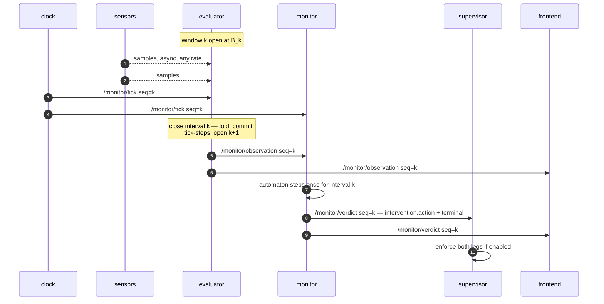

# The wire contract

Every payload in the system is defined here, once. Package specs in `packages/` link to a
section of this file; they never restate a schema. A package doc that contains a JSON
schema is a bug in the doc set.

Implemented by `skill_monitor/core/api.py` (P0) — pure Python, no ROS, so the contract is
importable and testable anywhere, including by clients that never install ROS.

## Envelope

Every `/monitor/*` topic is `std_msgs/String` carrying a JSON object with:

| field | type | meaning |
|---|---|---|
| `schema_version` | int | bumped on any breaking change to a payload below |
| `seq` | int | **closing boundary index** of the interval this payload describes. Everything carrying `seq=n` — pulse, observation, verdict — refers to the same interval, the one that just ended. Monotonic, never reused |
| `t` | float | seconds on the active clock at the tick boundary |
| `step` | int｜null | tick index *within the current episode*; resets on `arm`/`reset` |

`seq` and `step` travel together so an episode is locatable inside the global stream.
A payload that is not tick-scoped (a manifest, a spec status) omits `step`.

### Why JSON in `std_msgs/String` and not custom `.msg` types

Custom messages would be typed and self-describing on the wire. They would also require a
colcon-built interface package inside every image, which breaks the property that
`skill_monitor/core/` is pure Python testable with no ROS installed — the property that
lets the spec generator, the contract oracle and every unit test run on a laptop. And they
would turn the gateway (P6) from a pass-through into a translator with its own bugs.

JSON gives one payload shape across ROS, WebSocket and the recorded verdict files on disk.
"Untyped on the wire" does not mean unchecked: each payload has a builder and a validator
in `core/api.py`, exercised in `tests/test_api.py`.

## One tick, end to end



## Topic names

Declared once as constants in `core/api.py`. Nothing else in the repo may contain a
`/monitor/...` string literal — the rename from the old `/ltl/*` names is a consequence of
importing the constant, not a sweep that a branch can forget.

| constant | topic |
|---|---|
| `TICK` | `/monitor/tick` |
| `OBSERVATION` | `/monitor/observation` |
| `VERDICT` | `/monitor/verdict` |
| `ADAPTER` | `/monitor/adapter` *(latched)* |
| `MANIFEST` | `/monitor/manifest` *(latched)* |
| `COMMAND` | `/monitor/command` |
| `LOAD_SPEC` | `/monitor/load_spec` |
| `SPEC_STATUS` | `/monitor/spec_status` *(latched)* |
| `RAW_ECHO_REQUEST` | `/monitor/raw_echo_request` |
| `RAW_ECHO` | `/monitor/raw_echo` |

Latched means `TRANSIENT_LOCAL`, depth 1, reliable: a client that connects mid-mission
receives the last value immediately instead of waiting for a change that may never come.
The marker is a statement about what the publisher does today, not about what it ought to
do — `/monitor/verdict` carries no marker because it is `VOLATILE`, and the durable
profile it needs is a *different* one (depth 10, not depth 1) for the reason given under
[`terminal`](#terminal--the-episode-end-signal).

---

## `/monitor/tick` — clock → everyone

Produced by P1. The only thing that advances the system.

```json
{
  "schema_version": 1,
  "seq": 1041,
  "t": 1041.0,
  "t0": 1755500000.0,
  "tick_hz": 1.0,
  "mode": "wall"
}
```

| field | notes |
|---|---|
| `tick_hz` | the *effective* rate, after any CLI override — not the descriptor default |
| `mode` | `wall` ｜ `replay` ｜ `manual` |
| `t0` | unix time at which this clock started. **Required.** It is the only way a consumer can tell a clock restart — where `seq` legitimately begins again — from an out-of-order delivery it must refuse. A changed `t0` is a new epoch: reset and keep stepping. Without it a restarted clock silently discards the next run's first *N* ticks, *N* being however far the previous run got |

A pulse is emitted even when no data arrived in the interval it closes. See
[clocking.md](clocking.md) for the interval semantics.

---

## `/monitor/observation` — evaluator → monitor, frontend

Produced by P3 from the window P2 folded. One message per tick, always, including ticks
where nothing arrived.

```json
{
  "schema_version": 1, "seq": 1041, "step": 88, "t": 1041.0,
  "clock": "external",
  "tick_membership": "arrival",
  "sensors": {"min_range": 0.42, "nav_state": "following", "...": "…"},
  "ap_values": {"path_active": true, "collision_risk": false},
  "unknown_aps": [],
  "confidence": 0.67,
  "data_health": {
    "points": {"rate_hz": 14.2, "expected_hz": 15.0, "age_s": 0.07,
               "samples_this_tick": 14, "refreshed": true, "dropped": 0},
    "status": {"rate_hz": 0.0, "expected_hz": 5.0, "age_s": 3.9,
               "samples_this_tick": 0, "refreshed": false, "dropped": 0}
  }
}
```

| field | notes |
|---|---|
| `clock` | `external` when driven by `/monitor/tick`, `internal` when free-running — a recorded run must never be ambiguous about which drove it |
| `tick_membership` | `arrival` today; `stamp` once the robot stamps its messages |
| `sensors` | the folded observation — every key the adapter's schema declares, always present |
| `ap_values` | booleans only. **UNKNOWN never appears here** — see [clocking.md](clocking.md#three-valued-aps) |
| `unknown_aps` | names of APs that could not be evaluated this tick |
| `confidence` | fraction of `required` sources fresh, 0.0–1.0 |
| `data_health` | per source. `refreshed` false with `samples_this_tick` 0 is the alert condition |

`dropped` is non-zero when a bounded queue shed load. It is published rather than logged
because a silent drop is indistinguishable from a sensor that stopped.

---

## `/monitor/verdict` — monitor → supervisor, frontend

Produced by P4, **exactly once per tick the monitor stepped** — one automaton step, one
verdict, never two. That is not the same as "once per pulse the clock emitted", and the
difference is the honest part:

| the monitor … | verdict? |
|---|---|
| admits an observation and steps | **yes**, exactly one |
| receives a redelivered or backwards `seq` | no — the tick already produced its verdict |
| never receives the observation for a tick | no — the gap is counted in the *next* verdict's `missed_ticks` |
| is paused, halted or idle | no — it is not stepping, and a frame for a tick it did not judge would be the first lie in the record |

So a consumer must reconstruct the tick axis from `seq` and `missed_ticks`, not by
counting messages. A verdict stream with no holes is a claim the monitor is not in a
position to make: the observation is what says a tick happened, and the monitor emits
for the ticks it actually judged.

The end of an episode is no exception to that rule. It travels in the
[`terminal`](#terminal--the-episode-end-signal) field of the verdict for the tick that
ended it, so the run's last message is the verdict that ended it — not a second frame
repeating the same `seq`.

```json
{
  "schema_version": 1, "seq": 1041, "step": 88, "t": 1041.0,
  "skill_name": "G1HumanoidNavigation",
  "phase": "ExecutionAndTracking", "phase_index": 1,
  "verdict": "UNDECIDED",
  "formulas": [{"name": "full_navigation_sequence", "status": "INCONCLUSIVE"}],
  "failure_modes": [{"name": "collision_imminent", "fault_category": "SAFETY",
                     "status": "VIOLATED", "confidence": 0.67}],
  "terminal": null,
  "risk": {"steps_to_timeout": 32, "seconds_to_timeout": 32.0,
           "violations_to_fault": 3, "warn": false, "severity": null,
           "trigger_confidence": 0.67, "stale_sources": ["status"]},
  "intervention": {"action": "WARN", "category": "SAFETY",
                   "imminence": null, "confidence": 0.67},
  "missed_ticks": 0,
  "phase_guards": {
    "phase": "ExecutionAndTracking",
    "guards": [{"name": "enter_condition", "expr": "path_active", "value": null},
               {"name": "invariant", "expr": "upright and not collision_risk",
                "value": true},
               {"name": "progress_condition",
                "expr": "moving_towards_target or not nav_stuck", "value": true},
               {"name": "exit_condition", "expr": "mission_finished or nav_stuck",
                "value": false}]
  }
}
```

| field | notes |
|---|---|
| `step` | int on every verdict P4 publishes, because it only publishes for ticks it stepped and a stepped tick is inside an episode. The field stays `int｜null` in the envelope for producers that are not the monitor |
| `verdict` | `SATISFIED` ｜ `VIOLATED` ｜ `UNDECIDED` ｜ `INCONCLUSIVE_NO_DATA` |
| `formulas[].status` | the automaton's own `MonitorStatus` — `INCONCLUSIVE` here means "the prefix neither proves nor refutes", a **different axis** from `INCONCLUSIVE_NO_DATA` |
| `failure_modes[]` | the spec's named failure modes, **and the phase machine's own fault**. A phase invariant breach that never reached this list halted the monitor while the token said CONTINUE, and a supervisor obeying the token would not have stopped the robot. A phase fault is named `phase:<phase>:<invariant｜timeout｜progress｜precondition>` |
| `failure_modes[].confidence` | **required, and per mode**: the freshness of the sources feeding *that* mode's APs, not one number for all of them. One global scalar lets a quiet battery topic de-escalate a collision the depth camera saw perfectly well. Without any confidence at all, a VIOLATED derived from a dead sensor grades at 1.0 and the ladder goes straight to ABORT |
| `failure_modes[].fault_category` | closed: a category the engine cannot classify ships as `PROGRESS`, which never reaches HALT, and the spec is **rejected at load** naming the unrecognised spelling. An unclassifiable fault is not thereby a severe one |
| `terminal` | **required, and the only thing on the wire that says the episode ended.** `null` ｜ `SUCCESS` ｜ `FAILURE` ｜ `ABORTED` — see below |
| `intervention.action` | one rung of `CONTINUE < WARN < SLOW < REPLAN < HALT < ABORT`. The monitor decides; the supervisor enforces this **and** `terminal` — the two are separate legs of one stop rule, see [P5](packages/P5-supervisor.md). The monitor's own halt is this same decision, so the token and the process's behaviour cannot disagree on one tick |
| `seconds_to_timeout` | ships **beside** `steps_to_timeout`, never replacing it, until spec bounds move to seconds (P11) |
| `missed_ticks` | pulses the monitor did not see. Logged, never interpolated |
| `phase_guards` | the evaluated truth of the active phase's guard conditions, or `null` when no phase is active — see below |

### `phase_guards` — the guards, as the monitor evaluated them

The structural half of a phase already rides the latched `manifest.execution_phases`:
its `enter_condition`, `exit_condition`, `invariant`, `progress_condition`,
`precondition`, `timing_bounds.max_steps` and `progress_violation_limit`. The one thing
a consumer cannot get from there is whether each condition **holds right now**, and it
must not work that out for itself: a second implementation of the expression evaluator
is where this project's `min_range < 0.25` decimal-point bug lived three times. So
`monitor_node._update_phase_state` records what it computed, and this field publishes
that recording. The number on the wire is the number the monitor acted on.

| field | notes |
|---|---|
| `phase_guards` | `object` ｜ `null`. Null — not an empty guard list — when no phase is active, which is the same absence `phase_index` reports |
| `guards[].name` | closed: `enter_condition` ｜ `precondition` ｜ `invariant` ｜ `progress_condition` ｜ `exit_condition`, in the order the phase machine consults them. Only guards the phase **actually declares**: a phase with no `progress_condition` contributes no row, because the machine's internal `"True"` fallback is not a condition the spec wrote |
| `guards[].expr` | the expression **exactly as the spec authored it**, so the console shows the operator their own words. Carried, never re-derived, and never parsed by the consumer |
| `guards[].value` | `true` ｜ `false` ｜ **`null`**, and the null is load-bearing: it means the guard was **not evaluated this tick** — the machine short-circuited before reaching it, an AP the expression reads was in `unknown_aps`, or the expression raised. `null` must stay distinguishable from `false`: "we did not check" and "it does not hold" are different facts and one of them is a fault |

`enter_condition` and `precondition` are asked once, on entry, so they read `null` on
every later tick of the same phase — as in the example above, which is a steady tick of
a phase entered earlier. On a tick that *transitions*, the block describes the phase the
verdict says the run is in: the incoming phase's `enter_condition` and `precondition`
carry real values, and its `invariant`, `progress_condition` and `exit_condition` are
`null` because the machine does not reach them until the next tick.

`phase_guards` landed after `schema_version` 1, so it is **declared but not required**:
a producer that predates it still validates, and one that sends it is type-checked. The
same rule `formulas[].state` and an adapter step's `threshold` already follow.

### `terminal` — the episode-end signal

Present on every verdict, never omitted. `null`, plus three non-null values:

| value | means |
|---|---|
| `null` | the episode is still running. This verdict is not the last one |
| `"SUCCESS"` | the episode ended, and it ended the way the spec says success looks |
| `"FAILURE"` | the episode ended on a fault the monitor observed |
| `"ABORTED"` | the episode ended without the monitor observing either — it was stopped from outside, or the monitor stopped for a reason that is not about the skill |

`terminal` is a statement about **the episode**, not about the robot and not about the
world. Non-null means exactly one thing, and it is checkable: *this is the last verdict of
this episode; the monitor has stopped stepping and will publish nothing further until
`arm`/`reset` on `/monitor/command`.* Consumers must not read `"FAILURE"` as "the skill
failed at its task": a phase timeout ends the episode as `"FAILURE"` while the token
published on that same tick says `REPLAN` — the monitor's own reading is that the plan
needs redoing, not that the skill failed. `"ABORTED"` is meanwhile a value the monitor
cannot currently reach at all: the string appears nowhere in `skill_monitor/`, so every
episode end that reaches the wire today is `"SUCCESS"` or `"FAILURE"` (see the follow-up
recorded in [P5](packages/P5-supervisor.md#the-follow-up-p4-owes)).

The three non-null values exist to keep the ablation's outcome column honest. The set is
**closed**: adding a value is a `schema_version` change, not something a producer may do
on its own. It is not yet closed in the *validator* — `api.validate_verdict` still types
this field as any string, so a typo'd `"Success"` passes — item 6 of the
[follow-up](packages/P5-supervisor.md#the-follow-up-p4-owes) closes it.
**The stop rule reads only null vs non-null**, so a consumer that only needs the rule is
unaffected if a fourth non-null value is ever added.

**The completeness obligation.** Every way an episode can end must put a non-null
`terminal` on the wire, in a verdict the monitor actually publishes, before it stops
publishing. There is no second channel, no sentinel `verdict` word, and no "the stream
went quiet" convention: a consumer that has to infer the end from silence cannot tell an
ended episode from a paused monitor, a dropped observation, or a dead node.

The paths, and where each is decided:

| the episode ends because … | `terminal` |
|---|---|
| a named failure mode breached and graded at or above the stopping rung | `FAILURE` |
| a phase invariant was violated | `FAILURE` |
| a phase precondition failed on entry | `FAILURE` |
| a phase exceeded its `timing_bounds.max_steps` | `FAILURE` |
| a phase's `progress_condition` failed `progress_violation_limit` times | `FAILURE` |
| the spec's `terminal_failure.condition` became true | `FAILURE` |
| the spec's `terminal_success.condition` became true | `SUCCESS` |
| **the phase ladder ran to completion — the last phase's `exit_condition` held** | `SUCCESS` |
| **an external `__done__` / termination signal arrived** | `ABORTED` |
| **the monitor process stops for any other reason it can see coming** | `ABORTED` |

The three bold rows are the ones that do not hold today; they are the substance of the
follow-up P4 owes. The last of them fails twice over: the string `"ABORTED"` appears
nowhere in `skill_monitor/`, so nothing can assign it — and a stop that *did* route
through `_halt` or `_enter_idle` would report `"FAILURE"` anyway, since `self._terminal
or "FAILURE"` is what both of those default to.

A fault that is *breached but graded below the stopping rung* — the low-confidence SAFETY
case — does **not** end the episode. `terminal` stays `null`, monitoring continues, and
the same fault ends the episode as soon as the data backing it is fresh again. The
episode-end signal and the intervention token are two answers to two different questions
about one tick; they are allowed to differ, and `terminal` is what makes the difference
legible instead of implicit.

**Durability.** `terminal` is a single edge: it appears on one verdict and is never
repeated, because the monitor stops publishing immediately after. A one-shot message on a
`VOLATILE` topic is not a sound carrier for a signal a supervisor must never miss — a
supervisor that starts, restarts, or resubscribes after the episode ended sees only
silence and, under P5's rule, has no basis to stop. `/monitor/verdict` is published
`VOLATILE` with depth 10 today, so it must move to **`TRANSIENT_LOCAL` + `RELIABLE` +
`KEEP_LAST`, depth 10** — durability so a late joiner gets the last verdict at all, and
the existing depth kept so a live subscriber that falls a message behind does not lose
ticks the stream is supposed to be complete about.

**Depth 1 was rejected.** That is what the three genuinely latched topics use — the
`_LATCHED` profile shared by `/monitor/manifest`, `/monitor/adapter` and
`/monitor/spec_status` — and it is right for a document that changes rarely and wrong for
a per-tick stream: it
retains one sample, so a reconnecting client is handed a single frame and no history, and
a reader lagging by one message on a `RELIABLE` writer whose history holds one sample can
lose the sample it had not yet acknowledged. The cost of depth 10 is that a late joiner
replays up to ten frames rather than one, which a consumer folds in order — `seq` and `t`
already tell a replayed frame from a live tick, and reading them in order lands on the
same state either way. This is the profile [P5](packages/P5-supervisor.md#the-follow-up-p4-owes)
specifies; the two documents must not disagree about a QoS setting.

**The closing frame — open, and nothing depends on it yet.** "Exactly once per tick" holds
for every verdict today, the episode's last one included: `terminal` rides the verdict of
the tick that ended it, and the monitor stops publishing after it. `_halt()` says so at
the point it happens — *"the run's last message is the verdict that ended it and not a
second frame for the same tick"*.

The unresolved case is an episode ended from *outside*, between ticks — the `__done__` row
above, one of the three that do not hold today. It would owe a verdict with no tick of its
own, and the two ways out are a closing frame repeating the previous `seq` and `t` (which
a consumer would have to fold onto the tick it repeats rather than count as a new one), or
holding `terminal` until the next tick's verdict, which costs up to one tick of latency on
a signal a supervisor must not miss. That is P4's follow-up to settle alongside the row
itself. Until it does, no verdict shares a `seq` with another and a consumer may keep
treating `seq` as unique.

---

## `/monitor/adapter` *(latched)* — evaluator → everyone

What this robot can observe. Produced by P3 from the descriptor P2 loaded. This is how the
monitor validates a pushed spec **without ever reading an adapter descriptor file**, and
how the frontend renders a sensor table for a robot it has never heard of.

```json
{
  "schema_version": 1,
  "adapter": "real_g1",
  "doc": "The real TRAV-metric-map G1 …",
  "tick_hz": 1.0,
  "warnings": [],
  "schema": {"min_range": {"doc": "float, metres…", "default": 10.0}},
  "sources": [{"id": "points", "topic": "/depth_anything/points",
               "type": "sensor_msgs/msg/PointCloud2",
               "expected_hz": 15.0, "max_age_s": 0.5,
               "required": true, "tracked": true,
               "keys": ["min_range"],
               "steps": [{"keys": ["min_range"], "aggregate": "min", "on": "message"}]}],
  "scene": ["/tf", "/filtered_map", "/traversable_path"]
}
```

Resolved values only — a `debounce_s` declared in the descriptor appears here as the
integer tick threshold it resolved to, so the number exists in exactly one place and can be
read off the wire.

`scene` is **optional** (it landed after `schema_version` 1; an adapter without it is
valid) and it is not a source. It names topics a *recording* needs and that no consumer of
this contract may subscribe to: the terrain, the planner's paths, tf. Re-executing an
episode in a simulator means rebuilding the world it happened in, and no source describes
one — an observation carries `min_range`, a scalar, where an arena needs geometry. It
travels here so `ros2 bag record` gets its line off the adapter the run declared, on a
machine that never saw the descriptor.

For the G1 those topics are precisely the ones
[P12](packages/P12-planner-independent-schema.md) forbids as *inputs*. Forbidden as an
input is not the same as not worth recording: beside a verdict they are the best account
of what the planner believed; inside one they are what invalidates it. A descriptor that
lists a topic under both `sources` and `scene` is refused at load.

---

## `/monitor/manifest` *(latched)* — monitor → everyone

The skill spec exactly as authored, plus `phases` (names in order) and `source` (where it
came from: a path, or `pushed`). Passed through unaltered so a client sees the document the
engine was given, including fields this engine version does not itself understand.

## `/monitor/command` — frontend → monitor

```json
{"schema_version": 1, "command": "reset"}
```

`arm` ｜ `reset` ｜ `pause` ｜ `resume`.

## `/monitor/load_spec` → `/monitor/spec_status` *(latched)*

A whole spec in; then `{"ok": false, "problems": ["…"], "skill_name": "…"}`. Validated
against the schema last seen on `/monitor/adapter`. With no adapter on the graph only the
structural half can be checked — an unknown sensor field and an unseen one are
indistinguishable then, and refusing every spec until an adapter appears would break
offline replay.

## `/monitor/raw_echo_request` / `/monitor/raw_echo`

`{"source_id": "points"}` or `{"source_id": null}` to stop. The evaluator echoes a summary
of that **one** source's samples. One at a time, opt-in, because a point cloud per frame is
not free.

---

## Clock API

The tick is on a topic **and** on HTTP, so a client with no ROS can read and drive it. The
clock serves this itself, so it is queryable standalone; the gateway proxies the same paths
so the frontend has one origin.

| endpoint | purpose |
|---|---|
| `GET /api/clock` | `{seq, t, t0, tick_hz, mode, clock_time_s, subscribers}` |
| `WS /api/clock/stream` | one frame per pulse, **identical payload to `/monitor/tick`** |
| `POST /api/clock/mode` | `{"mode": "manual"}` |
| `POST /api/clock/step` | advance exactly one tick — any **driven** clock, so `manual` *or* `replay`; `wall` is a 409 |
| `POST /api/clock/rate` | `{"tick_hz": 5.0}`, `0 < tick_hz <= 1000` |
| `GET /api/clock/health` | liveness, and whether anything consumes the pulse |

`clock_time_s` is seconds advanced on the **active** clock, which is wall uptime only on
a `wall` clock: a `manual` clock stepped three times reports 3.0 however long the process
has been running. `GET /api/clock/health` carries both it and a true `uptime_s`.

Three constraints that are part of the contract, not implementation detail:

- **`GET /api/clock` is a sample, not a stream.** It is up to Δ seconds stale by
  construction and polling it will miss ticks. Anything that must not miss a tick uses the
  WS stream or the topic.
- **`POST /api/clock/rate` is refused while any monitor is armed**, and every accepted rate
  change is recorded in the verdict stream. `max_steps` is tick-denominated until P11, so a
  120-tick phase budget is 2 minutes at 1 Hz and 24 seconds at 5 Hz — a rate change
  mid-episode would silently redefine every timeout in the spec.
- **The clock service has no authentication and binds loopback by default.** `POST
  /api/clock/mode {"paused": true}` stops the tick for every service on the tier.
  Exposing it is a deliberate `--host 0.0.0.0`, behind something that terminates TLS
  and authenticates — the same rule the gateway states for itself.

## Gateway API

One-to-one with the topics, so the frontend keeps one data model on either transport:

| endpoint | maps to |
|---|---|
| `GET /api/monitors` | discovered namespaces + health |
| `GET /api/monitors/{ns}/manifest` | `/monitor/manifest` |
| `GET /api/monitors/{ns}/adapter` | `/monitor/adapter` |
| `WS /api/monitors/{ns}/stream` | `/monitor/observation` + `/monitor/verdict` frames |
| `POST /api/monitors/{ns}/command` | `/monitor/command` |
| `POST /api/monitors/{ns}/spec` | `/monitor/load_spec`, replying with `/monitor/spec_status` |
| `/api/clock*` | proxied from the clock, same paths |

Payloads are byte-identical to the topic payloads. P6's acceptance test feeds one recorded
frame through both paths and compares.

`{ns}` in a URL is the namespace with its leading slash stripped, or `_` for the
unnamespaced monitor; a nested namespace keeps its slashes (`/nav/left` →
`/api/monitors/nav/left/manifest`). Every entry of `GET /api/monitors` carries the segment
to use, so no client has to derive it. A segment that is not a legal ROS name is a **400**
and one no discovery has ever seen is a **404** — neither reaches `create_publisher`.

### The trust boundary

**There is no authentication.** If the network is not trusted, terminate TLS and
authenticate *in front of* the gateway; a token check inside it would be believed, and
should not be. What the gateway does defend is *reach*, and these three are part of the
contract a client meets:

- **It binds `127.0.0.1` by default.** `--host 0.0.0.0` publishes an unauthenticated
  control surface for the robot, so it is something a deployment types.
- **Every request that is not a `GET` must carry `X-Skill-Monitor: 1`** (any value);
  without it, **403**. This is not authentication — a script sets it in one line — it is
  what stops a page on another origin from driving the robot through the operator's own
  browser. `Access-Control-Allow-Origin: *` stays on the reads; the preflight for
  `POST .../command`, `POST .../spec` and `POST /api/clock/{mode,step,rate}` grants nothing
  unless the origin was named with `--allow-origin`. A browser console is a deployment that
  knows its own origin and says so.
- **Concurrent websocket clients are capped** (`--max-streams`, default 64); past the cap
  the upgrade is refused with a **503** carrying the cap. A stream is a thread, and nothing
  else bounded them.

A browser *can* still open `WS .../stream` cross-origin — the same-origin policy does not
apply to WebSockets. The streams are read-only, but their contents are readable by any page
the operator visits whenever the port is exposed.

### `POST /api/monitors/{ns}/spec` has no correlation id

The gateway pushes to `/monitor/load_spec` and answers with the monitor's own
`/monitor/spec_status`, verbatim. `spec_status` carries no request id, so the gateway waits
for a status whose *text* differs from the one latched before the push. Two consequences,
both contract-level rather than implementation detail:

- a spec that fails in **exactly** the same way twice reads as no answer and times out into
  a **504**, whose body carries `last_known`, `published: true`, `timeout_s` and
  `retry_with` so a client can tell that case from a push that was lost;
- **concurrent pushes to one namespace cross.** Each waiter takes the first status that
  differs from what *it* saw, so one client can be handed another's result and both can be
  handed the same one. A 200 means "a monitor answered", not "your spec was applied".

The fix is a `request_id` on `load_spec` echoed in `spec_status` — a change to this contract
and to the monitor that answers it, not to the gateway. Until then, push specs to a given
namespace one at a time.

---

## Async rules

Normative, because "async" is where this design fails quietly.

1. **No blocking call on a subscription callback.** The LLM client is a bounded queue plus a
   worker. It is `queue.Queue()` with no `maxsize` today
   ([evaluator_node.py:85](../skill_monitor/backend/evaluator_node.py#L85)), so a slow model
   silently publishes observations sampled minutes ago.
2. **Bounded queues drop oldest and publish the count** in `data_health.dropped`. Never a
   silent drop.
3. **Every service tolerates every other being absent** and reports which are missing.
4. **The tick index is authoritative.** Gaps are recorded in `missed_ticks`, never
   interpolated and never merged into one catch-up tick.
5. **Per-tick processing is idempotent.** A redelivered tick must not advance a debounce
   twice.

## Migration from `/ltl/*`

| today | becomes |
|---|---|
| `/ltl/evaluations` | `/monitor/observation` |
| `/ltl/state_description` | `/monitor/verdict` |
| `/ltl/required_aps` | folded into the manifest and the per-tick verdict |
| `/ltl/manifest`, `/ltl/adapter`, `/ltl/load_spec`, `/ltl/spec_status` | same names under `/monitor/*` |
| — | new: `/monitor/tick`, `/monitor/command`, `/monitor/raw_echo*` |

Consumers that must move, each owned by the package that owns the file:

- [evaluator_node.py:93,101](../skill_monitor/backend/evaluator_node.py#L93) — P3
- [monitor_node.py:632,643,645](../skill_monitor/backend/monitor_node.py#L632) — P4
- [intervention_supervisor.py:35](../skill_monitor/backend/intervention_supervisor.py#L35) — P5
- [skill_center.py:43](../skill_monitor/frontend/skill_center.py#L43) — P7. **`STATE_TOPIC` is
  the discovery key**, not merely a subscription: the panel finds zero monitors until it moves.
- `backend/ablation_runner.py` — P4

Dual publication for one release, then `/ltl/*` is dropped.
