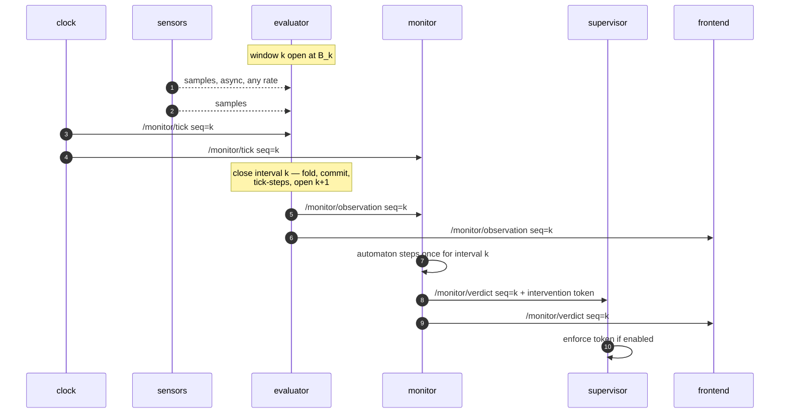

# The wire contract

Every payload in the system is defined here, once. Package specs in `packages/` link to a
section of this file; they never restate a schema. A package doc that contains a JSON
schema is a bug in the doc set.

Implemented by `skill_monitor/core/api.py` (P0) — pure Python, no ROS, so the contract is
importable and testable anywhere, including by clients that never install ROS.

## Envelope

Every `/monitor/*` topic is `std_msgs/String` carrying a JSON object with:

| field | type | meaning |
|---|---|---|
| `schema_version` | int | bumped on any breaking change to a payload below |
| `seq` | int | **closing boundary index** of the interval this payload describes. Everything carrying `seq=n` — pulse, observation, verdict — refers to the same interval, the one that just ended. Monotonic, never reused |
| `t` | float | seconds on the active clock at the tick boundary |
| `step` | int｜null | tick index *within the current episode*; resets on `arm`/`reset` |

`seq` and `step` travel together so an episode is locatable inside the global stream.
A payload that is not tick-scoped (a manifest, a spec status) omits `step`.

### Why JSON in `std_msgs/String` and not custom `.msg` types

Custom messages would be typed and self-describing on the wire. They would also require a
colcon-built interface package inside every image, which breaks the property that
`skill_monitor/core/` is pure Python testable with no ROS installed — the property that
lets the spec generator, the contract oracle and every unit test run on a laptop. And they
would turn the gateway (P6) from a pass-through into a translator with its own bugs.

JSON gives one payload shape across ROS, WebSocket and the recorded verdict files on disk.
"Untyped on the wire" does not mean unchecked: each payload has a builder and a validator
in `core/api.py`, exercised in `tests/test_api.py`.

## One tick, end to end



## Topic names

Declared once as constants in `core/api.py`. Nothing else in the repo may contain a
`/monitor/...` string literal — the rename from the old `/ltl/*` names is a consequence of
importing the constant, not a sweep that a branch can forget.

| constant | topic |
|---|---|
| `TICK` | `/monitor/tick` |
| `OBSERVATION` | `/monitor/observation` |
| `VERDICT` | `/monitor/verdict` |
| `ADAPTER` | `/monitor/adapter` *(latched)* |
| `MANIFEST` | `/monitor/manifest` *(latched)* |
| `COMMAND` | `/monitor/command` |
| `LOAD_SPEC` | `/monitor/load_spec` |
| `SPEC_STATUS` | `/monitor/spec_status` *(latched)* |
| `RAW_ECHO_REQUEST` | `/monitor/raw_echo_request` |
| `RAW_ECHO` | `/monitor/raw_echo` |

Latched means `TRANSIENT_LOCAL`, depth 1, reliable: a client that connects mid-mission
receives the last value immediately instead of waiting for a change that may never come.

---

## `/monitor/tick` — clock → everyone

Produced by P1. The only thing that advances the system.

```json
{
  "schema_version": 1,
  "seq": 1041,
  "t": 1041.0,
  "t0": 1755500000.0,
  "tick_hz": 1.0,
  "mode": "wall"
}
```

| field | notes |
|---|---|
| `tick_hz` | the *effective* rate, after any CLI override — not the descriptor default |
| `mode` | `wall` ｜ `replay` ｜ `manual` |
| `t0` | unix time at which this clock started. **Required.** It is the only way a consumer can tell a clock restart — where `seq` legitimately begins again — from an out-of-order delivery it must refuse. A changed `t0` is a new epoch: reset and keep stepping. Without it a restarted clock silently discards the next run's first *N* ticks, *N* being however far the previous run got |

A pulse is emitted even when no data arrived in the interval it closes. See
[clocking.md](clocking.md) for the interval semantics.

---

## `/monitor/observation` — evaluator → monitor, frontend

Produced by P3 from the window P2 folded. One message per tick, always, including ticks
where nothing arrived.

```json
{
  "schema_version": 1, "seq": 1041, "step": 88, "t": 1041.0,
  "clock": "external",
  "tick_membership": "arrival",
  "sensors": {"min_range": 0.42, "nav_state": "following", "...": "…"},
  "ap_values": {"path_active": true, "collision_risk": false},
  "unknown_aps": [],
  "confidence": 0.67,
  "data_health": {
    "points": {"rate_hz": 14.2, "expected_hz": 15.0, "age_s": 0.07,
               "samples_this_tick": 14, "refreshed": true, "dropped": 0},
    "status": {"rate_hz": 0.0, "expected_hz": 5.0, "age_s": 3.9,
               "samples_this_tick": 0, "refreshed": false, "dropped": 0}
  }
}
```

| field | notes |
|---|---|
| `clock` | `external` when driven by `/monitor/tick`, `internal` when free-running — a recorded run must never be ambiguous about which drove it |
| `tick_membership` | `arrival` today; `stamp` once the robot stamps its messages |
| `sensors` | the folded observation — every key the adapter's schema declares, always present |
| `ap_values` | booleans only. **UNKNOWN never appears here** — see [clocking.md](clocking.md#three-valued-aps) |
| `unknown_aps` | names of APs that could not be evaluated this tick |
| `confidence` | fraction of `required` sources fresh, 0.0–1.0 |
| `data_health` | per source. `refreshed` false with `samples_this_tick` 0 is the alert condition |

`dropped` is non-zero when a bounded queue shed load. It is published rather than logged
because a silent drop is indistinguishable from a sensor that stopped.

---

## `/monitor/verdict` — monitor → supervisor, frontend

Produced by P4, exactly once per tick.

```json
{
  "schema_version": 1, "seq": 1041, "step": 88, "t": 1041.0,
  "skill_name": "G1HumanoidNavigation",
  "phase": "ExecutionAndTracking", "phase_index": 1,
  "verdict": "UNDECIDED",
  "formulas": [{"name": "full_navigation_sequence", "status": "INCONCLUSIVE"}],
  "failure_modes": [{"name": "collision_imminent", "fault_category": "SAFETY",
                     "status": "VIOLATED", "confidence": 0.67}],
  "terminal": null,
  "risk": {"steps_to_timeout": 32, "seconds_to_timeout": 32.0,
           "violations_to_fault": 3, "warn": false, "severity": null,
           "trigger_confidence": 0.67, "stale_sources": ["status"]},
  "intervention": {"action": "WARN", "category": "SAFETY",
                   "imminence": null, "confidence": 0.67},
  "missed_ticks": 0
}
```

| field | notes |
|---|---|
| `verdict` | `SATISFIED` ｜ `VIOLATED` ｜ `UNDECIDED` ｜ `INCONCLUSIVE_NO_DATA` |
| `formulas[].status` | the automaton's own `MonitorStatus` — `INCONCLUSIVE` here means "the prefix neither proves nor refutes", a **different axis** from `INCONCLUSIVE_NO_DATA` |
| `failure_modes[].confidence` | **required.** Without it a VIOLATED derived from a dead sensor grades at 1.0 and the ladder goes straight to ABORT |
| `intervention.action` | one rung of `CONTINUE < WARN < SLOW < REPLAN < HALT < ABORT`. The monitor decides; the supervisor only enforces |
| `seconds_to_timeout` | ships **beside** `steps_to_timeout`, never replacing it, until spec bounds move to seconds (P11) |
| `missed_ticks` | pulses the monitor did not see. Logged, never interpolated |

---

## `/monitor/adapter` *(latched)* — evaluator → everyone

What this robot can observe. Produced by P3 from the descriptor P2 loaded. This is how the
monitor validates a pushed spec **without ever reading an adapter descriptor file**, and
how the frontend renders a sensor table for a robot it has never heard of.

```json
{
  "schema_version": 1,
  "adapter": "real_g1",
  "doc": "The real TRAV-metric-map G1 …",
  "tick_hz": 1.0,
  "warnings": [],
  "schema": {"min_range": {"doc": "float, metres…", "default": 10.0}},
  "sources": [{"id": "points", "topic": "/depth_anything/points",
               "type": "sensor_msgs/msg/PointCloud2",
               "expected_hz": 15.0, "max_age_s": 0.5,
               "required": true, "tracked": true,
               "keys": ["min_range"],
               "steps": [{"keys": ["min_range"], "aggregate": "min", "on": "message"}]}]
}
```

Resolved values only — a `debounce_s` declared in the descriptor appears here as the
integer tick threshold it resolved to, so the number exists in exactly one place and can be
read off the wire.

---

## `/monitor/manifest` *(latched)* — monitor → everyone

The skill spec exactly as authored, plus `phases` (names in order) and `source` (where it
came from: a path, or `pushed`). Passed through unaltered so a client sees the document the
engine was given, including fields this engine version does not itself understand.

## `/monitor/command` — frontend → monitor

```json
{"schema_version": 1, "command": "reset"}
```

`arm` ｜ `reset` ｜ `pause` ｜ `resume`.

## `/monitor/load_spec` → `/monitor/spec_status` *(latched)*

A whole spec in; then `{"ok": false, "problems": ["…"], "skill_name": "…"}`. Validated
against the schema last seen on `/monitor/adapter`. With no adapter on the graph only the
structural half can be checked — an unknown sensor field and an unseen one are
indistinguishable then, and refusing every spec until an adapter appears would break
offline replay.

## `/monitor/raw_echo_request` / `/monitor/raw_echo`

`{"source_id": "points"}` or `{"source_id": null}` to stop. The evaluator echoes a summary
of that **one** source's samples. One at a time, opt-in, because a point cloud per frame is
not free.

---

## Clock API

The tick is on a topic **and** on HTTP, so a client with no ROS can read and drive it. The
clock serves this itself, so it is queryable standalone; the gateway proxies the same paths
so the frontend has one origin.

| endpoint | purpose |
|---|---|
| `GET /api/clock` | `{seq, t, t0, tick_hz, mode, clock_time_s, subscribers}` |
| `WS /api/clock/stream` | one frame per pulse, **identical payload to `/monitor/tick`** |
| `POST /api/clock/mode` | `{"mode": "manual"}` |
| `POST /api/clock/step` | advance exactly one tick — any **driven** clock, so `manual` *or* `replay`; `wall` is a 409 |
| `POST /api/clock/rate` | `{"tick_hz": 5.0}`, `0 < tick_hz <= 1000` |
| `GET /api/clock/health` | liveness, and whether anything consumes the pulse |

`clock_time_s` is seconds advanced on the **active** clock, which is wall uptime only on
a `wall` clock: a `manual` clock stepped three times reports 3.0 however long the process
has been running. `GET /api/clock/health` carries both it and a true `uptime_s`.

Three constraints that are part of the contract, not implementation detail:

- **`GET /api/clock` is a sample, not a stream.** It is up to Δ seconds stale by
  construction and polling it will miss ticks. Anything that must not miss a tick uses the
  WS stream or the topic.
- **`POST /api/clock/rate` is refused while any monitor is armed**, and every accepted rate
  change is recorded in the verdict stream. `max_steps` is tick-denominated until P11, so a
  120-tick phase budget is 2 minutes at 1 Hz and 24 seconds at 5 Hz — a rate change
  mid-episode would silently redefine every timeout in the spec.
- **The clock service has no authentication and binds loopback by default.** `POST
  /api/clock/mode {"paused": true}` stops the tick for every service on the tier.
  Exposing it is a deliberate `--host 0.0.0.0`, behind something that terminates TLS
  and authenticates — the same rule the gateway states for itself.

## Gateway API

One-to-one with the topics, so the frontend keeps one data model on either transport:

| endpoint | maps to |
|---|---|
| `GET /api/monitors` | discovered namespaces + health |
| `GET /api/monitors/{ns}/manifest` | `/monitor/manifest` |
| `GET /api/monitors/{ns}/adapter` | `/monitor/adapter` |
| `WS /api/monitors/{ns}/stream` | `/monitor/observation` + `/monitor/verdict` frames |
| `POST /api/monitors/{ns}/command` | `/monitor/command` |
| `POST /api/monitors/{ns}/spec` | `/monitor/load_spec`, replying with `/monitor/spec_status` |
| `/api/clock*` | proxied from the clock, same paths |

Payloads are byte-identical to the topic payloads. P6's acceptance test feeds one recorded
frame through both paths and compares.

---

## Async rules

Normative, because "async" is where this design fails quietly.

1. **No blocking call on a subscription callback.** The LLM client is a bounded queue plus a
   worker. It is `queue.Queue()` with no `maxsize` today
   ([evaluator_node.py:85](../skill_monitor/backend/evaluator_node.py#L85)), so a slow model
   silently publishes observations sampled minutes ago.
2. **Bounded queues drop oldest and publish the count** in `data_health.dropped`. Never a
   silent drop.
3. **Every service tolerates every other being absent** and reports which are missing.
4. **The tick index is authoritative.** Gaps are recorded in `missed_ticks`, never
   interpolated and never merged into one catch-up tick.
5. **Per-tick processing is idempotent.** A redelivered tick must not advance a debounce
   twice.

## Migration from `/ltl/*`

| today | becomes |
|---|---|
| `/ltl/evaluations` | `/monitor/observation` |
| `/ltl/state_description` | `/monitor/verdict` |
| `/ltl/required_aps` | folded into the manifest and the per-tick verdict |
| `/ltl/manifest`, `/ltl/adapter`, `/ltl/load_spec`, `/ltl/spec_status` | same names under `/monitor/*` |
| — | new: `/monitor/tick`, `/monitor/command`, `/monitor/raw_echo*` |

Consumers that must move, each owned by the package that owns the file:

- [evaluator_node.py:93,101](../skill_monitor/backend/evaluator_node.py#L93) — P3
- [monitor_node.py:632,643,645](../skill_monitor/backend/monitor_node.py#L632) — P4
- [intervention_supervisor.py:35](../skill_monitor/backend/intervention_supervisor.py#L35) — P5
- [skill_center.py:43](../skill_monitor/frontend/skill_center.py#L43) — P7. **`STATE_TOPIC` is
  the discovery key**, not merely a subscription: the panel finds zero monitors until it moves.
- `backend/ablation_runner.py` — P4

Dual publication for one release, then `/ltl/*` is dropped.
