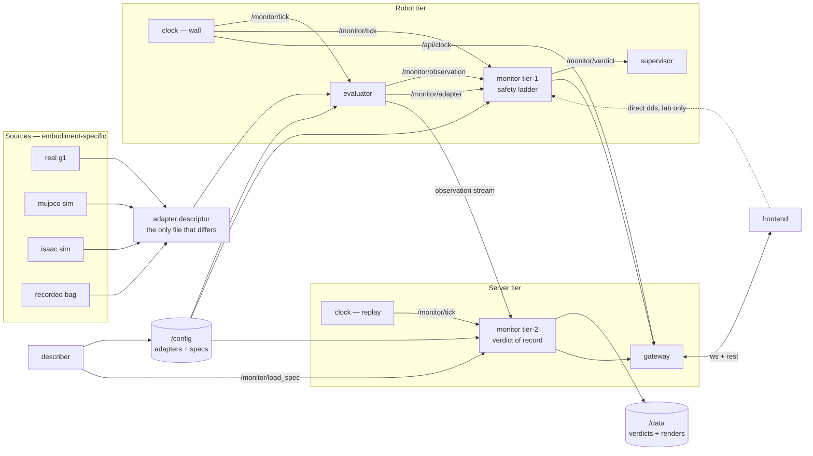

# System architecture

A set of independently containerised services, each runnable standalone, communicating only
over the contract in [api.md](api.md), driven by an external clock.

## The map



## Services

| service | tier | package | standalone behaviour |
|---|---|---|---|
| `clock` | one per tier | [P1](packages/P1-clock.md) | pulses `/monitor/tick` and serves `/api/clock` — queryable and steppable with no ROS and no gateway present |
| `evaluator` | robot | [P3](packages/P3-evaluator.md) | no clock → free-runs at its own `tick_hz` and marks the stream `clock: internal`; no monitor → still publishes |
| `monitor` | robot (tier 1) and server (tier 2) | [P4](packages/P4-monitor.md) | idles, publishes its manifest, accepts a pushed spec |
| `supervisor` | robot | [P5](packages/P5-supervisor.md) | subscribes verdicts, enforces nothing until `enabled` |
| `gateway` | server | [P6](packages/P6-gateway.md) | serves an empty API |
| `frontend` | anywhere | [P7](packages/P7-frontend.md) | `--mock`: the whole UI with no ROS and no gateway |
| `describer` | anywhere | [P8](packages/P8-deploy.md) | one-shot job; `--mock-llm` needs no model |

**Where the clock lives is a decision, not a detail.** One clock per tier, and the robot's
is authoritative for live data: the tick index is stamped at the source and travels inside
the observation, so the tier-2 monitor advances on the *received* tick rather than on a
second clock racing the first. The server's clock exists only to pace replay of a recorded
stream. Two clocks driving one trace is the bug this rule prevents.

## Where each artifact lives

| artifact | what it is | authored by | in the repo | ships as | consumed by |
|---|---|---|---|---|---|
| **sensor schema** | key → prose + default, per robot family | integrator | `skill_monitor/adapters/nav_schema.json` | `/config/adapters/` | evaluator (validates `sensor_eval`), describer (prompt), monitor (validates a pushed spec — **via `/monitor/adapter`, not the file**), frontend (sensor table) |
| **adapter descriptor** | topics → fields → keys, `tick_hz`, per-source health | integrator | `skill_monitor/adapters/<robot>.json` | `/config/adapters/` | **evaluator only**; its manifest travels on `/monitor/adapter` |
| **skill spec** | APs, LTL, phases, terminals — per skill | describer or human | `skill_monitor/specs/formulas_<skill>.json` | `/config/specs/` | **monitor only**; its content travels on `/monitor/manifest` |
| **AP rules** | `"True when <python expr>"` | — | inside the spec | — | evaluator executes them; `spec_contract` validates them against the schema |
| **verdict records** | per-tick verdicts + episode fold | monitor | — | `/data/verdicts` | analysis, ablation |
| **automaton renders** | `output/*.png` at spec load | monitor | — | `/data/output` | humans |

Config resolution everywhere: **CLI flag > `SKILL_MONITOR_CONFIG` env > packaged defaults**.
The packaged fallback is what keeps `pytest` and a bare `python3 -m` working on a machine
with nothing mounted.

**The invariant, stated because it is checkable: the monitor never reads an adapter
descriptor, and the evaluator never reads a spec.** Each learns of the other only through a
latched topic — which is exactly what lets the tier-2 monitor run with no adapter present.

## Hardware agnosticism

The claim: replaying an experiment in Isaac Sim runs **the same monitor container, the same
spec and the same verdict pipeline** as the real robot, and cannot tell the difference.

It holds by construction, not by discipline. The monitor's only inputs are a spec and an
observation stream, and **neither names an embodiment**. Everything embodiment-specific
stops at the evaluator's descriptor.

Verified today — `real_g1`, `mujoco` and `isaac_lab` declare **identical 14-key schemas**
over completely different topics:

| adapter | topics |
|---|---|
| `real_g1` | `/t265/odom/sample`, `/depth_anything/points`, `/path_manager/status`, `/vision/goal_similarity` |
| `mujoco` | `/odom`, `/scan`, `/navigate_to_pose/_action/status`, `/vision/goal_similarity` |
| `isaac_lab` | `/odom`, `/g1/lidar/points`, `/navigate_to_pose/_action/status`, `/vision/goal_similarity` |

**Superseded, and the reason matters.** The robot no longer runs Nav2 — navigation is the
TRAV algorithm on a RealSense D435i, no lidar. That change alone would have broken the two
sim descriptors above, and it exposed a deeper fault: the schema read the *planner's own
status* (`nav_state`, `nav_mode`, `nav_stuck`, `mission_finished`, `num_waypoints`,
`current_target_idx`), so swapping planners broke the monitor. A monitor that must be told
by the planner whether the planner is stuck is not independent of it.

[P12](packages/P12-planner-independent-schema.md) redesigns the schema around the robot's
own sensors plus the commanded waypoints, and forbids every planner topic by test. Until it
lands, treat the topic table above as describing the old, planner-coupled design.

```bash
python3 -c "from skill_monitor.core import adapter_spec as a; \
  print({n: sorted(a.load(n).keys()) == sorted(a.load('real_g1').keys()) for n in a.available()})"
```

Two replay paths, which must agree:

| path | what runs | what it proves |
|---|---|---|
| **re-execution in Isaac** | sim publishes its topics → evaluator with `isaac_lab.json` → monitor, live | the full stack is embodiment-independent |
| **stream replay** | recorded `/monitor/observation` frames re-published → monitor | the verdict is a function of the observation stream alone |

Same episode through both → same verdict. That equality is the acceptance test for the
claim; the exclusion count when it fails is the fidelity report.

**Three things break agnosticism**, named so they can be refused:

1. **An AP rule over a key only one embodiment provides.** Already caught —
   `spec_contract.validate()` rejects it against the declared schema.
2. **A different `tick_hz` between real and sim.** Same episode, different trace length, and
   every `max_steps` bound silently means something else.
3. **A debounce counted in messages rather than ticks — broken today.** See
   [clocking.md](clocking.md#two-bugs-this-exists-to-fix): `nav_stuck` debounces 10 s on the
   robot and **never fires** in sim. Until P2 lands, sim and real verdicts are not comparable.

Two invariants worth asserting in tests rather than prose: every shipped descriptor exposes
the same schema keys, and the monitor package never reads `skill_monitor/adapters/`.

## Deployment

| stack | file | contains |
|---|---|---|
| robot | `deploy/docker-compose.robot.yml` | clock, evaluator, monitor tier-1, supervisor |
| server | `deploy/docker-compose.server.yml` | clock, monitor tier-2, gateway, frontend |
| sim | `sim/docker-compose.sim.yml` | mujoco, nav2, clock, evaluator, monitor, foxglove, dozzle |
| dev overlay | `deploy/docker-compose.dev.yml` | the live source mount, applied over any of the above |

Volumes: `/config` read-only (adapters + specs), `/data` read-write (verdicts + renders).

### Trust boundary

**No service in this system authenticates anything.** The clock's `/api/clock*` and the
gateway's `/api/monitors/*` both accept unauthenticated state-changing POSTs — pausing the
tick, arming or resetting a monitor, replacing the running spec. Two services were written
to this contract independently and both defaulted to binding every interface, because the
contract never said otherwise. It says so now:

- **Bind loopback by default.** Exposing a service on `0.0.0.0` is a deliberate act, made
  in a compose file where it is visible, not a library default.
- **The tier boundary is the trust boundary.** Everything on the robot tier trusts
  everything else on it. Nothing off the tier is trusted.
- **If the network is not trusted, terminate TLS and authenticate in front.** A partial
  auth layer inside these services would be worse than none, because it would be believed.
- **CORS is not access control.** A wildcard `Access-Control-Allow-Origin` plus a granted
  `Content-Type` header lets any web page an operator visits drive a cross-origin JSON POST
  at the robot. State-changing routes must not be reachable that way.

### Anything in this repo that serves HTTP

The clock and the gateway were written a week apart, by different authors, against the same
contract. Both bound every interface, both trusted `Content-Length` while ignoring
`Transfer-Encoding`, and neither checked `Host`. Three identical defects, independently
arrived at, because the contract asked for none of it. It asks now — this list is the
minimum, and a review should reject a new HTTP surface that skips any of it:

| requirement | why, concretely |
|---|---|
| bind loopback by default | exposure is a compose-file decision, visible in review, not a library default |
| validate `Host` against an allowlist | binding loopback stops a *remote* attacker, not a browser on the operator's own machine. DNS rebinding makes the attacker's page same-origin with the service, so there is no preflight and it sets any header and method it likes |
| reject `Transfer-Encoding`, or TE+CL together | a proxy prefers TE, this stack trusts CL, and the deployment story is "authenticate in a proxy in front" — so the desync lands precisely on the auth boundary and the smuggled request is the one nobody authorised |
| bound the body, and `close_connection` on rejection | answering 413 without draining or closing leaves the undrained bytes to be parsed as the next request on the same socket |
| bound in-flight requests and set a socket timeout | capping WebSockets is not enough: any handler that waits — a spec push, a dribbled body — parks a thread, and `MAX_BODY_BYTES` bounds the declared size, never the arrival rate |
| a custom-header gate on state-changing methods | not authentication, and must not be described as such. It is CSRF defence: no forbidden-header-free browser API can set a non-safelisted header, so forms, `sendBeacon` and `no-cors` fetches are all refused |
| override `handle_error` | the stdlib prints a full traceback per client reset; on an exposed port that is log exhaustion |

None of this is authentication. If the network is not trusted, terminate TLS and
authenticate in front — and note that doing so is what makes the smuggling and `Host` rules
load-bearing rather than theoretical.

Two caveats stated once rather than left implied: containerising the frontend means mounting
`/var/run/docker.sock` into it, which is root-equivalent control of the host daemon — right
for a lab console, wrong anywhere shared; and a Tk GUI in a container needs `DISPLAY` and
`/tmp/.X11-unix`.

## Layers

Unchanged, and still one-directional — `core` knows nothing about the layers above it.
See [README.md](../README.md#layout). The new services slot in as: `core/` gains `api.py`,
`clock.py`; `backend/` gains `clock_node.py`, `gateway.py`.

## Reading order

1. this file — what exists and why
2. [api.md](api.md) — the contract every service speaks
3. [clocking.md](clocking.md) — the tick, in detail
4. [packages/](packages/README.md) — one implementable brief per work package
