# The system in UML, and the life of one tick

This document has two halves that answer two different questions.

**Half one — structure.** What objects exist, which process each one lives in, what
each one owns, and which way the dependencies point. Component diagram, deployment
diagram, class diagram.

**Half two — behaviour.** What actually happens between the instant the clock fires
and the instant a verdict lands on the wire — *one tick*, one automaton step, traced
call by call with the file and line of every hop. Sequence diagram, activity diagram,
state machines, and a worked example with real numbers.

Read [architecture.md](architecture.md) first if you want the *why* of the service
split, [api.md](api.md) for the byte-level wire contract, and
[clocking.md](clocking.md) for the formal definition of a tick as a half-open
interval. This file is the connective tissue between those three and the source.

> **A warning that changes how you should read the sequence diagram.** The tick is
> fully specified and only partly wired. The clock produces ticks; the monitor
> *records* them; but the evaluator does not consume them, and the observation window
> is never folded. Two diagrams are given — **as-built** (what runs today, tracing the
> real call chain) and **as-designed** (what P2/P3 land). The gap is spelled out in
> [§9](#9-as-built-vs-as-designed-the-honest-gap) with the code that admits it. If you
> are debugging, read as-built. If you are implementing, read as-designed.

---

## Contents

1. [The one-paragraph version](#1-the-one-paragraph-version)
2. [Component diagram — the services and their ports](#2-component-diagram--the-services-and-their-ports)
3. [Deployment diagram — which tier, which container, which volume](#3-deployment-diagram--which-tier-which-container-which-volume)
4. [Class diagram — the core domain model](#4-class-diagram--the-core-domain-model)
5. [Class diagram — the ROS layer and its seams](#5-class-diagram--the-ros-layer-and-its-seams)
6. [The life of one tick — as-built sequence](#6-the-life-of-one-tick--as-built-sequence)
7. [Inside the step — activity diagram of `_advance`](#7-inside-the-step--activity-diagram-of-_advance)
8. [State machines — three of them, deliberately separate](#8-state-machines--three-of-them-deliberately-separate)
9. [As-built vs as-designed: the honest gap](#9-as-built-vs-as-designed-the-honest-gap)
10. [A worked tick, with numbers](#10-a-worked-tick-with-numbers)
11. [File index — what to open when](#11-file-index--what-to-open-when)

---

## 1. The one-paragraph version

A **clock** emits a tick. An **evaluator** holds a bag of sensor values built from
whatever ROS messages arrived, evaluates the atomic propositions the monitor asked for
— each AP is a Python expression parsed out of its own English description — and
publishes a dict of booleans. A **monitor** admits that dict as one step of the trace,
feeds it to a set of Büchi automata compiled from LTL formulas, advances a phase state
machine, grades any violated failure mode into an action on a ladder from `CONTINUE`
to `ABORT`, and publishes a **verdict**. A **supervisor** reads the verdict and, if the
action is `HALT` or worse, out-publishes the planner on `/cmd_vel` with zeros. A
**gateway** fans the same JSON out to a browser. Nothing in that chain names a robot;
everything embodiment-specific stops at the evaluator's JSON descriptor.

The two artifacts that parameterise the whole system:

| artifact | varies with | consumed by | reaches the other side via |
|---|---|---|---|
| **adapter descriptor** (`skill_monitor/adapters/<robot>.json`) | the **embodiment** | evaluator **only** | latched `/monitor/adapter` |
| **skill spec** (`skill_monitor/specs/formulas_<skill>.json`) | the **skill** | monitor **only** | latched `/monitor/manifest` |

**The monitor never opens an adapter descriptor and the evaluator never opens a spec.**
That is not a convention, it is what lets a tier-2 monitor run in a datacentre with no
adapter file mounted anywhere near it.

---

## 2. Component diagram — the services and their ports

UML component notation, in Mermaid: each box is a deployable component, each labelled
arrow is a required→provided interface. Interface names are the literal topic and
route strings from [`core/api.py`](../skill_monitor/core/api.py) lines 44–54, not
paraphrases.

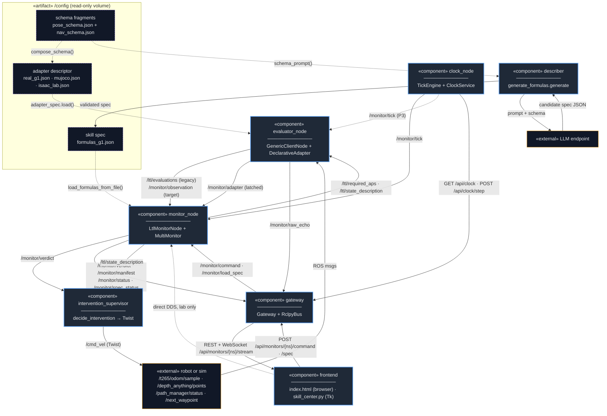

### The interfaces, enumerated

Every arrow above is a `std_msgs/String` carrying JSON, or an HTTP route. There is no
custom message type in this system, on purpose: a client that watches a monitor does
not have to import this package, share its filesystem, or build its `.msg` files.

| interface | direction | producer | consumer | QoS | builder / validator |
|---|---|---|---|---|---|
| `/monitor/tick` | pulse | `clock_node:534` | `monitor_node:795` | volatile, depth 10 | `api.build_tick:367` / `api.validate_tick:392` |
| `/monitor/observation` | per tick | *(P3, not yet published)* | `monitor_node:796` | volatile | `api.build_observation:426` |
| `/ltl/evaluations` | per pseudo-tick | `evaluator_node:98` | `monitor_node:804` | volatile | *legacy flat dict, no builder* |
| `/monitor/adapter` | on connect | `evaluator_node:126` | `monitor_node:832` | **TRANSIENT_LOCAL** | `AdapterSpec.manifest:695` |
| `/monitor/manifest` | on spec load | `monitor_node:817` | gateway, frontend | **TRANSIENT_LOCAL** | `manifest.skill_manifest:73` |
| `/monitor/verdict` | per step | `monitor_node:794` | supervisor, gateway | volatile | `manifest.build_verdict_payload:1105` / `api.validate_verdict` |
| `/monitor/status` | on change | `monitor_node:825` | gateway | **TRANSIENT_LOCAL** | `api.build_monitor_status` |
| `/monitor/spec_status` | on push | `monitor_node:818` | gateway, frontend | **TRANSIENT_LOCAL** | `api.build_spec_status:1125` |
| `/monitor/load_spec` | on demand | gateway `:1370`, frontend `:231` | `monitor_node:830` | volatile | `spec_contract.validate:117` |
| `/ltl/required_aps` | per step | `monitor_node:835` | `evaluator_node:96` | volatile | bare JSON array |
| `/ltl/state_description` | per step | `monitor_node:836` | evaluator `:97`, supervisor `:35` | volatile | `publish_legacy_state:2186` |
| `/cmd_vel` | 10 Hz while halting | `intervention_supervisor:34` | robot base | volatile | `geometry_msgs/Twist` |

**Four topics are latched (`TRANSIENT_LOCAL`), and it matters.** `api.LATCHED_TOPICS`
([api.py:71](../skill_monitor/core/api.py#L71)) is `{ADAPTER, MANIFEST, SPEC_STATUS,
MONITOR_STATUS}`. A browser that connects thirty minutes into a mission needs the
manifest to render an AP table at all, and a manifest only changes when a spec is
loaded — an event that may never happen again. Without latching the panel would render
blank forever and look broken. `MONITOR_STATUS` is deliberately *both* latched and
streamed (`gateway.py:243–249`): a paused monitor publishes nothing else, so the only
frame that would ever tell a late joiner "this thing is alive but paused" is the
latched one.

### The one asymmetry worth memorising

The evaluator and the monitor are mutually dependent but neither imports the other's
data:

- The monitor tells the evaluator **which APs to bother computing** (`/ltl/required_aps`,
  derived at `monitor_node.required_aps:2146` from the automata's outgoing-edge support
  plus the terminal and phase conditions).
- The evaluator tells the monitor **what a sensor key means and where it came from**
  (`/monitor/adapter`).

Each is a projection of a file the other never reads. That is the whole trick.

---

## 3. Deployment diagram — which tier, which container, which volume

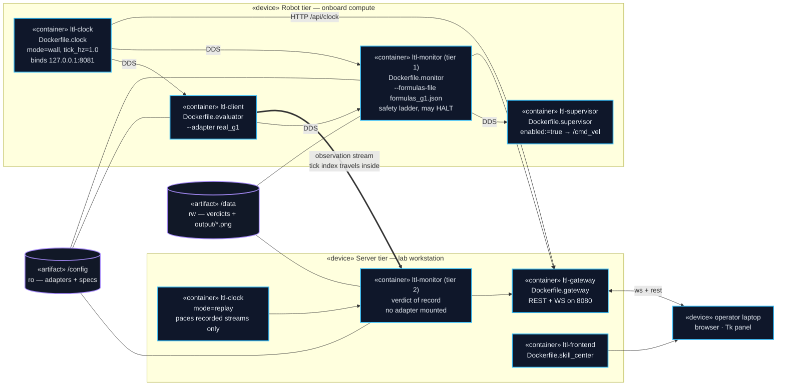

**One clock per tier, and the robot's is authoritative for live data.** The tick index
is stamped at the source and travels *inside* the observation
([`Observation.seq`](../skill_monitor/core/manifest.py#L354)), so the tier-2 monitor
advances on the **received** tick rather than on its own clock racing the first. The
server's clock exists only to pace replay. Two clocks driving one trace is the bug this
rule prevents, and `TickLedger.admit` ([manifest.py:274](../skill_monitor/core/manifest.py#L274))
is where the rule is enforced: a `seq` that arrives *ahead* of the local clock is
refused with `reason="ahead"` rather than being stepped on faith.

Compose files: `deploy/docker-compose.robot.yml`, `deploy/docker-compose.server.yml`,
`sim/docker-compose.sim.yml`, with `deploy/docker-compose.dev.yml` as the live-source
overlay applied over any of them.

---

## 4. Class diagram — the core domain model

Everything in this diagram lives under `skill_monitor/core/` and imports **nothing but
the stdlib and Spot**. No `rclpy`, no Tk, no sockets. That is why `python3 -m pytest`
runs 105 tests on a laptop with no ROS installed.

### 4a. Time — `core/clock.py`

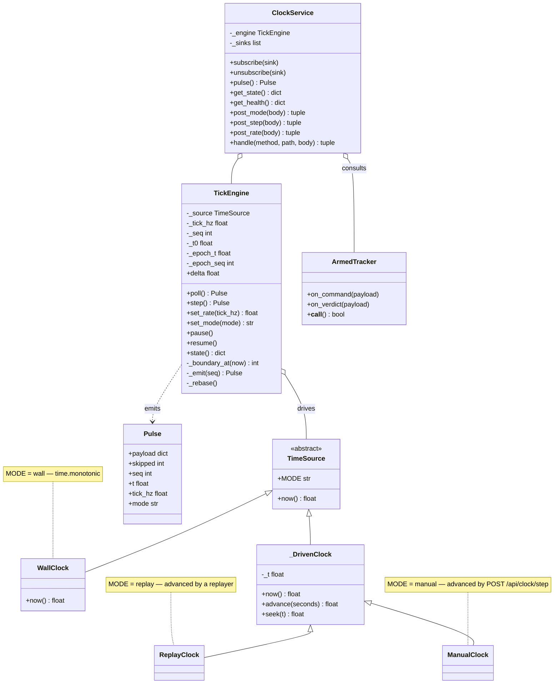

Three design decisions visible in the shape:

1. **`TickEngine` has no I/O and `ClockService` has no time.** The engine turns a
   monotonic float into a sequence of boundaries; the service decides who is allowed to
   change the rate and who gets told. `clock_node.py` is a *third* layer that owns the
   socket and the ROS publisher and nothing else. Testing the boundary arithmetic needs
   no server; testing the HTTP policy needs no wall clock.
2. **`ManualClock` is a first-class mode, not a test hook.** `POST /api/clock/step`
   ([clock.py:701](../skill_monitor/core/clock.py#L701)) advances the *entire system* by
   exactly one tick. Every service downstream is already event-driven off the pulse, so
   single-stepping a live stack costs no extra code.
3. **`ArmedTracker` exists so the rate cannot change mid-episode.** `post_rate`
   ([clock.py:722](../skill_monitor/core/clock.py#L722)) returns **409** while armed. If
   `tick_hz` changed mid-run, every `max_steps` in the spec would silently mean a
   different amount of wall time before and after the change, and the episode's trace
   would no longer be a function of the data.

### 4b. Sensing — `core/adapter_spec.py` + the ROS adapters

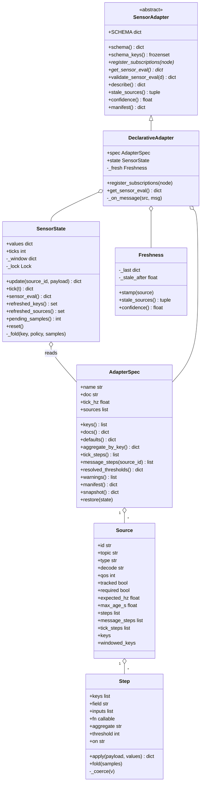

`Step` is the whole extension mechanism, and it is deliberately small. A step is
*"take this field off this message, optionally run this named function over it,
optionally with these other sensor keys as extra arguments, and write the result to
these keys."* That is `Step.apply`
([adapter_spec.py:470](../skill_monitor/core/adapter_spec.py#L470)):

```python
if self.inputs:                 args = [values.get(k) for k in self.inputs]
elif self.field is not None:
    v = _path(payload, self.field)          # dotted path: "pose.pose.orientation"
    if v is _MISSING:
        if self.default is _MISSING: return {}
        v = self.default
    args = [v]
else:                           args = [payload]
out = self.fn(*args) if self.fn else args[0]
if out is None: return {}
vals = out if isinstance(out, tuple) else (out,)
return {k: self._coerce(v) for k, v in zip(self.keys, vals)}
```

Three properties fall out of those fifteen lines and are worth naming:

- **A step can write more than one key.** `quat_to_roll_pitch` returns a tuple and the
  descriptor declares `"keys": ["base_roll", "base_pitch"]`. Arity is checked at
  `:495`, so a mismatched extractor fails loudly instead of silently dropping a key.
- **A step can read keys other steps wrote.** `"inputs": ["base_roll","base_pitch","base_height"]`
  with `"fn": "upright"`. `SensorState.update` runs message-steps against a
  `ChainMap(scratch, self.values)` (`:1001`) so a step sees this message's fresh values
  first and last tick's committed values behind them.
- **`"on": "tick"` moves a step out of the message path entirely.** `dist_to_goal` in
  `real_g1.json` is a tick-step: it needs `pos_x`/`pos_y` from odom *and*
  `goal_x`/`goal_y` from the waypoint topic, which arrive on unrelated schedules. Computing
  it per message would mean computing it against whichever half is stale. Tick-steps are
  forbidden from declaring `field` and required to declare `inputs` (`:383–399`) —
  the type system for a thing that has no types.

Anything that needs real mathematics is a **named function in Python**
(`EXTRACTORS`, [adapter_spec.py:265](../skill_monitor/core/adapter_spec.py#L265)), not
more JSON. The JSON says *which* function and *where its arguments come from*; it never
expresses the function. That boundary is what keeps a descriptor reviewable.

### 4c. Judging — `core/automata.py`, `core/monitor_action.py`, `core/supervisor_logic.py`

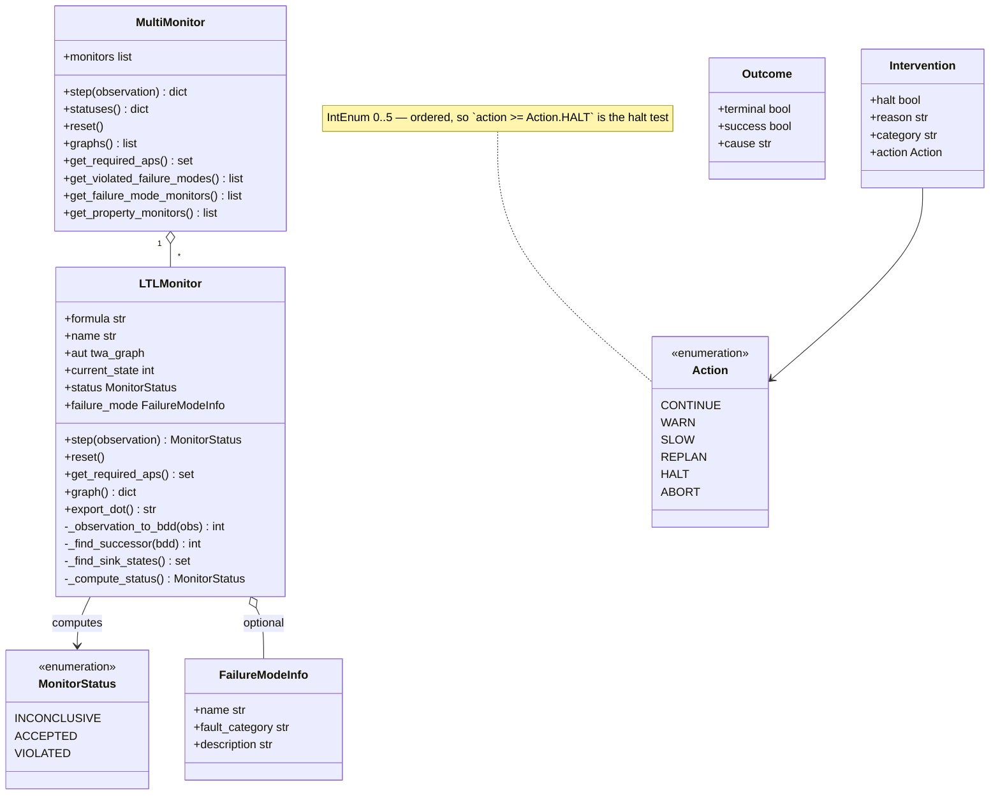

`grade_action` ([monitor_action.py:33](../skill_monitor/core/monitor_action.py#L33)) is
the ladder, and it is a pure function of three arguments — category, imminence,
confidence — with no state and no I/O. The reason it is a separate 73-line module is
that it is the single place where *policy* lives; everything else in the system reports
facts. Its shape:

| category | not confident | imminent (`≤ warn_steps`) | overdue (`≤ 0`) |
|---|---|---|---|
| `SAFETY`, `INVARIANT` | `WARN` | `HALT` | `ABORT` |
| `TIMEOUT` | `WARN` | `REPLAN` | `REPLAN` |
| `PROGRESS` | `WARN` | `SLOW` | `REPLAN` |
| unrecognised | `CONTINUE` | `WARN` | `WARN` |

**Confidence is a first-class input to the ladder, not a display field.** A `SAFETY`
mode that fires while its own sources are stale grades to `WARN`, not `HALT`. That is
the mitigation for the `min` fold on `min_range` described in
[clocking.md](clocking.md#why-min-on-min_range-and-what-it-costs): one spurious
near-pixel from a monocular-depth cloud should not stop a robot, and the thing that
stops it from stopping the robot is `confidence >= min_confidence` at
`monitor_action.py:50`.

### 4d. Bookkeeping — `core/manifest.py`

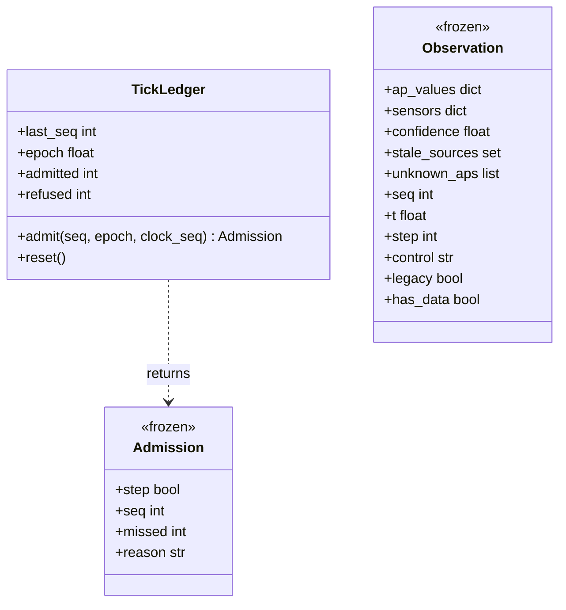

`Admission.reason` is a closed vocabulary of seven strings —
`first · advanced · redelivered · stale · ahead · implicit · epoch` — and it is the
answer to *"why did the trace not advance?"* being a **recorded fact** rather than a
thing you infer from a gap in the logs. `normalize_observation`
([manifest.py:380](../skill_monitor/core/manifest.py#L380)) is the other half: it
accepts either the envelope form (keyed on the presence of `"ap_values"`) or the legacy
flat dict with its `__dunder__` reserved keys, and returns one frozen `Observation`
either way. Every consumer downstream of it is wire-format-agnostic, which is what made
it possible to add the new contract without a flag day.

---

## 5. Class diagram — the ROS layer and its seams

`skill_monitor/backend/` is where `rclpy` appears. Each node is a thin transport shell
around core objects that know nothing about it.

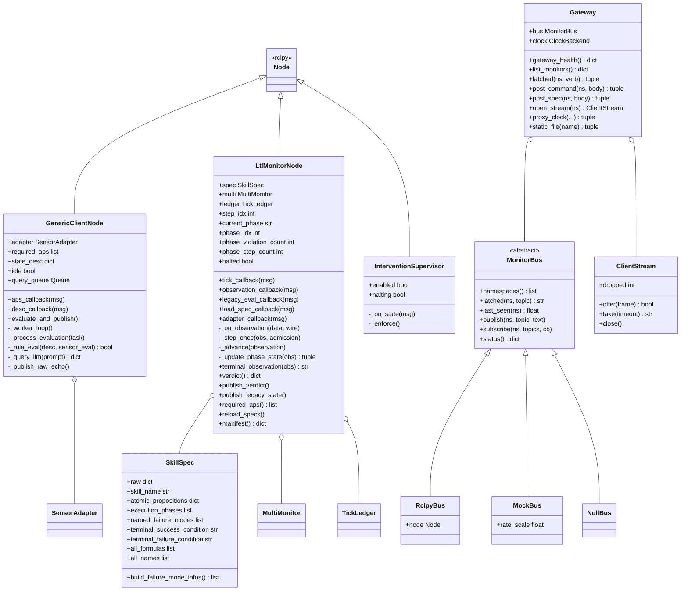

**`MonitorBus` is the seam that makes the whole frontend testable.** `Gateway` deals
only in raw payload *text* — it never parses a monitor's JSON, and `stream_frame`
([gateway.py:975](../skill_monitor/backend/gateway.py#L975)) assembles the WebSocket
frame by **string concatenation** rather than `json.dumps` precisely so the bytes that
reach the browser are byte-identical to the bytes that came off the topic:

```python
head = json.dumps({"ns": ns, "topic": topic, "dropped": dropped})
return head[:-1] + ', "payload": ' + payload_text + "}"
```

A re-serialisation round-trip would quietly renormalise floats and key order, and then
a bug reproduced from a browser recording would not be the bug the monitor had. Given
that seam, `MockBus` ([mock_monitor.py:663](../skill_monitor/frontend/mock_monitor.py#L663))
can drive the entire UI — including latched-topic replay to new subscribers, which is
what a paused monitor depends on — with no ROS in the process at all. `python3 -m
skill_monitor.frontend.web --mock` is the whole console, fabricated end to end, and it
says so on the wire: `services.ros.detail` reads `"MOCK -- there is no ROS here…"`.

---

## 6. The life of one tick — as-built sequence

This is the real call chain in the tree today. Read the note at
[§9](#9-as-built-vs-as-designed-the-honest-gap) before trusting it as the intended
design; it traces what executes, which is what you need when something is wrong.

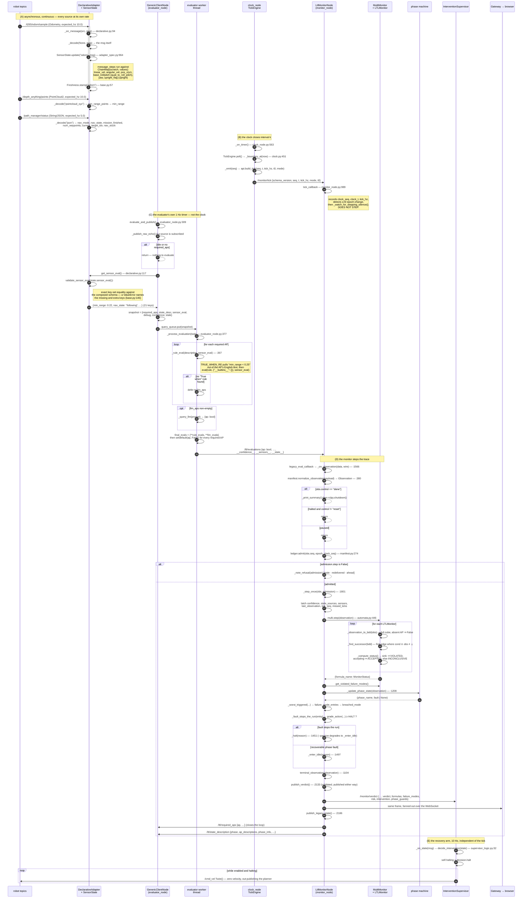

### 6.1 Stage A — messages accumulate

`DeclarativeAdapter.register_subscriptions`
([declarative.py:88](../skill_monitor/backend/adapters/declarative.py#L88)) creates one
subscription per `Source` in the descriptor, resolving `"nav_msgs/msg/Odometry"` to a
class at import time (`_msg_class:26`) and mapping `"qos": "action_status"` to
`qos_profile_action_status_default` (`_qos:35`) — Nav2's `GoalStatusArray` is latched
and transient-local, and subscribing to it with a plain depth-10 profile means you
never see the status that was published before you started.

Each arriving message goes through `_decode` (`:46`), which is a four-entry dispatch —
`json`, `pointcloud_xyz`, `laserscan_ranges`, `goal_status`, or `None` for "hand the
message through untouched". Then `SensorState.update`:

```python
scratch: dict = {}
chained = ChainMap(scratch, self.values)
for step in src.message_steps:
    scratch.update(step.apply(payload, chained))
for key, value in scratch.items():
    self._window.setdefault(key, []).append(value)
return dict(self.values) | scratch
```

**Note what is written where.** Steps write into `scratch`, and `scratch` is appended
to the *window* — a per-key list of every sample seen since the last tick. It is
**not** written to `self.values`. Only `SensorState.tick()` rebinds `self.values`, and
it does so atomically, after folding the window by each key's declared policy. That is
the guarantee called *tick-stable* in [clocking.md](clocking.md#the-observation-window):
within one tick, every AP evaluates against the same snapshot, so
`nav_state == 'following'` and `min_range < 0.25` cannot describe two different
instants.

The fold policies are declared per key in the descriptor: `last` (the default, and
byte-identical to the old behaviour), `min`, `max`, `mean`, `first`, `any`, `all`,
`quantile`. `min_range` is folded with `min` for the reason given in the clocking doc:
at 1 Hz over the cloud's declared 10 Hz, last-sample-wins discards nine frames out of
ten, and the one it keeps need not be the frame that saw 0.2 m.

In parallel, `Freshness.stamp(src.id)` ([base.py:57](../skill_monitor/backend/adapters/base.py#L57))
records the arrival — but only for `tracked` sources. `Freshness.confidence` is then
`1.0 - len(stale)/len(tracked)`, and **never-seen counts as stale**, which is the
correct default: an adapter that has never received a topic should not report full
confidence in it.

### 6.2 Stage B — the clock closes the interval

`clock_node._on_timer` runs on a ROS timer whose period is `delta/20`, floored at
0.2 ms and ceilinged at 1 s (`poll_period:459`). Oversampling the boundary by 20× is
how a timer with millisecond jitter still lands ticks on the right side of a boundary.
`TickEngine.poll()` emits **at most one pulse per call** and returns `None` if no
boundary has been crossed — which is why the tuner can oversample freely without
producing duplicate ticks.

`Pulse.skipped` is computed as `seq - self._seq - 1` (`clock.py:439`) and deliberately
**left out of the payload** (`clock.py:243–245`): it describes the *publisher's*
scheduling health, not the interval, and putting it in the pulse would make two
subscribers that received the same tick disagree about what tick 42 was.

On the monitor side, `tick_callback` ([monitor_node.py:989](../skill_monitor/backend/monitor_node.py#L989))
carries an explicit comment that it does not step. It records `clock_seq`, `clock_t`
and `tick_hz`; it checks `manifest.tick_epoch(tick)` for a `t0` change, which means the
clock restarted and every prior `seq` is meaningless; and it runs
`_watch_for_stepping_silence()`. That last one is why a monitor that stops receiving
observations does not just go quiet: after `_STALL_TICKS = 5` silent clock ticks it
publishes a verdict with `has_data=False`, which folds through `verdict_word` to
`INCONCLUSIVE_NO_DATA`. **A monitor that is not receiving data says so on the same
topic and in the same shape as one that is.** A consumer never has to distinguish
"no verdict" from "no data" by timeout.

### 6.3 Stage C — the evaluator answers the question it was asked

`evaluate_and_publish` ([evaluator_node.py:309](../skill_monitor/backend/evaluator_node.py#L309))
returns immediately when `self.idle or not self.required_aps`. Both come from the
monitor: `aps_callback` sets `self.idle = not new_aps`, and the monitor publishes `[]`
on `/ltl/required_aps` when it halts or goes idle. So a halted monitor silences the
evaluator's LLM traffic without any extra protocol.

Rule evaluation is the piece most likely to surprise a reader, because **the machine
contract lives inside the English**. An AP in `formulas_g1.json` is a single string:

```json
"collision_risk": "True when min_range < 0.25. An obstacle is too close to the robot."
```

`TRUE_WHEN_RE` ([spec_contract.py:28](../skill_monitor/core/spec_contract.py#L28))
extracts `min_range < 0.25`, and `_rule_eval` (`:367`) evaluates it with the sensor dict as the
*locals* mapping:

```python
return bool(eval(rule, {"__builtins__": {}}, sensor_eval))
```

Sensor keys are therefore the free variables of the rule, which is why
`spec_contract.unknown_keys` can statically check a spec against an adapter's schema
before it is ever loaded: extract the identifiers, subtract the operators and literals
(`NON_SENSOR_TOKENS`), and anything left that the schema does not declare is a
guaranteed `NameError` at runtime, reported as a validation problem instead.

The regex is worth one sentence of its own. Its terminator is `(?:\.\s|\.$|$)`, not
`\.`, and the comment above it says why: a naive `\.` truncated `min_range < 0.25` to
`min_range < 0`, which is a rule that is *always false* and produced a monitor that
silently never detected a collision. That is the kind of bug this codebase writes
comments about.

An AP with no `"True when"` rule falls through to `llm_aps` and is sent to the model
with the whole sensor dict. Merge order is `{**rule_evals, **llm_evals}` followed by
`setdefault(ap, False)` for every required AP, so the published dict is **total over
`required_aps`** — a missing AP never reaches the automaton, where it would be
defaulted to `False` anyway but without anyone recording that it happened.

The published frame is the legacy flat dict: every `ap_name: bool`, plus three reserved
keys — `__confidence__`, `__sensors__` (the full sensor snapshot, so a panel can render
the numbers behind a boolean), and `__stale__` (present only when non-empty).

### 6.4 Stage D — the monitor steps the trace

`_on_observation` ([monitor_node.py:1566](../skill_monitor/backend/monitor_node.py#L1566))
is a gauntlet of guards before anything is allowed to advance, and each one exists for
a named failure:

| guard | line | what it prevents |
|---|---|---|
| `normalize_observation` returns `None` | 1573 | a malformed frame stepping the trace |
| `obs.control == "done"` | 1586 | ignoring an explicit end-of-episode marker |
| `halted` and not a `reset` | 1593 | a halted monitor quietly resuming on the next frame |
| `paused` | 1601 | an operator's pause being overridden by data |
| dual-wire demotion | 1615 | **the same tick being stepped twice** — once from `/monitor/observation` and once from the legacy `/ltl/evaluations` mirror during the migration |
| `ledger.admit(...)` | 1642 | a redelivered, stale, or clock-ahead `seq` stepping the trace |

The dual-wire rule deserves emphasis because it is the migration-shaped hazard: while
both topics carry the same content, a monitor subscribed to both would double-step
every tick, and every `max_steps` in every spec would mean half as much wall time. The
rule is *once `api.OBSERVATION` has been seen, legacy arrivals return* — with a
re-admission path after `_LEGACY_READMIT_TICKS = 10` silent ticks, so killing the new
producer does not leave the monitor permanently deaf to the old one.

Then `_step_once` latches the tick's context onto the node, and `_advance` does the
work. The automaton step itself is four lines
([automata.py:125](../skill_monitor/core/automata.py#L125)):

```python
obs_bdd   = self._observation_to_bdd(observation)   # full cube over self.aut.ap()
next_state = self._find_successor(obs_bdd)          # first edge whose cond ∧ obs ≠ ⊥
assert next_state is not None                        # the automaton is `complete`
self.current_state = next_state; self.status = self._compute_status()
```

Three properties are load-bearing and all three come from the `spot.translate` call at
`:108` — `translate(formula, "Buchi", "det", "complete", "sbacc")`:

- **`det`** — deterministic, so "the first matching edge" is "the only matching edge",
  and stepping is a total function rather than a search.
- **`complete`** — every state has an outgoing edge for every valuation, which is what
  lets `_find_successor` returning `None` be an assertion failure rather than a
  branch. There is no "the automaton got stuck" state to handle.
- **A sink is absorbing** — `_find_sink_states:387` identifies non-accepting states
  whose only edge is a `bddtrue` self-loop, and `step` early-returns once `VIOLATED`.
  A safety property that has been violated stays violated; the trace cannot un-violate
  it by behaving well afterwards.

`_observation_to_bdd:367` builds a **full cube** over the automaton's own AP set, using
`observation.get(name, False)`. So the automaton is *structurally two-valued*: there is
no third value to pass it. This is exactly why the three-valued design in
[clocking.md](clocking.md#three-valued-aps) freezes rather than guesses — an AP whose
required sources are stale makes the tick `UNDECIDED` and the automaton simply does not
step, preserving its two-valued semantics instead of fabricating a `False` that would
read as evidence of safety.

### 6.5 The phase machine — `_update_phase_state`

Running alongside the automata, and in a strict order that encodes a priority:

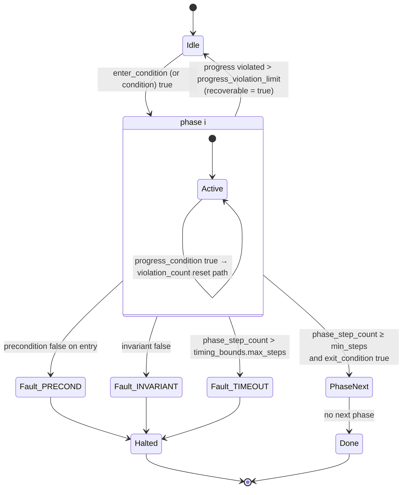

The evaluation order in
[`_update_phase_state:1208`](../skill_monitor/backend/monitor_node.py#L1208) is
**precondition → invariant → timeout → progress → exit**, and it is a priority
ordering, not an arbitrary one. A phase whose invariant just broke should report
`INVARIANT`, not `TIMEOUT`, even if it also happened to run out of steps on the same
tick; and it should certainly not report `exit_condition` satisfied and advance to the
next phase carrying an unreported fault.

Two categories of fault, distinguished by one flag:

- **`recoverable=False`** — `PRECONDITION`, `INVARIANT`, `TIMEOUT`. These reach
  `_fault_stops_the_run` and can halt.
- **`recoverable=True`** — `PROGRESS`, and only after `progress_violation_limit`
  consecutive violations (default 5). It drops the monitor to **Idle**, not to Halted.
  A robot that is not making progress has not done anything unsafe; the correct
  response is to stop asserting things about a phase it is no longer in.

Every guard evaluation is recorded in `_phase_guard_values[(idx, guard_name)]` — but
**only on a successful eval** (`:1246–1248`). A guard that raised produces no entry
rather than a `False` entry, so the `phase_guards` block in the verdict distinguishes
"this guard was false" from "this guard could not be evaluated". A UI that showed both
as a red dot would be lying about one of them.

### 6.6 The verdict, assembled

`verdict()` ([monitor_node.py:2065](../skill_monitor/backend/monitor_node.py#L2065))
gathers everything and hands it to the single assembler
`manifest.build_verdict_payload:1105`. The published shape (`api.build_verdict:618`):

```jsonc
{
  "schema_version": 1,
  "seq": 42, "t": 41.998, "step": 37,
  "skill_name": "G1HumanoidNavigation",
  "phase": "ExecutionAndTracking", "phase_index": 1,
  "verdict": "VIOLATED",                       // SATISFIED|VIOLATED|UNDECIDED|INCONCLUSIVE_NO_DATA
  "formulas": [ {"name": "...", "status": "INCONCLUSIVE", "state": "q3"} ],
  "failure_modes": [ {"name": "collision_imminent", "fault_category": "SAFETY",
                      "status": "VIOLATED", "confidence": 1.0, "state": "sink"} ],
  "terminal": null,                            // "SUCCESS" | "FAILURE" | null
  "risk": { "steps_to_timeout": 83, "seconds_to_timeout": 83.0,
            "violations_to_fault": 5, "warn": false,
            "severity": null, "trigger_confidence": 1.0, "stale_sources": [] },
  "intervention": { "action": "HALT", "category": "SAFETY",
                    "imminence": "now", "confidence": 1.0 },
  "missed_ticks": 0,
  "phase_guards": { "phase": "ExecutionAndTracking",
                    "guards": [ {"name": "invariant", "expr": "upright and not collision_risk",
                                 "value": false} ] }
}
```

Four things about this payload are deliberate:

1. **`verdict` is derived, not asserted.** `verdict_word:1084` folds formulas and
   failure modes with a fixed precedence: `VIOLATED > INCONCLUSIVE_NO_DATA >
   SATISFIED > UNDECIDED`. A consumer that only reads one field gets the safe answer.
2. **`risk` is predictive and `intervention` is prescriptive.** `risk` says *how close*
   — steps to timeout, violations to fault, seconds derived by dividing by `tick_hz`.
   `intervention` says *what to do about it*, via `grade_action`. Separating them means
   a consumer can implement its own policy off `risk` without re-deriving the facts.
3. **`confidence` is per failure mode, not global, when it can be.**
   `failure_mode_entries:869` uses `mode_sources` — a map from each mode's formula to
   the adapter sources its APs transitively depend on, computed by
   `expression_source_map ∘ ap_source_map` — and only falls back to the global scalar
   when that map is absent. A stale camera should not lower confidence in an
   accelerometer-derived `fell_over`.
4. **`publish_verdict` validates and publishes anyway** (`:2138–2142`). It logs an
   error on a schema violation but does not swallow the frame. A monitor that silently
   stopped publishing because its own payload was malformed would be the worst possible
   failure mode for a safety monitor: the consumer would see silence, which is
   indistinguishable from a healthy monitor with nothing to say. Loud and wrong beats
   quiet and wrong here.

### 6.7 Stage E — the supervisor acts

`InterventionSupervisor._on_state`
([intervention_supervisor.py:44](../skill_monitor/backend/intervention_supervisor.py#L44))
calls `decide_intervention` and latches `self.halting`. `_enforce` then publishes a
bare zero `Twist()` on `/cmd_vel` at 10 Hz for as long as the flag is set.

It does not send a stop *command*. It **out-publishes the planner**. That is a
deliberate choice for a system whose whole point is to be independent of the planner: a
stop command has to be understood by the thing being stopped, which means the monitor
would need to know the planner's interface and the planner would need to be
well-behaved at the exact moment we have decided it is not. Continuously writing zeros
to the same topic the planner writes to requires the planner to be *nothing* — not
correct, not cooperative, just present on the same bus.

`enabled:=false` makes the identical logic run and publish nothing: that is the
detection-only arm of the ablation, where the monitor's decisions are recorded and
scored without being allowed to change the outcome.

---

## 7. Inside the step — activity diagram of `_advance`

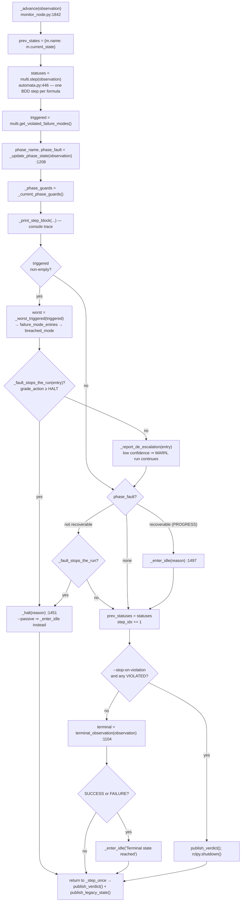

Note `terminal_observation`'s two grace conditions (`:1115`, `:1117`): it returns
`None` while `step_idx < 2`, and while `has_phases and phase_idx < 0`. Both guard the
same class of bug — a terminal condition like `mission_finished` that happens to be
true from the schema *default* on the very first tick, before any real sensor data has
arrived, would otherwise declare the episode over before it began.

---

## 8. State machines — three of them, deliberately separate

Conflating these three is the most common way to misread a verdict, so they are named
and drawn apart.

### 8a. Per-formula automaton status — `MonitorStatus`

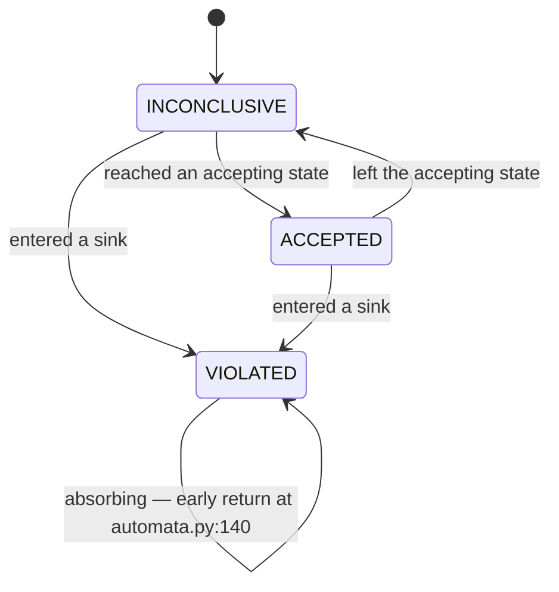

`INCONCLUSIVE` means *"the prefix seen so far neither proves nor refutes the
property"*, and it is the **normal, healthy** state of a running episode. `F(...)`
formulas sit in it for the entire run and only become `ACCEPTED` at the end.
`clocking.md` states the rule flatly: *do not add a member to this enum and do not
rename it*. "Not enough data" is a statement about observation, not about the trace,
and belongs on a different axis.

### 8b. Monitor run state — `api.RUN_STATES`

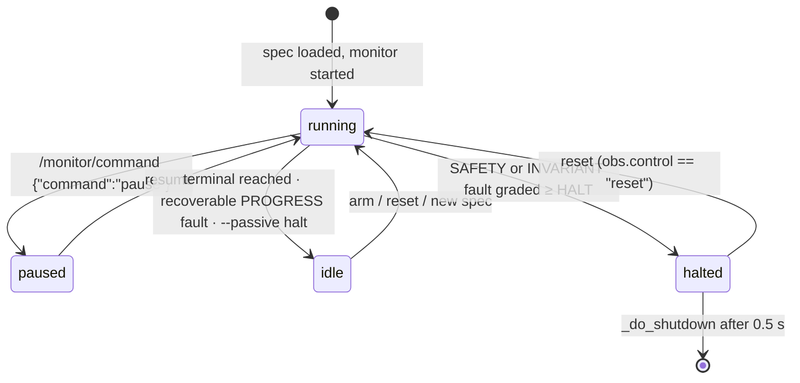

Written by exactly one method, `_set_run_state:880`, and published on the latched
`/monitor/status`. Single-writer is the point: with four states and eight edges spread
across `_halt`, `_enter_idle`, `reload_specs` and `command_callback`, any second writer
would eventually publish a state nobody could explain.

### 8c. Tick admission — `TickLedger`

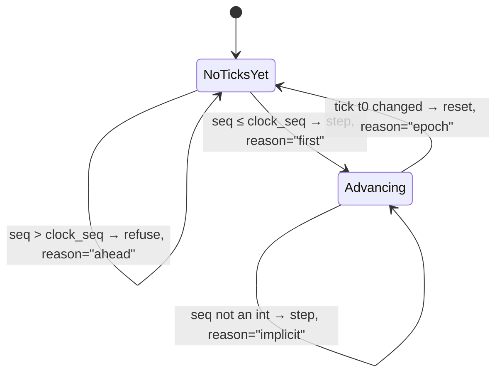

Each refusal reason is a distinct operational story: `redelivered` is a republishing
producer, `stale` is out-of-order transport, `ahead` is a producer whose clock is
running fast relative to ours, `epoch` is a clock that restarted, and `implicit` is a
frame with no sequence at all (the legacy wire), which is admitted because refusing it
would mean refusing every observation from the old producer.

---

## 9. As-built vs as-designed: the honest gap

The sequence in §6 is what runs. This is what is *specified*, and the difference is
three concrete pieces of wiring.

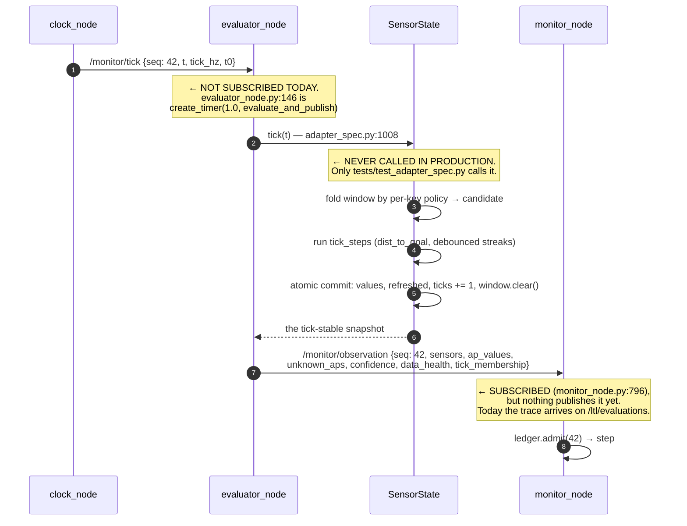

### The three gaps, each with the code that admits it

**1. The evaluator does not consume the tick.** `evaluator_node.py:137–139`:

> *Echoes published since this process started. NOT the clock's `seq`: this node does
> not consume `api.TICK` yet (P3's tick migration is what gives it one), so the envelope
> carries the only sequence it honestly has.*

The only `api.TICK` subscriber in the repo is `monitor_node.py:795`, and its callback
explicitly does not step. So the trace today advances on the **arrival of an
evaluation**, paced by the evaluator's own `create_timer(1.0, …)` (`:146`), which means it is
paced by transport and scheduling rather than by data. That is the precise thing
[clocking.md](clocking.md) exists to forbid.

**2. `SensorState.tick()` is never called.** The module says so at
`adapter_spec.py:944–948`:

> *A caller that never calls `tick()` gets a monitor whose sensor values are the schema
> defaults forever, and it is SILENT … `DeclarativeAdapter` is in exactly that state on
> dev today (P3 is what will call `tick()`), so this is a live regression.*

Consequences, in order of severity: `sensor_eval()` returns `self.values`, which is
only rebound by `tick()`, so it returns **schema defaults** — `min_range = 10.0`,
`nav_state = "waiting_inputs"`. Every AP evaluates against those. `_window` grows
without bound. No tick-step ever runs, so `dist_to_goal` is never computed at all.
`SensorState` tracks this itself via `_untick_budget` and warns, which is how you would
notice.

**3. The observation envelope has no producer.** `api.build_observation:426` and its
validator exist, `monitor_node` subscribes at `:796`, and the only caller in the tree is
`frontend/mock_monitor.py:974`. Until P3 publishes it, the trace rides the legacy flat
dict, which carries no `seq` — so `TickLedger.admit` takes the `implicit` branch and the
missed-tick accounting is structurally unavailable.

### Two more mismatches worth knowing before they cost you an afternoon

**The `/monitor/load_spec` wrapper is not unwrapped.** `gateway.py:1370` wraps a posted
document as `api.build_load_spec(spec=payload)` → `{"schema_version", "spec", "source"}`.
`load_spec_callback` ([monitor_node.py:1054](../skill_monitor/backend/monitor_node.py#L1054))
treats the received payload as the **bare** spec — it reads `data.get("skill_name")` and
passes `data` straight to `validate_spec`, never touching `data["spec"]`. A spec pushed
through the gateway fails `validate_structure` with *"spec declares no atomic
propositions"*. `frontend/skill_center.py:231` publishes the bare document and works.

**Two topic namespaces coexist.** `gateway.py`, `index.html` and `mock_monitor.py`
speak the `/monitor/*` contract from `api.py`. `frontend/skill_center.py` (`:44`,
`:207`) and `backend/intervention_supervisor.py` (`:35`) still speak the pre-migration
`/ltl/*` names. `core/discovery.py:38–41` documents this deliberately: `key_topic` is a
*parameter* rather than a constant precisely because P7 has not moved yet.

**Also: two independent `--mock` implementations, sharing no code.**
`skill_center.py --mock` uses `MockSource` (`:320`), a thread speaking the panel's
internal queue protocol. `web.py --mock` uses `mock_monitor.MockBus` (`:663`), a
`MonitorBus` implementation sitting behind the real gateway. Do not assume a fix to one
affects the other.

---

## 10. A worked tick, with numbers

`tick_hz = 1.0`, so `Δ = 1.0 s`. The robot is mid-navigation in phase
`ExecutionAndTracking`, `step_idx = 36`, `phase_step_count = 37`, and a wall is
approaching.

**During interval 42** — `(41.0, 42.0]` on the robot's wall clock — messages arrive:

| topic | count in the window | keys written | window contents |
|---|---|---|---|
| `/t265/odom/sample` | 10 | `linear_vel`, `angular_vel`, `pos_x/y/z`, `base_roll`, `base_pitch`, `yaw`, `upright_flag` | 10 samples each |
| `/depth_anything/points` | 10 | `min_range` | `[4.1, 3.8, 3.2, 2.6, 2.0, 1.6, 1.3, 0.9, 0.22, 1.1]` |
| `/path_manager/status` | 5 | `nav_mode`, `nav_state`, `mission_finished`, `num_waypoints`, `current_target_idx`, `nav_stuck` | 5 samples each |
| `/next_waypoint` | 1 | `goal_x`, `goal_y` | 1 sample |
| `/vision/goal_similarity` | 1 | `image_similarity_to_goal` | `[0.33]` |

**At `t = 42.0` the boundary closes** and the fold runs (as-designed; see §9):

- `min_range` folds with **`min`** → **0.22**. Note the last sample was 1.1. Under the
  default `last` policy this tick would have reported 1.1 m of clearance and the
  0.22 m frame — the actual wall — would have been discarded. This is the entire
  argument for a declared per-key fold policy in one line of a table.
- `nav_state` folds with `last` → `"following"`. State-like values want the most
  recent, not the extreme.
- `upright_flag` folds with `last` → `1.0`.
- Tick-steps then run against the folded snapshot: `dist_to_goal = planar_distance(pos_x,
  pos_y, goal_x, goal_y)` → `3.4`.
- Atomic commit: `values` rebound, `ticks → 42`, window cleared.

**AP evaluation**, over the required set the monitor asked for:

| AP | rule extracted from its description | value |
|---|---|---|
| `mission_started` | `nav_mode == 'AUTOMATIC' and num_waypoints > 0` | `True` |
| `path_active` | `nav_state in ['following','unblocking','positioning']` | `True` |
| `moving_towards_target` | `nav_state == 'following'` | `True` |
| `collision_risk` | `min_range < 0.25` | **`True`** ← 0.22 |
| `nav_stuck` | `nav_stuck` (debounced streak) | `False` |
| `mission_finished` | `mission_finished` | `False` |
| `upright` | `upright_flag > 0.5` | `True` |
| `visually_at_goal` | `image_similarity_to_goal > 0.75` | `False` (0.33) |

Published with `__confidence__ = 1.0` (all three tracked sources — `odom`, `points`,
`status` — fresh; `goal`, `vision` and `camera` are untracked and never count), `__sensors__`
carrying all 21 values, and no `__stale__` key.

**The monitor steps.** `ledger.admit(42, …)` → `Admission(step=True, seq=42, missed=0,
reason="advanced")`. Then:

- **`full_navigation_sequence`** — `F(mission_started && F(path_active &&
  F(moving_towards_target && F(mission_finished))))` — advances into its third nested
  `F`, still `INCONCLUSIVE`. That is correct and expected: nothing has been proved yet.
- **`collision_imminent`** — `G(!collision_risk)`. With `collision_risk = True`, the
  BDD cube matches the edge into the sink. Status → **`VIOLATED`**, and it is absorbing.
- **`fell_over`** — `G(upright)`. `upright = True`, stays `INCONCLUSIVE`.
- **Phase machine**: precondition `True` passes; invariant `upright and not
  collision_risk` evaluates **`False`** → a fault with category `INVARIANT`,
  `recoverable=False`. Recorded as `_phase_guard_values[(1, "invariant")] = False`.

**Grading.** `_worst_triggered` grades `collision_imminent`:
`fault_category = "SAFETY"`, `confidence = 1.0`, `imminence = 0`. Through
`grade_action`: `sure = 1.0 >= 0.5` ✓, `overdue = 0 <= 0` ✓ → **`ABORT`**.
`fault_stops_the_run` is true, so `_halt("[SAFETY] collision_imminent: …")` runs — and
under `--passive` it would degrade to `_enter_idle` instead, which is how the
detection-only ablation arm records the decision without acting on it.

**The verdict published on `/monitor/verdict`:**

```jsonc
{ "seq": 42, "t": 42.0, "step": 37, "verdict": "VIOLATED",
  "phase": "ExecutionAndTracking", "phase_index": 1,
  "failure_modes": [{"name": "collision_imminent", "fault_category": "SAFETY",
                     "status": "VIOLATED", "confidence": 1.0, "state": "sink"}],
  "intervention": {"action": "ABORT", "category": "SAFETY",
                   "imminence": "now", "confidence": 1.0},
  "risk": {"steps_to_timeout": 83, "seconds_to_timeout": 83.0,
           "violations_to_fault": 5, "warn": false,
           "severity": null, "trigger_confidence": 1.0, "stale_sources": []},
  "phase_guards": {"phase": "ExecutionAndTracking",
                   "guards": [{"name": "invariant",
                               "expr": "upright and not collision_risk", "value": false}]} }
```

**Within 100 ms** the supervisor's `_on_state` sets `halting = True`, and `_enforce`
begins writing zero `Twist` at 10 Hz. **Within 500 ms** the monitor publishes `[]` on
`/ltl/required_aps`, which sets `self.idle = True` in the evaluator and stops its LLM
traffic, then calls `_do_shutdown`.

**The counterfactual worth sitting with.** `real_g1` declares **three** tracked sources
— `odom`, `points`, `status` — so the global confidence scalar moves in thirds. Had
`/depth_anything/points` gone stale, say the camera dropped out at `t = 39`,
`confidence` would have been `1 - 1/3 = 0.667`. That still clears the `0.5` threshold,
`sure` holds, and this tick would still have halted. Lose a **second** tracked source
and confidence falls to `0.333`, `sure` becomes false, and the same `SAFETY` violation
grades to **`WARN`**: reported, logged, not acted on.

So on this robot the safety ladder de-escalates after exactly two dead topics. That is
a consequence of the tracked-source *count*, not a designed threshold — a descriptor
that marked `vision` and `camera` tracked would move the same cliff to four. Two knobs
control it, and neither is a fact about the world: `min_confidence` at
[`monitor_action.py:33`](../skill_monitor/core/monitor_action.py#L33), and which sources
carry `"tracked": true` in the descriptor. Both should be measured against a recorded
bag before they are trusted, exactly like the `min_range < 0.25` threshold they
interact with.

Worth noting what does *not* save you here: `confidence` is the **global** scalar only
when `mode_sources` is absent. When the monitor can compute the per-mode source map
(`expression_source_map ∘ ap_source_map`), `collision_imminent` is scored against
`points` alone — one dead camera takes it straight to `0.0` and the halt de-escalates
on the *first* failure rather than the second. Which of the two paths you are on
depends on whether the adapter manifest reached the monitor, and the verdict records
it: `risk.trigger_confidence` versus the per-mode `confidence` field.

---

## 11. File index — what to open when

### The tick path, in execution order

| # | file | what happens here |
|---|---|---|
| 1 | [`core/clock.py`](../skill_monitor/core/clock.py) | `TickEngine.poll` finds the boundary; `ClockService` decides who may change the rate |
| 2 | [`backend/clock_node.py`](../skill_monitor/backend/clock_node.py) | the socket and the ROS publisher; nothing else |
| 3 | [`backend/adapters/declarative.py`](../skill_monitor/backend/adapters/declarative.py) | ROS msg → decoder → `SensorState.update` |
| 4 | [`core/adapter_spec.py`](../skill_monitor/core/adapter_spec.py) | `Step.apply`, the extractors, the window and its fold |
| 5 | [`backend/adapters/base.py`](../skill_monitor/backend/adapters/base.py) | `Freshness`, the abstract adapter, exact-key-set validation |
| 6 | [`backend/evaluator_node.py`](../skill_monitor/backend/evaluator_node.py) | required APs in, rule-or-LLM evaluation, evaluations out |
| 7 | [`core/spec_contract.py`](../skill_monitor/core/spec_contract.py) | `TRUE_WHEN_RE`, `sensor_keys_in_rule`, `validate` |
| 8 | [`core/manifest.py`](../skill_monitor/core/manifest.py) | `TickLedger`, `normalize_observation`, risk, grading, the verdict assembler |
| 9 | [`backend/monitor_node.py`](../skill_monitor/backend/monitor_node.py) | the node: guards, `_step_once`, `_advance`, the phase machine, publishing |
| 10 | [`core/automata.py`](../skill_monitor/core/automata.py) | Spot translation, the BDD step, sinks, required-AP extraction |
| 11 | [`core/monitor_action.py`](../skill_monitor/core/monitor_action.py) | the ladder: category × imminence × confidence → `Action` |
| 12 | [`core/supervisor_logic.py`](../skill_monitor/core/supervisor_logic.py) | state description → `Intervention` |
| 13 | [`backend/intervention_supervisor.py`](../skill_monitor/backend/intervention_supervisor.py) | zero `Twist` at 10 Hz while halting |

### Everything else

| file | what it is for |
|---|---|
| [`core/api.py`](../skill_monitor/core/api.py) | **the wire contract.** Every builder, every validator, every topic constant, every closed enum |
| [`core/episode_outcome.py`](../skill_monitor/core/episode_outcome.py) | folds a finished episode into `reached_goal` / `nav_failed` / `timeout` / a safety cause |
| [`core/discovery.py`](../skill_monitor/core/discovery.py) | namespace parsing — the presence of `<ns>/monitor/verdict` is what *defines* a monitor |
| [`backend/gateway.py`](../skill_monitor/backend/gateway.py) | REST + WebSocket, the `MonitorBus` seam, back-pressure, the HTTP hardening rules |
| [`frontend/web.py`](../skill_monitor/frontend/web.py) + `index.html` | browser console; page and gateway on one origin |
| [`frontend/skill_center.py`](../skill_monitor/frontend/skill_center.py) | Tk panel, direct DDS, still on the `/ltl/*` names |
| [`frontend/mock_monitor.py`](../skill_monitor/frontend/mock_monitor.py) | `MockBus` — the whole UI with no ROS, and it says so on the wire |
| [`describer/generate_formulas.py`](../skill_monitor/describer/generate_formulas.py) | description + live schema → candidate spec → validate → repair loop |
| [`adapters/*.json`](../skill_monitor/adapters/) | one descriptor per embodiment; `*_schema.json` are the composable fragments |
| [`specs/formulas_g1.json`](../skill_monitor/specs/formulas_g1.json) | one spec per skill: APs, LTL, failure modes, phases, terminals |

### Tests that pin the behaviour in this document

`tests/test_clock.py` (boundaries, modes, rate-change refusal) · `tests/test_adapter_spec.py`
(the **only** caller of `SensorState.tick()`, so the fold semantics live here) ·
`tests/test_spec_contract.py` (rule extraction, including the decimal-point case) ·
`tests/test_monitor_node.py` (admission, dual-wire demotion, phase faults) ·
`tests/test_manifest.py` (`TickLedger`, `normalize_observation`, verdict assembly) ·
`tests/test_monitor_action.py` (the ladder, exhaustively) ·
`tests/test_supervisor_logic.py` (the halt decision) · `tests/test_api.py` (every
builder against every validator).

All of them run with `python3 -m pytest` on a machine with no ROS, no Spot and no
hardware. If a change to this document's subject matter does not break one of those
files, it is worth asking what is actually being tested.
