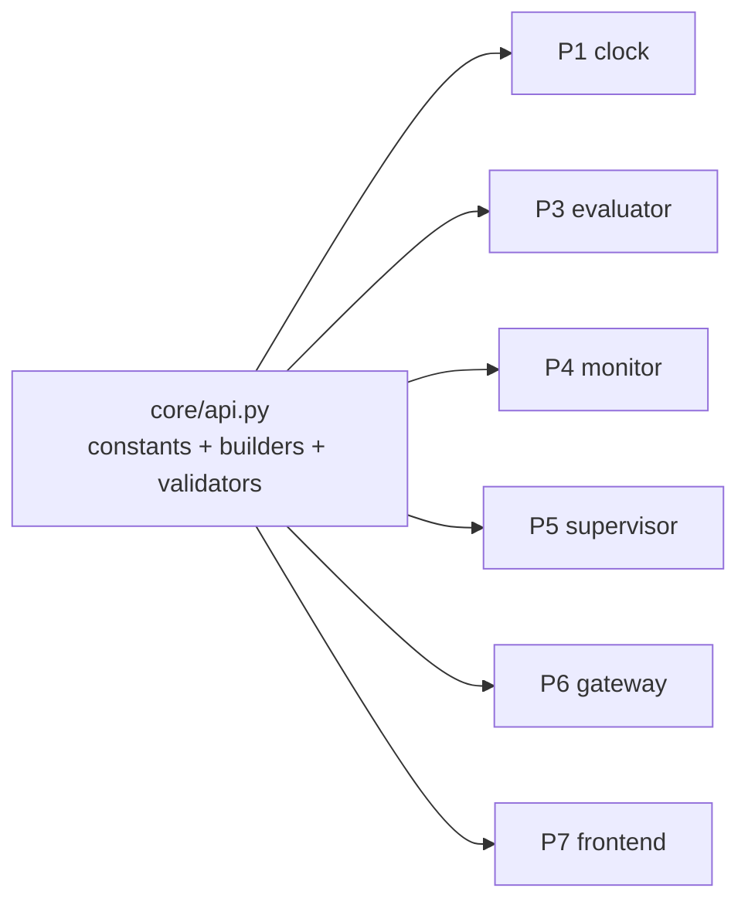

# P0 — wire contract

## Purpose

Declares the API every other service speaks: topic names, the JSON envelope, and a builder
plus validator per payload. It is its own package because it must land **before** the other
nine so they cannot invent divergent topic names or JSON keys — reconciling that afterwards
is a rewrite, not a merge.

## Where it sits

## Services

None. A pure module, no process, no container, no ROS import.

## Inputs

Nothing. No I/O, no clock, no network.

## Outputs

`skill_monitor.core.api`, importable by every package and by any client that never installs
ROS:

- topic name constants — `TICK`, `OBSERVATION`, `VERDICT`, `ADAPTER`, `MANIFEST`, `COMMAND`,
  `LOAD_SPEC`, `SPEC_STATUS`, `RAW_ECHO_REQUEST`, `RAW_ECHO`
- `SCHEMA_VERSION`
- one `build_*` and one `validate_*` per payload in [../api.md](../api.md)
- `LATCHED_TOPICS` — the set that must be published `TRANSIENT_LOCAL`

## Design

**JSON in `std_msgs/String`, not custom `.msg` types.** Custom messages would be typed on
the wire, and would also require a colcon-built interface package inside every image. That
breaks the property that `skill_monitor/core/` is pure Python testable with no ROS — the
property that lets the generator, the contract oracle and every unit test run on a laptop —
and it turns the gateway into a translator with its own bugs instead of a pass-through. JSON
gives one payload shape across ROS, WebSocket and the recorded verdict files. Reasoning in
full: [../api.md](../api.md#why-json-in-std_msgsstring-and-not-custom-msg-types).

**The envelope is `{schema_version, seq, t, step}`.** `seq` is the tick index since the
clock started; `step` is the tick index within the current episode and resets on
`arm`/`reset`. Both travel together so an episode is locatable inside the global stream. A
payload that is not tick-scoped omits `step`.

**Topic names are constants, and that is what makes the rename safe.** No other file in the
repo may contain a `/monitor/...` string literal. The `/ltl/*` → `/monitor/*` migration then
happens because a package imported `api.OBSERVATION`, not as a sweep across nine branches
that one of them forgets. Add a test that greps the tree for stray literals.

**Validators return a list of problems, never raise.** Same shape as
`spec_contract.validate()`, for the same reason: a gateway or a frontend receiving a
malformed frame must be able to report it rather than die on it.

**Builders take keyword arguments and fill the envelope.** A caller cannot forget `seq`
because it is a required parameter, and cannot mistype `schema_version` because it is not a
parameter at all.

**Rejected: a shared base class or dataclasses per payload.** The payloads cross a language
boundary (Python ↔ WebSocket ↔ JSON on disk); dicts validated at the edge travel; class
instances do not.

## Files owned

- `skill_monitor/core/api.py`
- `tests/test_api.py`

## Depends on

Nothing.

## Test plan

- every payload round-trips `build_*` → `validate_*` → `json.dumps` → `json.loads` →
  `validate_*` with an empty problem list
- a payload missing a required field, and one with an unknown field, each produce a named
  problem
- `validate_*` never raises, for any input including `None`, a list, and a string
- the envelope of every builder carries `schema_version` and `seq`
- a repo grep finds no `/monitor/` or `/ltl/` string literal outside `api.py` — this test
  fails for the whole team the moment someone hardcodes a topic
- `LATCHED_TOPICS` ⊆ the declared topic constants

## Done when

Every payload documented in [../api.md](../api.md) has a builder, a validator and a
round-trip test; the stray-literal test passes; and nothing in the module imports `rclpy`.

## Non-goals

Publishing or subscribing anything (P1, P3, P4). Deciding *what* to put in a verdict (P4).
The HTTP surface (P1 serves it, P6 proxies it) — P0 only declares the payloads those
endpoints carry.
