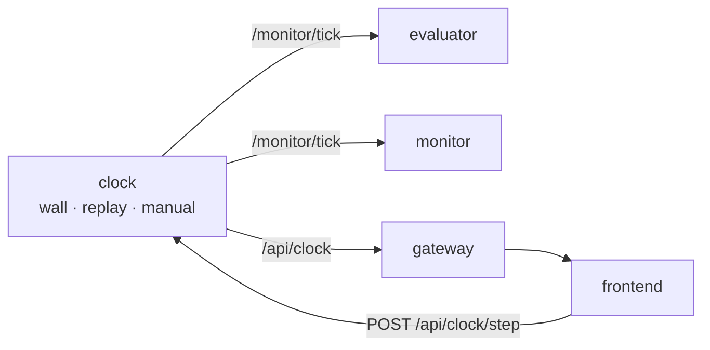

# P1 — clock service

## Purpose

Schedules the entire system. It decides the ticks and pulses every other part into the next
step, so the trace is a property of one declared frequency rather than of whichever timer
happened to fire. It is its own container because both tiers need one, and because a replay
run swaps the clock and nothing else.

## Where it sits

## Services

`clock` — one container per tier. Publishes `/monitor/tick` and serves the HTTP surface on
its own port. **Standalone**: pulses and answers queries with nothing else on the graph;
that is its whole job, so it has no degraded mode.

## Inputs

| input | schema | producer |
|---|---|---|
| `--tick-hz`, `--mode`, `--port` | — | operator / compose |
| `POST /api/clock/{mode,step,rate}` | [api.md § clock API](../api.md#clock-api) | frontend, gateway, a replay driver |

In `replay` mode, an external driver advances the clock instead of wall time.

## Outputs

| output | schema | consumers |
|---|---|---|
| `/monitor/tick` | [api.md § /monitor/tick](../api.md#monitortick--clock--everyone) | evaluator, monitor |
| `GET /api/clock`, `WS /api/clock/stream` | same payload, byte for byte | frontend, gateway, tests |

## Design

**The tick is an interval, and the definition is the contract.** Tick *k* is the half-open
interval `(B_k−1, B_k]` where `B_k = t₀ + k·Δ` and `Δ = 1/tick_hz` **seconds** on the active
clock. Half-open means every instant belongs to exactly one tick — no sample counted twice,
none lost between ticks. A tick is **named by the boundary that closes it**, so `seq=n` on a
pulse, an observation and a verdict all mean the same interval; `seq=0` means no interval
has closed yet and never reaches the wire. Full semantics: [../clocking.md](../clocking.md#the-tick-defined).

**The pulse never waits for data.** It fires on an empty interval, because that is precisely
the tick that must report "not enough data" downstream. There is no watermark and no
adaptive delay; that was considered and dropped.

**Three clock sources, one interface.** `WallClock` (live), `ReplayClock` (advanced by a
driver, so replay speed cannot change the tick count and therefore cannot change the
verdict), `ManualClock` (`POST /api/clock/step` advances the whole system by exactly one
tick — the debugging tool that makes a stuck monitor inspectable). Keep them pure in
`core/clock.py`; `backend/clock_node.py` is the thin ROS wrapper. The existing injectable
test clocks (`Freshness(clock=…)`) follow the same shape.

**`seq` is monotonic over the clock's lifetime and never reused.** Restarting the clock is
observable: `t0` changes. Episode-scoped counting is `step`, and that belongs to the monitor
— the clock knows nothing about episodes.

**No catch-up.** If the process is descheduled and two intervals elapse, emit one pulse and
report the gap; never emit two pulses back-to-back to "catch up", and never widen an
interval. Downstream folds one window per pulse, so a catch-up pulse would silently merge
two windows.

**`GET /api/clock` is a sample, not a stream.** It is up to Δ stale by construction and
polling it will miss ticks. Document it on the endpoint itself, not just here — someone will
try to drive a loop from it.

**`POST /api/clock/rate` is refused while any monitor is armed.** `max_steps` is
tick-denominated until P11, so a 120-tick phase budget is 2 minutes at 1 Hz and 24 seconds
at 5 Hz. Changing the rate mid-episode silently redefines every timeout in the spec.
Accepted changes are recorded in the pulse so a recording cannot be misread.

**`tick_hz` ships as 1.0 and stays there** until P11 converts spec bounds to seconds.

## Files owned

- `skill_monitor/core/clock.py` — pure `WallClock` / `ReplayClock` / `ManualClock`
- `skill_monitor/backend/clock_node.py` — ROS wrapper + HTTP surface
- `deploy/Dockerfile.clock`
- `tests/test_clock.py`

## Depends on

P0 — `api.build_tick()`, `api.TICK`.

## Test plan

All against injected clocks; no sleeping, no sockets.

- `test_tick_count_depends_only_on_elapsed_clock_time` — advance an injected clock by 10 s
  at 2 Hz → exactly 20 pulses, regardless of how many times the loop ran
- `test_replay_speed_does_not_change_tick_count` — the same episode driven at 1× and 10×
  produces identical `seq` sequences
- `test_manual_mode_advances_exactly_one_tick_per_step`
- `test_pulse_fires_on_an_empty_interval` — no data at all, still a pulse
- `test_no_catch_up_after_a_stall` — a 3Δ gap yields one pulse and a reported gap, not three
- `test_seq_is_monotonic_and_never_reused`
- `test_rate_change_refused_while_armed` and `test_accepted_rate_change_is_recorded`
- `test_api_payload_is_identical_to_topic_payload`

## Done when

The four invariants hold under test — tick count depends only on elapsed clock time; replay
speed does not change it; a pulse fires on an empty interval; a stall produces a gap and not
a burst — and `POST /api/clock/rate` is refused while a monitor is armed.

## Non-goals

Folding observations (P2), deciding what a tick *means* to a monitor (P4), the free-running
fallback when no clock is present — that belongs to each consumer (P3, P4), because only the
consumer knows it has stopped hearing pulses.
