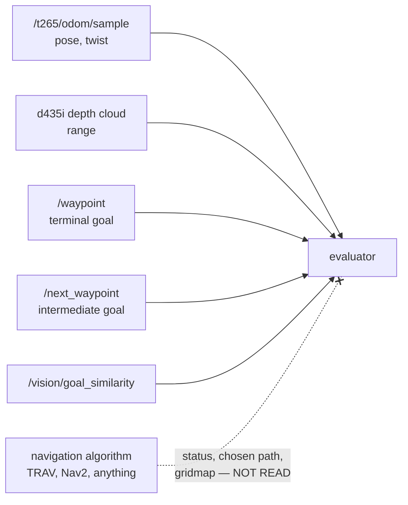

# P12 — planner-independent schema

## Purpose

Remove the monitor's dependency on the navigation algorithm entirely. It observes the
robot's own sensors and the waypoints the robot was commanded to reach — nothing the
planner says about itself. Six of the current fourteen schema keys come from
`/path_manager/status`, which is the planner's self-report, so the schema is redesigned
rather than patched.

This is the strongest form of the agnosticism claim. TRAV replaced Nav2 and the monitor
should not have noticed; today it would have broken, because it was reading Nav2's
`GoalStatusArray` in sim and TRAV's status JSON on the robot.

## Where it sits

## Services

None of its own. It redefines the data the evaluator (P3) subscribes to.

## Inputs

**Allowed** — the robot, and the goals it was given:

| topic | type | keys |
|---|---|---|
| `/t265/odom/sample` | `nav_msgs/Odometry` | pose, orientation, twist. The T265 is still fitted; cuVSLAM VO can republish onto the same topic |
| D435i depth cloud | `sensor_msgs/PointCloud2` | `min_range`. **Topic name must be confirmed on the robot** — likely `/camera/camera/depth/color/points`; it is one line in the descriptor |
| `/waypoint` | `geometry_msgs/PointStamped` | the terminal goal |
| `/next_waypoint` | `geometry_msgs/PointStamped` | the current intermediate target on the way to it |
| `/vision/goal_similarity` | `std_msgs/Float32` | monitor-side CLIP score, not planner output |

`/next_waypoint` is admitted despite being *derived* from the planner's chosen path
(`simple_path_manager_realtime.py:603` publishes it as a lookahead point on
`traversable_path`). It is admitted as a **goal at a shorter horizon**, not as a report on
the planner's health: it says where the robot is being sent, never whether the planner
thinks it is succeeding. That is a judgement call rather than a bright line, and it is
recorded here because the next person adding a topic will apply the stated rule and needs
to know which side of it this one sits on.

**Forbidden** — the planner talking about itself:

| topic | why |
|---|---|
| `/path_manager/status` | the planner's own state machine: `following`, `no_traversable`, `no_path_found`, `finished`. This is the log |
| `/traversable_path*` | the planner's chosen path — its plan, not the robot's state |
| `/filtered_map`, `traversability_projected` | the traversability surface the planner acts on. Agreeing with it would blind the monitor to exactly the errors the planner makes |
| Nav2 `GoalStatusArray` | the same thing for the stack that was replaced |

## Outputs

A new `nav_schema.json` and a rewritten `real_g1.json`:

| key | from | notes |
|---|---|---|
| `pos_x`, `pos_y` | odom | needed for every distance below |
| `base_roll`, `base_pitch`, `base_height`, `upright_flag` | odom | unchanged |
| `linear_vel`, `angular_vel` | odom | unchanged |
| `min_range` | D435i depth | native stereo depth now, not monocular `/depth_anything/points` |
| `has_goal` | `/waypoint` | a terminal goal has been commanded |
| `goal_x`, `goal_y` | `/waypoint` | terminal |
| `next_x`, `next_y` | `/next_waypoint` | intermediate |
| `distance_to_goal` | derived | `hypot(goal − pos)` |
| `distance_to_next` | derived | `hypot(next − pos)` |
| `closing_speed` | derived, tick-step | rate of decrease of `distance_to_goal`, per tick |
| `no_progress` | derived, tick-step | `closing_speed` below `eps` continuously for `debounce_s`, while `has_goal` |
| `goal_reached` | derived | `distance_to_goal < arrival_radius` |
| `image_similarity_to_goal` | vision | unchanged |

Gone: `nav_state`, `nav_mode`, `nav_stuck`, `mission_finished`, `num_waypoints`,
`current_target_idx`.

## Design

**`no_progress` replaces `nav_stuck`, and it is a better signal.** The old one asked the
planner whether it was stuck. A planner that reports `following` while physically wedged
was invisible — structurally, not by accident. Deriving progress from odometry against
the commanded goal catches it, and cannot be lied to.

**What is lost, stated plainly.** The planner used to name its own failure:
`no_traversable` versus `no_path_found` versus `unreachable`. The monitor now sees only
"not closing on the goal" and cannot distinguish "no path exists" from "planner crashed"
from "robot physically blocked". That is a real loss of diagnostic granularity, traded for
independence. If a run needs the distinction it belongs in the episode log alongside the
verdict, not inside the monitor.

**All three derived keys are tick-steps** — they need P2's `on: "tick"` machinery and its
`debounce_s`, which ship with no shipped descriptor using them. This package is the first
consumer. New pure extractors in `core/adapter_spec.py`: `distance_2d`,
`rate_of_decrease` (stateful across ticks, so Δ comes from `tick_hz`), and a threshold
debounce that generalises `StuckStreak`.

**Four uncalibrated knobs**, and the doc says so rather than pretending otherwise:
`arrival_radius`, `closing_speed` epsilon, `no_progress` `debounce_s`, and the
`min_range` height band. Every one needs measuring on a recorded run before it is trusted.
Native stereo depth has different failure modes from monocular metric depth — dropouts
read as holes rather than as confidently wrong distances — so the `min` aggregation
decided in P2 should be re-checked against a real bag.

**The spec is regenerated, not hand-edited.** `formulas_g1.json` references
`nav_state`, `nav_stuck`, `mission_finished` and `num_waypoints` throughout; its APs,
phases and terminal conditions all break. Feed the new schema and a free-language
description through `describer.generate()` — generate → validate → repair — which is the
thesis claim exercised on a real schema change rather than a demo. Keep the current spec
as the evaluation reference; a hand-authored replacement would undercut the claim.

**The sim descriptors are not this package's problem.** With a planner-independent schema
a sim descriptor is the same schema over different topic names, whatever plans inside it.
`mujoco.json` and `isaac_lab.json` stay frozen until someone decides what sim runs;
`core/nav2_status_map.py` and the `goal_status` decoder become removable the moment no
descriptor references them.

## Files owned

- `skill_monitor/adapters/nav_schema.json`, `skill_monitor/adapters/real_g1.json`
- `skill_monitor/core/adapter_spec.py` — the three new extractors only
- `skill_monitor/specs/formulas_<skill>.json` — the regenerated spec
- `tests/test_planner_independence.py` (new)

## Depends on

**P2 must merge first** — this package is the first consumer of its tick-steps,
`debounce_s` and aggregation, and it edits the same file, so it cannot run concurrently.
Also P3, whose evaluator subscribes to the new topics.

## Test plan

- `test_no_forbidden_topic_in_any_descriptor` — the guard that keeps this true: no shipped
  descriptor may reference `/path_manager/status`, `/traversable_path`, `/filtered_map` or
  a Nav2 action status topic. This is the package's whole point, expressed as a test
- `test_no_progress_fires_when_the_robot_stops_closing` — goal fixed, position static for
  the debounce window while `has_goal` → true
- `test_no_progress_does_not_fire_while_closing` — even slowly
- `test_no_progress_clears_on_resumed_progress`
- `test_no_progress_ignores_motion_that_is_not_toward_the_goal` — circling at constant
  distance is not progress
- `test_goal_reached_at_the_arrival_radius`
- `test_distance_keys_are_none_until_a_goal_arrives` — no goal is not distance zero.
  `null` is a legal sensor value on the wire (`api.validate_observation` accepts it), and
  the distinction that matters is "present but unknown" versus "absent": every schema key is
  always present, and `null` is how it says it has nothing to report. A key that is *absent*
  is a contract violation
- `test_regenerated_spec_validates_against_the_new_schema` — `spec_contract.validate()`
  clean against the new keys
- schema parity across shipped descriptors still holds

## Done when

No shipped descriptor references a planner topic; `no_progress` is derived from odometry
and the commanded goal; the regenerated spec validates against the new schema; and the
forbidden-topic test would fail if anyone reintroduced the dependency.

## Non-goals

Deciding what runs in simulation. Deleting `nav2_status_map.py` — it goes when the last
descriptor referencing it goes. Calibrating the four thresholds; that needs a robot and a
recorded run, and the knobs exist precisely so it can be done without a code change.
