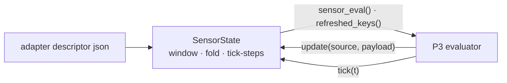

# P2 — observation window, fold, and data health

## Purpose

Turns event-driven arrivals at many different rates into exactly one observation per tick.
Messages accumulate in a window; the tick folds them by a declared per-key policy. This is
the package that fixes the two live bugs — `nav_stuck` counting messages instead of ticks,
and `min_range` losing a transient obstacle — and it is pure, so all of it is testable with
plain objects and no ROS.

## Where it sits

## Services

None — a pure library inside `core/`, loaded by the evaluator container.

## Inputs

| input | schema | producer |
|---|---|---|
| adapter descriptors | [api.md § /monitor/adapter](../api.md#monitoradapter-latched--evaluator--everyone) describes the *published* form | integrator, on the `/config` volume |
| `SensorState.update(source_id, payload)` | already-decoded payload | P3 |
| `SensorState.tick(t)` | — | P3, once per pulse |

## Outputs

| output | consumers |
|---|---|
| `SensorState.sensor_eval()` — the folded observation, a **pure read** | P3 |
| `SensorState.refreshed_keys()` — keys that got a real sample in the tick just closed | P3, and P10 later |
| `AdapterSpec.manifest()` — schema, per-source health, **resolved** thresholds | P3 publishes it |
| `AdapterSpec.tick_hz`, `aggregate_by_key()`, `tick_steps()`, `warnings()` | P3 |

## Design

**Only `tick()` writes held values.** `update()` appends to a per-tick window;
`sensor_eval()` is a pure read that can be called any number of times between ticks. Today
`update()` writes `self.values` directly
([adapter_spec.py:301](../../skill_monitor/core/adapter_spec.py#L301)) and `describe()` reads
those values, so making the getter fold-and-clear would put correctness at the mercy of dict
literal evaluation order in the evaluator. It also could not express "the tick happened but
nobody asked for the observation" — which is required, because the window must be closed on
every pulse whether or not anyone is listening.

**The fold is built fully, then committed atomically.** A bad aggregator (a `min` over mixed
types) must not leave half the observation updated. Order inside `tick()`: fold → capture
`refreshed_keys()` → commit → clear the window → run tick-steps → freeze. The window is
cleared *before* tick-steps so a tick-step's output goes straight to the held values and is
never itself windowed.

**Within-message chaining must survive.** A scratch layer (`ChainMap(scratch, values)`)
means later steps in one message still see earlier steps' output — `upright_flag` must be
computed from *this* message's roll/pitch/height, not from last tick's held values.

**Tick-steps read *this* tick's folded value.** That is the difference between "blocked for
10 s" and "blocked for 10 s, reported one tick late", and it is the most likely thing to be
silently wrong. Pin it with a test.

**`aggregate` vocabulary, default `last`.** `last | first | min | max | mean | any | all`.
The default reproduces today's behaviour byte for byte, so a descriptor that declares
nothing behaves exactly as before.

**`min` on `min_range` is the chosen policy, and it has a cost.** It stops a transient
obstacle being missed; it also means one spurious near-pixel per second in a
monocular-depth cloud can trip `collision_risk` → SAFETY → HALT, and a spurious low sample
latched just before the topic dies pins `collision_risk` true until it returns. The
mitigations ship elsewhere (P4 puts `confidence` on failure modes; per-source ages make the
dead topic visible) and the residual closes with P10. **`min_range < 0.25` is a calibration
knob — measure the depth noise floor on a recorded bag before trusting it.** Full reasoning:
[../clocking.md](../clocking.md#why-min-on-min_range-and-what-it-costs).

**A key with no sample this tick holds its previous value.** Zero-order hold is preserved;
`refreshed_keys()` is what says the number is stale rather than steady.

**`debounce_s` resolves to ticks at load**, `threshold = max(1, ceil(debounce_s · tick_hz))`,
and the resolved integer is published in `manifest()`. The number then exists in exactly one
place and can be read off the wire — which is why the "10+ consecutive ticks" prose comes
out of `formulas_g1.json`.

**A lock guards the two phases.** Uncontended under the default single-threaded executor,
load-bearing the moment anyone uses a callback group, a `MultiThreadedExecutor`, or the
server tier's network thread. Add it now with the comment explaining why.

**Validation, because a silent descriptor typo is a monitor reporting plausible nonsense.**
Unknown aggregate · `quantile` without `q` · a numeric aggregate on a `str`/`bool`-defaulted
key · two sources folding one key with different policies · a tick-step without `inputs` or
with a `field` · `debounce_s` outside `on: "tick"` · `threshold` and `debounce_s` together ·
non-positive `tick_hz`/`expected_hz`/`max_age_s` · cross-source `inputs` · **and unknown keys
on a step or a source**, which is the highest-value rule of the set: today `{"agregate":
"min"}` is silently ignored.

## Files owned

- `skill_monitor/core/adapter_spec.py`
- `skill_monitor/core/stuck_detector.py` — add `threshold_from_seconds(debounce_s, tick_hz)`
- `skill_monitor/adapters/*.json`
- `tests/test_adapter_spec.py`, `tests/test_stuck_detector.py`

## Depends on

P0.

## Test plan

Six of the twelve existing tests in `tests/test_adapter_spec.py` break by design — they
encode the semantics being changed, so rewriting them *is* the specification.

- **`test_transient_obstacle_within_one_tick_is_not_lost`** — three cloud messages in one
  tick (5.0, 0.2, 5.0) → `min_range == 0.2`, asserted **through the AP** by evaluating
  `spec_contract.rule_of(spec["atomic_propositions"]["collision_risk"])`, so the test cannot
  drift from `formulas_g1.json`
- `test_window_is_cleared_between_ticks` — the next tick with only far points returns 5.0
- `test_ticking_while_idle_does_not_accumulate` — 200 update+tick cycles leave an empty
  window
- `test_a_tick_with_no_data_still_ticks` — index advances, values hold, nothing refreshed
- `test_a_key_with_no_sample_holds_its_last_value`
- `test_sensor_eval_is_a_pure_read` — three calls between ticks are identical and do not
  consume the window
- `test_default_aggregate_is_last_and_matches_todays_behaviour`
- **`test_stuck_debounce_counts_ticks_not_messages`** — 30 blocked messages inside one tick
  → not stuck; then one message per tick → fires on the 10th
- **`test_stuck_debounce_is_expressed_in_seconds`** — `tick_hz: 5.0`, `debounce_s: 10.0` →
  resolved threshold 50, readable off `manifest()`, fires on tick 50
- `test_debounce_rounds_up_and_floors_at_one_tick`
- `test_tick_steps_see_this_ticks_folded_value`
- `test_within_message_chaining_survives_windowing` — one odom message with `z=0.2` →
  `upright_flag == 0.0`, which would be 1.0 if `upright` read last tick's height
- `test_streak_advances_on_a_tick_with_no_status_message`, asserting `nav_state` is absent
  from `refreshed_keys()`
- the validation rules, one test each, each asserting the message names the offender
- `test_every_shipped_descriptor_declares_tick_hz_and_per_source_health`

## Done when

The two live bugs are dead under test — the transient obstacle survives the fold, and the
debounce fires on the 10th tick rather than the 10th message — and no window survives an
idle period, `sensor_eval()` has no side effects, and a descriptor typo raises at load.

## Non-goals

Subscribing to anything or calling `tick()` (P3). Publishing the manifest (P3). Deciding
what UNKNOWN means for the automaton (P10) — `refreshed_keys()` is the seam that package
will use, and it is three lines, so it goes in now rather than forcing a re-cut.
