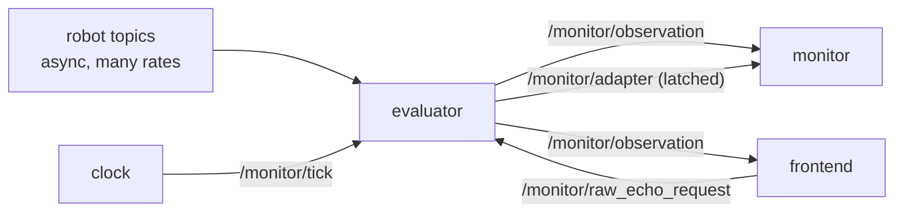

# P3 — evaluator

## Purpose

The only service that knows an embodiment exists. It subscribes the robot's native topics
event-driven, advances on the clock's pulse, and publishes what the monitor consumed. Every
embodiment-specific fact stops here, which is what makes the monitor hardware-agnostic
rather than merely claiming to be.

## Where it sits



## Services

`evaluator` — robot tier, one per embodiment. **Standalone**: with no clock on the graph it
free-runs at its own `tick_hz` and marks every observation `clock: internal`; with no
monitor it still publishes; with no LLM reachable it evaluates rule-based APs and reports
the LLM ones as unknown.

## Inputs

| input | schema | producer |
|---|---|---|
| robot sensor topics | native ROS types, declared per source in the descriptor | the robot, or sim, or a bag player |
| `/monitor/tick` | [api.md](../api.md#monitortick--clock--everyone) | P1 |
| `/monitor/raw_echo_request` | [api.md](../api.md#monitorraw_echo_request--monitorraw_echo) | P7 |
| `--adapter`, `--tick-hz`, `--stale-after`, `--api-url`, `--model` | — | compose |
| adapter descriptor | `/config/adapters/<name>.json` | P8 resolves the path |

## Outputs

| output | schema | consumers |
|---|---|---|
| `/monitor/observation` | [api.md](../api.md#monitorobservation--evaluator--monitor-frontend) | P4, P7 |
| `/monitor/adapter` *(latched)* | [api.md](../api.md#monitoradapter-latched--evaluator--everyone) | P4 (spec validation), P7 (sensor table) |
| `/monitor/raw_echo` | [api.md](../api.md#monitorraw_echo_request--monitorraw_echo) | P7 |

## Design

**Ingestion is event-driven; emission is tick-driven.** No source is polled. A subscription
callback decodes and hands the payload to `SensorState.update()`; nothing else. The pulse
calls `SensorState.tick()` and publishes.

**`adapter.tick()` must run above the idle early-return.** `evaluate_and_publish` returns
early when idle ([evaluator_node.py:215](../../skill_monitor/backend/evaluator_node.py#L215)).
If the only thing that closes the window is the publishing path, the window grows across
every idle period — between skills, after a halt, before the first `required_aps` — and the
first tick after resume folds `min` over minutes of history. An obstacle the robot walked
past two minutes ago would fire `collision_risk` on the resume tick. Close the window on
every pulse, publish only when active.

**Free-running fallback, and it must be visible.** No pulse for N periods → fall back to an
internal timer and set `clock: internal` on every observation. "The clock schedules
everything" and "each part runs standalone" are both true; which one produced a recording
must never be a guess.

**The LLM queue is bounded and drops oldest, with the count published.** It is
`queue.Queue()` with no `maxsize` today
([evaluator_node.py:85](../../skill_monitor/backend/evaluator_node.py#L85)), drained only on
three edge transitions, so a slow model silently publishes observations sampled minutes ago
while the log shows a growing depth. Bounded + drop-oldest + `data_health[*].dropped` makes
load shedding an observation rather than a mystery.

**Freshness becomes per-source.** `max_age_s` from the descriptor replaces the single global
2.0 s ([base.py:52](../../skill_monitor/backend/adapters/base.py#L52)), which cannot express
that a 30 Hz cloud and a 5 Hz status topic have different notions of late. Publish per-source
ages in `data_health` — the server tier is blind without them, since its own receipt clock
says "fresh" as long as the stream flows even if the robot's sensor died ten seconds ago.

**Delete the four hand-written adapters.** `backend/adapters/{real_g1,nav2_common,mujoco,
isaac_lab}.py` keep per-message debounce and would silently produce non-comparable numbers
next to the declarative path. Remove them and their `ADAPTERS` entries; the JSON descriptors
cover all three embodiments and are tested.

**`SCHEMA` stays an instance attribute on the declarative adapter**, not a class attribute —
the schema belongs to the loaded descriptor, not to the class.

## Files owned

- `skill_monitor/backend/adapters/base.py` — add `SensorAdapter.tick()` (no-op default),
  per-source `Freshness`, `ages()`
- `skill_monitor/backend/adapters/declarative.py`
- `skill_monitor/backend/evaluator_node.py`
- deletes `skill_monitor/backend/adapters/{real_g1,nav2_common,mujoco,isaac_lab,vision_mixin}.py`

## Depends on

P0 (`api.build_observation`, topic constants) and P2 — code against exactly:

```python
SensorState.update(source_id: str, payload) -> dict
SensorState.tick(t: float | None = None) -> dict
SensorState.sensor_eval() -> dict          # pure read
SensorState.refreshed_keys() -> frozenset
```

## Test plan

No ROS in tests: drive `DeclarativeAdapter` with a fake node that records subscriptions, and
call the tick path directly.

- `test_tick_closes_the_window_while_idle` — the regression test for the idle-accumulation
  bug: 200 idle pulses, then activity, and the first active observation reflects only the
  last window
- `test_free_running_fallback_marks_the_stream_internal`
- `test_external_pulse_wins_over_the_internal_timer`
- `test_llm_queue_drops_oldest_and_reports_the_count`
- `test_observation_carries_every_schema_key_before_any_message`
- `test_data_health_reports_per_source_age_and_rate`
- `test_adapter_manifest_is_published_latched_at_startup`
- `test_raw_echo_is_off_by_default_and_one_source_at_a_time`
- `test_unknown_adapter_name_lists_available_descriptors`

## Done when

`adapter.tick()` runs on every pulse regardless of idle state; the observation carries
`clock`, `data_health` and `dropped`; the LLM queue is bounded; and the four hand-written
adapters are gone with `--adapter real_g1` resolving to the descriptor.

## Non-goals

The fold itself (P2). Stepping an automaton or producing a verdict (P4). Serving HTTP (P1,
P6). Deciding UNKNOWN semantics (P10) — publish `unknown_aps` as an empty list for now, so
the field exists in the contract from day one.
