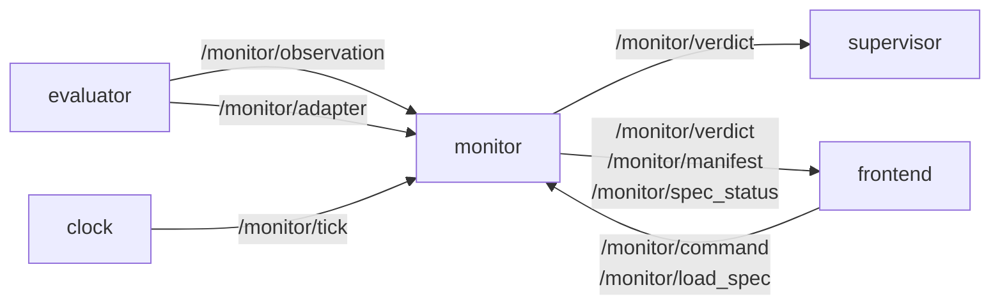

# P4 — monitor and verdict

## Purpose

Steps the Büchi automata and the phase machine exactly once per tick and publishes the
verdict together with the intervention token. It is the tier-1 safety monitor on the robot
and the tier-2 verdict-of-record on the server — the same image in both places, differing
only in which spec it was given.

## Where it sits

## Services

`monitor` — robot tier (safety ladder) and server tier (verdict of record). **Standalone**:
idles with no evaluator, publishes its manifest so a panel can still find and describe it,
and accepts a pushed spec.

## Inputs

| input | schema | producer |
|---|---|---|
| `/monitor/observation` | [api.md](../api.md#monitorobservation--evaluator--monitor-frontend) | P3 |
| `/monitor/tick` | [api.md](../api.md#monitortick--clock--everyone) | P1 |
| `/monitor/adapter` *(latched)* | [api.md](../api.md#monitoradapter-latched--evaluator--everyone) | P3 — used to validate a pushed spec |
| `/monitor/command` | [api.md](../api.md#monitorcommand--frontend--monitor) | P7 |
| `/monitor/load_spec` | a whole spec | P7, P8's describer |
| spec file | `/config/specs/formulas_<skill>.json` | P8 resolves the path |

## Outputs

| output | schema | consumers |
|---|---|---|
| `/monitor/verdict` | [api.md](../api.md#monitorverdict--monitor--supervisor-frontend) | P5, P7 |
| `/monitor/manifest` *(latched)* | [api.md](../api.md#monitormanifest-latched--monitor--everyone) | P7, any client |
| `/monitor/spec_status` *(latched)* | `{ok, problems[], skill_name}` | P7 |

## Design

**Exactly one automaton step per tick.** Today the step is driven by message arrival
([monitor_node.py:1079](../../skill_monitor/backend/monitor_node.py#L1079)), and the
evaluator publishes from a worker thread behind an unbounded queue — so under LLM backlog
the monitor evaluates tick N's automaton against tick N−k's observation with nothing to
indicate it, and every `max_steps` bound stretches silently. The received `seq` becomes
authoritative: one step per `seq`, gaps recorded in `missed_ticks`, never interpolated and
never merged.

**Idempotent per-tick processing.** A redelivered `seq` must not advance a debounce or a
phase counter twice. Track the last processed `seq` and ignore a repeat.

**The intervention token moves here.** `grade_action` decides the rung
(`CONTINUE < WARN < SLOW < REPLAN < HALT < ABORT`) and it ships inside the verdict. Today
the *enforcing* node re-derives it from the state
([intervention_supervisor.py:35](../../skill_monitor/backend/intervention_supervisor.py#L35)),
which puts the decision in the actuator and makes it unlogged.

**Every failure-mode entry carries `confidence` — this closes a live bug.**
`supervisor_logic`'s VIOLATED branch reads `violated.get("confidence", 1.0)`, but the
entries are built without that key
([monitor_node.py:1259](../../skill_monitor/backend/monitor_node.py#L1259)). A
`collision_imminent` or `fell_over` derived from a dead sensor therefore grades at 1.0 and
goes straight to `ABORT` with no de-escalation — and P2's `min` aggregation makes that path
easier to reach.

**`seconds_to_timeout` ships beside `steps_to_timeout`, never replacing it.** Spec bounds
stay tick-denominated until P11, and a consumer asserting on the existing field must keep
working.

**`MonitorStatus` is not extended.** Its `INCONCLUSIVE` means "the prefix neither proves nor
refutes" ([automata.py:53](../../skill_monitor/core/automata.py#L53)) — the normal state of a
healthy run, a different axis from "not enough data". The verdict carries both: per-formula
`status` from the enum, and a top-level `verdict` that can be `INCONCLUSIVE_NO_DATA`.

**A pushed spec is validated before adoption, and the schema comes off the wire.** With no
adapter announced, only the structural half can be checked — an unknown sensor field and an
unseen one are indistinguishable then, and refusing every spec until an adapter appears
would break offline replay.

**The spec is republished as authored.** `manifest()` passes the document through unaltered,
including fields this engine version does not understand.

## Files owned

- `skill_monitor/backend/monitor_node.py`
- `skill_monitor/core/manifest.py`
- `tests/test_manifest.py`
- `skill_monitor/backend/ablation_runner.py` — its topic names move with the rename

## Depends on

P0. Consumes P3's observation shape and P1's pulse, both defined in `api.py`, so it can be
written before either lands.

## Test plan

`monitor_node` needs `rclpy`, so the testable logic goes through `core/manifest.py` and pure
helpers; the node keeps a thin wrapper.

- `test_one_step_per_seq` — a repeated `seq` does not advance the automaton
- `test_missed_ticks_are_recorded_not_interpolated`
- `test_verdict_carries_confidence_on_every_failure_mode`
- `test_low_confidence_safety_violation_grades_below_abort`
- `test_seconds_to_timeout_accompanies_steps_to_timeout`
- `test_manifest_passes_the_spec_through_unchanged` *(exists — keep)*
- `test_pushed_spec_rejected_for_fields_the_robot_lacks` *(exists — keep)*
- `test_structure_check_runs_without_an_adapter` *(exists — keep)*
- `test_verdict_validates_against_api_schema`

## Done when

The tick index is authoritative and gaps are visible; a redelivered tick changes nothing;
every failure mode carries a confidence; and the intervention token appears in the verdict
so the supervisor has nothing left to decide.

## Non-goals

Enforcing the token (P5). Folding observations (P2). Three-valued AP handling (P10) — accept
`unknown_aps` from the observation and log it for now, without changing the step.
