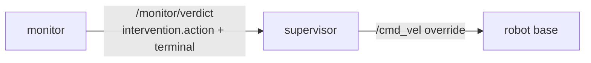

# P5 — supervisor

## Purpose

Enforces what the monitor decided. It stops deciding and starts obeying: after this
package the ladder is graded in exactly one place, and the node that actuates the robot
contains no policy.

Two things it obeys, not one — **the intervention token, and the end of the episode.**
See [the stop rule](#the-stop-rule).

## Where it sits



## Services

`supervisor` — robot tier only. **Standalone**: subscribes and enforces nothing until
`enabled` is true, which is also the ablation's detection-only arm.

## Inputs

| input | schema | producer |
|---|---|---|
| `/monitor/verdict` | [api.md](../api.md#monitorverdict--monitor--supervisor-frontend) — reads `intervention.action` **and `terminal`** | P4 |
| `enabled`, `rate_hz` params | — | compose |

## Outputs

| output | consumers |
|---|---|
| `/cmd_vel` zero-velocity override while `enabled` and (`action >= HALT` **or** `terminal != null`) | the robot base, overriding the planner |

## The stop rule

> **The supervisor stops actuating when `intervention.action` reaches `HALT`, or when the
> episode has ended.** Either leg alone is sufficient. `enabled` gates both.

```
override_active  ==  enabled and (intervention.action >= HALT or terminal is not None)
```

`override_active`, not `stop_actuating`: with `enabled=false` the flag is false while
nothing whatsoever is stopping the robot, so a name that reads "the robot is stopped"
would be a lie in exactly the ablation arm this package exists to support. The flag says
*this node is publishing the zero-velocity override*, and nothing more.

`terminal` is the episode-end signal defined in
[api.md](../api.md#terminal--the-episode-end-signal): `null` while the episode runs, one
of `SUCCESS` / `FAILURE` / `ABORTED` on the last verdict of the episode. The supervisor
reads **only null vs non-null**; which of the three it is changes nothing about what it
does, and a fourth non-null value added later needs no change here.

Once a non-null `terminal` has been seen, the override latches. It is released only by a
verdict for a **new** episode — one carrying `terminal: null`. Today nothing publishes
such a verdict on `arm`/`reset`: `_reset_for_new_skill` clears `_terminal` and then
publishes only the legacy state, which is [follow-up 5](#the-follow-up-p4-owes). Until
that lands, the release edge the rule depends on does not exist on the wire.

The obvious alternative — release the override on the next `action: CONTINUE` — is broken,
and it is worth saying exactly how, because it looks reasonable. `intervention.action` is
a statement about *one tick's rung*, not about the episode, and the two are independent by
design. Measured: on a spec whose `terminal_success.condition` becomes true with no fault
breached, the closing verdict carries `terminal: "SUCCESS"` **and**
`intervention.action: "CONTINUE"` on the same frame. A supervisor releasing on `CONTINUE`
would therefore release on the very frame that ended the episode and never latch at all;
and once the topic is durable that frame is also the one retained, so every late joiner is
handed the same `CONTINUE` and starts driving a robot whose monitor has stopped stepping.
That is the hole this package was opened to close, arriving through the mechanism added to
close it. Only `terminal: null` positively asserts "a new episode is running", so only
`terminal: null` may release the latch.

### Why it was decided this way

The monitor's internal halt and the token it publishes are two decisions about the same
tick, and they had drifted apart. PR #4 fixed half of it: a safety fault de-escalated by
low sensor confidence no longer halts the monitor while publishing WARN. Measured on
`dev` with PR #4 merged, this is what remains:

| case | published token | monitor halts |
|---|---|---|
| SAFETY, fresh sensors | `ABORT` | yes |
| SAFETY, dead camera | `WARN` | no |
| TIMEOUT | `REPLAN` | **yes** |
| PROGRESS | `REPLAN` | **yes** |

The two bold rows are the disagreements: the token says "get a new plan and keep going"
while the process that would have watched the new plan is shutting down. So after a phase
timeout the monitor stops monitoring while the supervisor is told `REPLAN`. **The robot
carries on unmonitored exactly while its plan is being redone**, which is the worst moment
to have no monitor.

A precondition fault has no row of its own, and it is worth saying why, because it looks
like it should. `_CATEGORY_ALIASES` maps the authored spelling `PRECONDITION` to
`INVARIANT`, which grades `ABORT` and stops the run — an *agreement*, identical in shape
to row 1. The shipped G1 spec does not author that spelling at all: all three phases carry
`precondition_fault_category: "NONE"`, which `wire_fault_category` reads as "no category
here", and since `failure_modes[].fault_category` admits no null it ships as
`UNCLASSIFIED_CATEGORY` — `PROGRESS`. So on the shipped spec a failed precondition grades
`REPLAN` and stops the run, which is row 4 again under a different name. Either way it
enumerates no new case, and a row claiming otherwise would pad the table with a
disagreement that is really one of the two above.

PR #4's author argued, correctly, that *"this episode is over"* and *"stop the robot"* are
different statements, and that the phase machine's termination contract was not that PR's
to change. That argument stands — the two statements really are different, and
`fault_stops_the_run` is right to keep grading them separately. What was missing is what
happens when they disagree. The owner has decided it: they disagree at the *monitor*, and
they are reconciled at the *supervisor*. The monitor may stop on `REPLAN`; the supervisor
must then stop too, because there is no longer anything watching.

This was **decided, not assumed**. A reader who thinks the supervisor should be a pure
function of `intervention.action` is reading an earlier version of this package.

### What it costs

**An episode ending in success also stops actuation.** `terminal: "SUCCESS"` stops the
robot exactly as `terminal: "FAILURE"` does. That is correct — nothing should be driving a
robot that is no longer being monitored, and a finished skill has no next command to
issue — but it is a real behavioural cost and it is named here so nobody discovers it as a
bug.

Consequences, in order of how much they will bite:

1. **The supervisor is no longer a pure function of the ladder.** Its output depends on
   two independent fields of the verdict. `action >= HALT` no longer explains every stop,
   and a reader debugging "why did the robot stop" must check `terminal` too. The naive
   test `test_action_below_halt_publishes_nothing` is now *false as stated*; it holds only
   with `terminal` null, and the test plan below says so.
2. **The ablation's `enabled=true` arm now measures two interventions.** Ladder
   enforcement and end-of-episode braking arrive on the same `/cmd_vel` override. An
   ablation isolating the ladder must count episode-end stops separately, or hold them
   constant across arms. The `enabled=false` detection-only arm is unaffected: `enabled`
   still gates everything.
3. **A stop is no longer attributable to a rung.** Analysis of a recorded run must read
   `terminal` alongside `intervention.action` before attributing a stop to the ladder.
4. **The failure modes are asymmetric, and the asymmetry decides every ambiguous case.**
   Missing an episode end leaves a robot driving with nothing watching it — a safety
   failure. Falsely seeing one stops a healthy robot — a liveness failure. When in doubt,
   stop. This is why the override latches and why the verdict topic must be made
   durable.

## Design

**It obeys, it does not grade.** Today it calls `decide_intervention` on the state it
received ([intervention_supervisor.py:48](../../skill_monitor/backend/intervention_supervisor.py#L48)),
so the decision lives inside the actuator and is never recorded. The rung now arrives in
the verdict — PR #4 landed that on `dev` — so this node maps (rung, `terminal`) →
actuation and nothing else. Keep
`core/monitor_action.py` and `core/supervisor_logic.py` as the pure grading library — P4
imports them — but the node stops calling them.

**`action >= HALT` means stop actuating, and so does a non-null `terminal`.** The ladder
is an `IntEnum` for exactly the first half: a supervisor for a different actor (MiniGrid
re-plan vs G1 zero-velocity) implements the same comparison with different effects. The
second half needs no ordering at all — the field is either null or it is not. Both legs
are read off the verdict; neither requires the supervisor to know what a phase is.

**Unify `warn_steps`.** It is declared `3` in
[monitor_action.py:39](../../skill_monitor/core/monitor_action.py#L39) and again in
[supervisor_logic.py:37](../../skill_monitor/core/supervisor_logic.py#L37), and a third
literal `3` sits in the monitor's risk block — so the effective horizon is
`min(3, warn_steps)` spread over three files. It is also tick-denominated, so it silently
rescales the moment `tick_hz` moves. One definition, imported.

**Low confidence de-escalates, safety is never softened away.** `grade_action` already
returns `WARN` instead of actuating when `confidence < min_confidence`; that path was dead
for failure modes because the entries carried no confidence. P4 has fixed the producer;
this package proves the consumer honours it.

**Zero velocity is a fixed-rate republish, not a one-shot.** The planner keeps publishing;
the override must too, or the last planner command wins between supervisor messages. This
applies to the episode-end leg as well: an ended episode holds the override at `rate_hz`
for as long as the node runs, not for one message.

**Silence is not an episode end, and must not be treated as one.** A monitor that pauses,
crashes, or loses its observation stream also stops publishing verdicts, and none of those
are `terminal`. The rule above deliberately does not include a staleness leg — a
"no verdict for N ticks → stop" rule is a *separate* liveness decision with its own
false-positive cost, and it has not been made. **Open item**, flagged here rather than
silently assumed either way: a supervisor that only obeys `terminal` will keep actuating
through a monitor crash, which is the same hole this package was opened to close, arriving
by a different route. Whoever implements P5 should raise it before writing the node.

## The follow-up P4 owes

`skill_monitor/backend/monitor_node.py` is P4's file, and these eight items are P4's to
land — but PR #4 has merged and `backend/feat-verdict-topic` is gone, so none of them has
an open branch behind it. **They are unowned work against `dev`**, and naming them as
"pending on a PR under review" would leave a reader waiting for a review that already
finished. They are the difference between `terminal` as it behaves on `dev` today and
`terminal` as [api.md](../api.md#terminal--the-episode-end-signal) now requires it, and
**P5 cannot be implemented correctly until they land** — the stop rule reads a field that
is not yet complete.

Verified by driving the repo's own ROS-free harness (`tests/ros_stub.py` +
`tests/test_monitor_node.py`). **Line numbers are at `fd7386f`**, the head of `dev`. The
earlier revision of this section pinned them to a commit that no branch reaches any more,
which by P9's rule is worse than citing nothing: a fresh clone cannot resolve it, so a
reader has no way to tell a moved line from a wrong one.

### 1. An external termination signal must publish a closing verdict — *required*

**File** `skill_monitor/backend/monitor_node.py` · **function** `LtlMonitorNode._on_observation`
· **lines** 1406–1410.

```python
        if obs.control == "done":
            self.get_logger().info("Received termination signal.")
            _print_summary(self.multi)
            rclpy.shutdown()          # ← ends the episode, publishes nothing
            return
```

The monitor shuts down without setting `_terminal` and without publishing. Measured: the
last verdict on the wire carries `terminal: null`, `self.halted` is never set. The exact
change:

```python
        if obs.control == "done":
            self.get_logger().info("Received termination signal.")
            _print_summary(self.multi)
            self.halted = True
            self._terminal = self._terminal or "ABORTED"
            self.publish_verdict()
            rclpy.shutdown()
            return
```

That is the *closing frame* option — one of the two api.md leaves
[open](../api.md#terminal--the-episode-end-signal), and this item is where it gets
settled. It repeats the last stepped tick's `seq`
and `t` (set at lines 1624 and 1629), because a `__done__` arrives between ticks and has
no envelope of its own — `normalize_observation` gives the legacy shape `seq=None, t=None`
(`skill_monitor/core/manifest.py:414-425`). It is identified by its non-null `terminal`.

`"ABORTED"` rather than `"FAILURE"`: an externally commanded stop is not evidence the
skill failed, and calling it a failure poisons the ablation's outcome column. If a third
value is unacceptable, the fallback is `"FAILURE"` — lossy, but the stop rule still works,
because it reads only null vs non-null.

### 2. Exhausting the phase ladder must end the episode — *required*

**File** `skill_monitor/backend/monitor_node.py` · **function** `LtlMonitorNode._advance`
· insert after line 1765 (after the `terminal_observation` block at 1760–1765, so an
explicit `terminal_failure` on the same tick still wins).

`_update_phase_state` returns `("Done", None)` when the last phase's `exit_condition`
holds (lines 1231–1235): `phase_idx` goes to `-1`, no fault is raised, and `_advance`
never sets `_terminal`. Measured on a two-phase spec with `terminal_success:
{"condition": "False"}`: the ladder completes, the verdict reports `phase: "Done"`, and
then the machine **re-enters phase 0 on the next tick** and oscillates `P1`/`Done`
indefinitely with `terminal: null` on every verdict. A well-formed spec that authors no
terminal conditions — `terminal_success` defaults to `"False"` at line 205 — can therefore
complete every phase and never end an episode.

```python
        if self.has_phases and self.current_phase == "Done":
            _print_summary(self.multi)
            self._terminal = self._terminal or "SUCCESS"
            self._enter_idle("All phases complete")
            return
```

This is a **behaviour change to the phase machine's termination contract**, which is
exactly what PR #4 declined to make and what the owner has now decided. It ends the
looping-ladder behaviour above. If a spec is ever meant to loop its phases, that must
become an explicit spec field rather than a side effect of `phase_idx = -1`.

### 3. `terminal_observation`'s "not started yet" guard also fires when the ladder finishes — *required*

**File** `skill_monitor/backend/monitor_node.py` · **function**
`LtlMonitorNode.terminal_observation` · **line** 1001.

```python
        if self.has_phases and self.phase_idx < 0:
            return None
```

The comment above it says this skips terminal checks "until the skill has actually
started". But `phase_idx` is set to `-1` when the ladder *finishes* too (line 1233), so on
the tick the ladder completes, the spec's own `terminal_success` is not evaluated at all.

Measured, on a spec whose `terminal_success.condition` is the last phase's
`exit_condition` — which is the shape the shipped G1 spec has, `terminal_success:
"mission_finished and visually_at_goal"` against `exit_condition: "visually_at_goal"`:

- SUCCESS is **delayed one tick**, and arrives only because the machine re-entered the
  ladder and made `phase_idx` non-negative again;
- if phase 0's `enter_condition` (`mission_started` on G1) has gone false by then, the
  machine cannot re-enter, `phase_idx` stays `-1`, and **SUCCESS is never published at
  all** — the mission succeeds and the wire says `terminal: null` forever.

The guard must distinguish "not started" from "finished". Latch a flag in `_enter_phase`
(line 1115) and clear it in `_reset_phase_state` (line 1242):

```python
        if self.has_phases and self.phase_idx < 0 and not self._phase_ever_entered:
            return None
```

With follow-up 2 in place this is belt-and-braces. Without follow-up 2 it is the only
thing standing between a successful G1 mission and a null `terminal`.

### 4. `/monitor/verdict` must be durable — *required*

**File** `skill_monitor/backend/monitor_node.py` · **line** 780.

```python
        self.verdict_pub = self.create_publisher(String, api.VERDICT, 10)
```

Depth 10, `VOLATILE`. `terminal` is a single edge — measured: exactly one verdict carries
it, and `_on_observation` returns at line 1413 (`if self.halted`) before any further
publish. A supervisor that starts, restarts, or resubscribes after the episode ended sees
only silence and, under the stop rule, has no basis to stop.

Use a `TRANSIENT_LOCAL` + `RELIABLE` + `KEEP_LAST` profile at **`depth=10`** — the same
profile [api.md](../api.md#terminal--the-episode-end-signal) specifies, and the two must
not drift apart, because a QoS mismatch between the contract and the package brief is a
mismatch a reader resolves by guessing.

**Not the existing `_LATCHED` constant** (line 78), which is what
`/monitor/manifest`, `/monitor/adapter` and `/monitor/spec_status` use. Its `depth=1` is
right for a document that changes rarely and wrong for a per-tick stream: it retains one
sample, so a reconnecting client gets a single frame and no history, and a reader lagging
by a message can lose the sample the writer's one-deep history has already replaced.
Keeping the existing `depth=10` and adding only durability changes the live stream's
behaviour not at all, which is the smallest change that fixes the late joiner. Declare a
second profile rather than widening `_LATCHED`: the three topics above want depth 1, and
this one does not.

### 5. `arm`/`reset` must publish one verdict with `terminal: null` — *required, and created by follow-up 4*

**File** `skill_monitor/backend/monitor_node.py` · **function**
`LtlMonitorNode._reset_for_new_skill` · **line** 1371.

It clears `self._terminal = None` (line 1357) and then calls `publish_legacy_state()` —
but never `publish_verdict()`. On a `VOLATILE` topic that is harmless. Once the topic is
**durable** it is a deadlock: the last retained verdict is the *previous* episode's
terminal one, so a supervisor subscribing after a reset reads `terminal != null`, latches
its override, and never actuates again. Add `self.publish_verdict()` beside the existing
`self.publish_legacy_state()`.

This is also the release edge [the stop rule](#the-stop-rule) names. Without it the latch
has no way to open at all, durable topic or not — a live supervisor that saw the terminal
verdict is never told the next episode started.

### 6. Close the `terminal` value set on the wire — *required, and separable*

**File** `skill_monitor/core/api.py`.

- Add `TERMINALS = ("SUCCESS", "FAILURE", "ABORTED")` beside `VERDICTS` /
  `FAULT_CATEGORIES` / `INTERVENTION_ACTIONS` (lines 78–87).
- Change `_VERDICT_FIELDS["terminal"]` (line 494) from `STRING_OR_NULL` to
  `_one_of(TERMINALS, nullable=True)`.

Today any string validates, so a typo'd `"Success"` is a valid episode end and
`api.validate_verdict` says nothing. Every other closed field on this wire is already
`_one_of`; `terminal` is the exception.

An earlier revision of this item claimed `core/api.py` was untouched by PR #4 and rested
the case for landing it separately on that. **The claim was false.** PR #4's `affc591`
edited this file twice: it added the `COUNT` primitive (line 145) and retyped
`_VERDICT_FIELDS["missed_ticks"]` from `INT` to `COUNT` — five lines below the `"terminal"`
entry this item asks to change, in the same dict.

The independence argument that survives is a different one, and it does not need the file
to have been untouched. This change is *ordering-safe in both directions*: it tightens a
validator and alters no producer's behaviour, and the only two values the node can put in
this field today are `"SUCCESS"` and `"FAILURE"` — both already in `TERMINALS` — so
landing it before items 1–5 rejects nothing that is currently published, and landing it
after them rejects nothing either. It touches P0's file rather than P4's node, so it
collides with none of the other items. That is why it can be its own PR; it is not that
nobody else has been here.

### 7. `_halt` / `_enter_idle` should default to `ABORTED`, not `FAILURE` — *recommended*

**File** `skill_monitor/backend/monitor_node.py` · **lines** 1299 and 1331.

```python
        self._terminal = self._terminal or "FAILURE"
```

**The `or` fallback is unreachable today**, which is the honest form of this item and a
stronger one than the version that stood here. There are exactly four call sites from
outside: `_halt` at 1713 and 1730, `_enter_idle` at 1725 and 1764. Each assigns
`self._terminal` — `"FAILURE"`, or the `"SUCCESS"`/`"FAILURE"` `terminal_observation`
returned — on the line immediately before the call. The fifth, `_enter_idle` at 1296, is
reached only from inside `_halt`, under the `--passive` guard at line 1295, so it inherits
a `_terminal` its caller has already set. The `or` has never chosen a value.

That is why this is *recommended* and not *required*: it changes nothing observable now.
It matters for what comes next. Every stop added later that does not remember to set
`_terminal` first will silently report `"FAILURE"` — "stopped" wearing the word "failed",
which is precisely the distinction the three values exist to make. `"ABORTED"` is the
right default for a door whose whole purpose is "the monitor stopped for a reason that is
not an observed fault". The stop rule is unaffected either way.

Two examples that used to sit here were wrong and are worth naming so they are not
re-derived. A **spec reload** does not reach these doors at all: `load_spec_callback`
calls `reload_specs`, which sets `self.halted = False` (line 1070) and never touches
`_terminal` — a reload *resumes* the monitor, it does not stop it. It also never clears
`_terminal`, so a reload after a halt resumes with the previous episode's value still set
and the next verdict carries a non-null `terminal` on a running episode; worth a look
alongside item 5, since the same latch reads it. And **`--passive`** is not a separate
stop: it is a re-route of `_halt` into `_enter_idle`, downstream of a caller that has
already chosen the value.

### 8. Refresh a docstring that this decision made stale — *recommended*

**File** `skill_monitor/core/manifest.py` · **function** `fault_stops_the_run` · **lines**
569–579.

The behaviour is correct and stays. The sentence *"'this episode is over' is a different
statement from 'stop the robot': the phase machine's termination contract predates this PR
and is not its to change"* is now half-stale: the two statements are still different — that
is why this function keeps grading them separately — but they are no longer independent,
because the supervisor obeys both. A pointer to
[the stop rule](#the-stop-rule) is enough.

## Files owned

- `skill_monitor/backend/intervention_supervisor.py`
- `skill_monitor/core/supervisor_logic.py`
- `skill_monitor/core/monitor_action.py`
- `tests/test_supervisor_logic.py`, `tests/test_monitor_action.py`

## Depends on

P0, and P4's verdict shape — specifically `intervention.action`,
`failure_modes[].confidence`, and **`terminal`**.

**Blocked on** items 1–6 of [the follow-up P4 owes](#the-follow-up-p4-owes) — which are
unowned work against `dev`, not work waiting behind an open PR. The stop rule reads
`terminal`, and until those land `terminal` is null on **three** of the ways an episode
can end: an external `__done__` (item 1), the phase ladder running to completion (item 2),
and a successful mission whose `terminal_success` is never evaluated because `phase_idx`
stayed `-1` (item 3).

## Test plan

Pure; the node is a thin wrapper and the decision logic is already unit-tested.

The token leg:

- `test_action_at_or_above_halt_publishes_zero_velocity`
- `test_action_below_halt_and_terminal_null_publishes_nothing` — the old
  `test_action_below_halt_publishes_nothing`, renamed because it is false as it stood: a
  `CONTINUE` verdict that also carries a non-null `terminal` *does* actuate
- `test_low_confidence_safety_verdict_does_not_actuate`
- `test_disabled_supervisor_never_publishes` — the ablation's detection-only arm
- `test_warn_steps_has_exactly_one_definition` — grep-style guard against the literal
  reappearing
- `test_override_republishes_at_rate_while_the_fault_holds`

The episode-end leg:

- `test_terminal_failure_with_replan_token_stops_actuating` — the phase-timeout case this
  decision exists for: `intervention.action: "REPLAN"`, `terminal: "FAILURE"`, override on
- `test_terminal_success_with_continue_token_stops_actuating` — the cost, pinned as
  intended behaviour so nobody "fixes" it
- `test_terminal_aborted_stops_actuating`
- `test_override_latches_after_terminal_and_survives_later_continue_verdicts`
- `test_override_releases_only_on_a_verdict_with_terminal_null` — the new-episode release
- `test_disabled_supervisor_ignores_terminal_too` — `enabled` gates both legs
- `test_no_verdict_is_not_an_episode_end` — silence alone must not actuate; pins the open
  staleness item as *not* decided

- existing ladder tests keep passing unchanged

## Done when

The node contains no grading call, `warn_steps` is defined once, a low-confidence SAFETY
verdict provably does not actuate, and a `REPLAN` verdict carrying a non-null `terminal`
provably does — from the verdict alone, with no phase or fault knowledge in the supervisor.

## Non-goals

Deciding the rung (P4). Deciding `terminal` (P4). Any actuation beyond `/cmd_vel` — a
manipulation supervisor is a different node implementing the same stop rule with different
effects. A staleness/liveness rule over verdict silence — flagged as open under
[Design](#design), not decided here.
