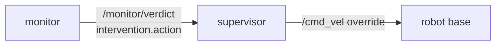

# P5 — supervisor

## Purpose

Enforces the intervention token the monitor decided. It stops deciding and starts obeying:
after this package the ladder is graded in exactly one place, and the node that actuates the
robot contains no policy.

## Where it sits

## Services

`supervisor` — robot tier only. **Standalone**: subscribes and enforces nothing until
`enabled` is true, which is also the ablation's detection-only arm.

## Inputs

| input | schema | producer |
|---|---|---|
| `/monitor/verdict` | [api.md](../api.md#monitorverdict--monitor--supervisor-frontend) — reads `intervention.action` | P4 |
| `enabled`, `rate_hz` params | — | compose |

## Outputs

| output | consumers |
|---|---|
| `/cmd_vel` zero-velocity override while `action >= HALT` and `enabled` | the robot base, overriding the planner |

## Design

**It obeys, it does not grade.** Today it calls `decide_intervention` on the state it
received ([intervention_supervisor.py:35](../../skill_monitor/backend/intervention_supervisor.py#L35)),
so the decision lives inside the actuator and is never recorded. After P4 the rung arrives
in the verdict; this node maps rung → actuation and nothing else. Keep `core/monitor_action.py`
and `core/supervisor_logic.py` as the pure grading library — P4 imports them — but the node
stops calling them.

**`action >= HALT` means stop actuating.** The ladder is an `IntEnum` for exactly this
reason: a supervisor for a different actor (MiniGrid re-plan vs G1 zero-velocity) implements
the same comparison with different effects.

**Unify `warn_steps`.** It is declared `3` in
[monitor_action.py:39](../../skill_monitor/core/monitor_action.py#L39) and again in
[supervisor_logic.py:37](../../skill_monitor/core/supervisor_logic.py#L37), and a third
literal `3` sits in the monitor's risk block — so the effective horizon is
`min(3, warn_steps)` spread over three files. It is also tick-denominated, so it silently
rescales the moment `tick_hz` moves. One definition, imported.

**Low confidence de-escalates, safety is never softened away.** `grade_action` already
returns `WARN` instead of actuating when `confidence < min_confidence`; that path was dead
for failure modes because the entries carried no confidence. P4 fixes the producer; this
package proves the consumer honours it.

**Zero velocity is a fixed-rate republish, not a one-shot.** The planner keeps publishing;
the override must too, or the last planner command wins between supervisor messages.

## Files owned

- `skill_monitor/backend/intervention_supervisor.py`
- `skill_monitor/core/supervisor_logic.py`
- `skill_monitor/core/monitor_action.py`
- `tests/test_supervisor_logic.py`, `tests/test_monitor_action.py`

## Depends on

P0, and P4's verdict shape — specifically `intervention.action` and
`failure_modes[].confidence`.

## Test plan

Pure; the node is a thin wrapper and the decision logic is already unit-tested.

- `test_action_at_or_above_halt_publishes_zero_velocity`
- `test_action_below_halt_publishes_nothing`
- `test_low_confidence_safety_verdict_does_not_actuate`
- `test_disabled_supervisor_never_publishes` — the ablation's detection-only arm
- `test_warn_steps_has_exactly_one_definition` — grep-style guard against the literal
  reappearing
- `test_override_republishes_at_rate_while_the_fault_holds`
- existing ladder tests keep passing unchanged

## Done when

The node contains no grading call, `warn_steps` is defined once, and a low-confidence SAFETY
verdict provably does not actuate.

## Non-goals

Deciding the rung (P4). Any actuation beyond `/cmd_vel` — a manipulation supervisor is a
different node implementing the same `action >= HALT` comparison.
