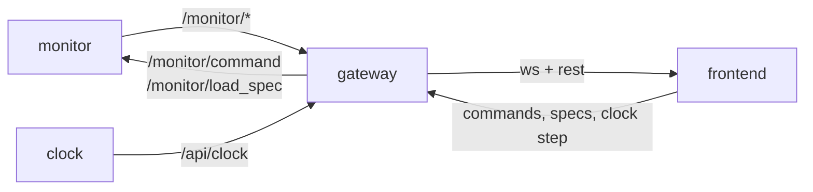

# P6 — gateway

## Purpose

Bridges ROS to HTTP so a client with no DDS can watch and drive the system. It exists
because the frontend runs where the operator is — a laptop, another subnet, a browser — and
DDS discovery does not cross a WAN. The dev host already cannot see the robot's graph, which
is the concrete case.

## Where it sits

## Services

`gateway` — server tier. **Standalone**: serves the API with an empty monitor list and
reports which services it cannot see, rather than failing to start.

## Inputs

| input | schema | producer |
|---|---|---|
| all `/monitor/*` topics | [api.md](../api.md) | P1, P3, P4 |
| the clock's own HTTP API | [api.md § clock API](../api.md#clock-api) | P1 |
| REST/WS requests | [api.md § gateway API](../api.md#gateway-api) | P7 |

## Outputs

| output | consumers |
|---|---|
| `GET /api/monitors`, `/api/monitors/{ns}/{manifest,adapter}` | P7 |
| `WS /api/monitors/{ns}/stream` — observation + verdict frames | P7 |
| `POST /api/monitors/{ns}/{command,spec}` → the matching topic | P4 |
| `/api/clock*` proxied at the same paths the clock serves | P7 |

## Design

**Pass-through, not translator.** Payloads are byte-identical on both transports. That is
only possible because P0 chose JSON in `std_msgs/String`: the gateway forwards a string it
does not have to understand. With custom `.msg` types this service would own a serialisation
layer and its own bugs. The acceptance test feeds one recorded frame through both paths and
compares.

**Discovery mirrors the topic contract.** A monitor is anything publishing
`<ns>/monitor/verdict`; `GET /api/monitors` returns the namespaces plus health derived the
same way the panel derives it today — live / stale / gone, distinguishing "crashed after
publishing" from "never started".

**The clock proxy keeps one origin.** The clock serves its own API so it is usable
standalone, but a frontend should not need two hosts and two CORS policies. Proxy the same
paths; do not invent different ones.

**WS is the stream, REST is the sample.** The same rule the clock API states applies here:
anything that must not miss a tick subscribes to the stream. Do not add a
`GET /api/monitors/{ns}/latest` that invites a polling loop.

**Backpressure is the gateway's problem, not the monitor's.** A slow WS client must not slow
the ROS side: per-client bounded queues, drop oldest, and report the drop count in the frame
so a viewer knows its view is decimated.

**No authentication in this package, and say so.** It binds to the server tier's network. If
that network is not trusted, the deployment terminates TLS and authenticates in front of it
— a fake auth layer here would be worse than none, because it would be believed.

## Files owned

- `skill_monitor/backend/gateway.py`
- `deploy/Dockerfile.gateway`
- `tests/test_gateway.py`

## Depends on

P0. Reads the shapes P1, P3 and P4 publish, all declared in `api.py`.

## Test plan

The ROS side is injected; tests drive the HTTP surface with a fake bus.

- `test_ws_frame_is_byte_identical_to_the_topic_payload` — the headline
- `test_rest_manifest_matches_the_latched_topic_value`
- `test_command_post_publishes_the_matching_topic_message`
- `test_spec_post_returns_the_monitors_spec_status`
- `test_empty_graph_serves_an_empty_monitor_list_not_an_error`
- `test_slow_client_is_dropped_oldest_and_told` — the frame carries the drop count
- `test_clock_proxy_paths_match_the_clocks_own_paths`

## Done when

One recorded frame proves byte-identity across both transports, a slow client cannot stall
the bus, and the service starts and serves with nothing else on the graph.

## Non-goals

Rendering anything (P7). Deciding what a verdict means (P4). Authentication and TLS —
deployment concerns, documented as out of scope rather than half-built.
