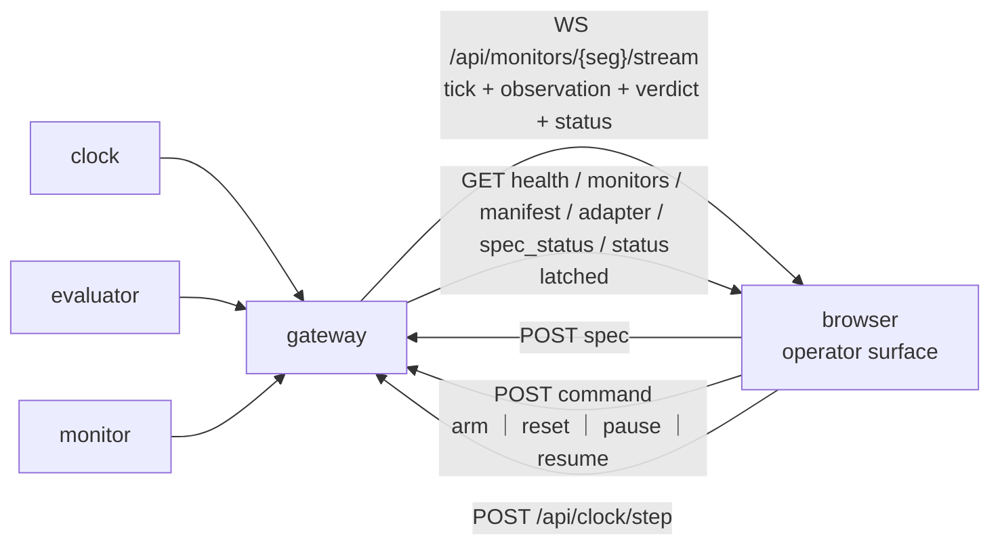

# P7 — operator surface

## Purpose

The window into a running monitor: the data going in, the propositions it is evaluated
against, the automaton it is driving, the phase machine timing that automaton, the clock
driving both, and what the whole thing cost to compute. It renders what it is told exists and imports nothing from the monitor — a
robot with a vocabulary this package has never heard of must render unchanged.

It is a **browser** surface served over the P6 gateway. The Tk panel it is meant to replace
cannot show a point cloud, cannot draw a live automaton, and cannot be opened from the far
side of a link; all three are requirements now. It is still on disk at
`frontend/skill_center.py` and still this package's — see [Files owned](#files-owned) for
why removing it is a later commit and not this one.

## Where it sits

One **host**, one socket. The direct-DDS client is gone — it existed so the panel could run
on the lab bench, and the gateway now runs there too — and what replaces it is two shapes
on one origin: a stream, and a set of reads. The page is simpler if it is honest about
which is which up front. See [Inputs](#inputs) for the row-by-row mapping and for the two
topics that have no route at all today.

`/monitor/tick` is on that one socket rather than on a second one because `api.TICK` joined
`STREAM_TOPICS`. `WS /api/clock/stream` still exists and still carries what the clock
*sent*; the monitor's own pulses are a different question — whether this namespace is being
clocked at all, and by what — and that is the one the console asks. It opens no second
socket to ask it.

## Services

`python3 -m skill_monitor.frontend.web` — the gateway and the page in one process, on one
origin, so there is no second port and no CORS. **No build step**: one hand-written HTML
file with its CSS and script inline, served directly. A toolchain that has to be installed
before the operator can see a verdict is a toolchain that will be broken on the day it
matters.

One origin is not a convenience. The gateway refuses a state-changing request without
`X-Skill-Monitor` and refuses a websocket from an `Origin` it was not told about; a page
served from anywhere else would need both of those relaxed to work at all. This launcher
names its own origin so the operator never has to work out that
`--allow-origin http://127.0.0.1:8080` is the incantation.

`--mock` belongs here rather than in the gateway: the simulated monitor is a *frontend*
fixture, and `backend/` importing `frontend/` to find it would invert the layering the
package split exists for. It is injected through `MonitorBus`, the same seam `RclpyBus`
uses, and it says on the wire that it is a fiction — `services.ros.mock` is where the
page's MOCK DATA badge comes from. Its frames are built by `core.api`'s builders and
checked by `core.api`'s validators, so it cannot drift into an approximation of the
contract.

## Inputs

Every payload is byte-identical to the topic it came from — see
[api.md](../api.md#gateway-api) — but the *transports* are two, not one, and the split is
the gateway's deliberate rule rather than an accident: **WS is the stream, REST is the
sample**. Anything that must not miss a tick is subscribed; anything latched is fetched,
because a client that reconnects wants the current value rather than a wait for a change
that may never come. `gateway.py` states it as a design constraint and refuses to grow a
`GET .../latest`. So the page opens one socket and does five GETs on boot, and the row
below says which is which.

| input | how it reaches the page | gives the surface | producer |
|---|---|---|---|
| [`/monitor/tick`](../api.md#monitortick--clock--everyone) | `WS /api/monitors/{seg}/stream` — since `api.TICK` joined `STREAM_TOPICS`; the frame is the identical payload | `seq`, `t`, `t0`, effective `tick_hz`, `mode` | P1 |
| [`/monitor/observation`](../api.md#monitorobservation--evaluator--monitor-frontend) | the same socket | `sensors` (every schema key, every tick), `ap_values`, `unknown_aps`, `confidence`, per-source `data_health` | P3 |
| [`/monitor/verdict`](../api.md#monitorverdict--monitor--supervisor-frontend) | the same socket — `STREAM_TOPICS` is exactly these three | `step`, verdict, per-formula status, failure modes with `fault_category` and per-mode confidence, `risk`, `intervention`, `missed_ticks` | P4 |
| [`/monitor/adapter`](../api.md#monitoradapter-latched--evaluator--everyone) *(latched)* | `GET /api/monitors/{seg}/adapter` | the loaded descriptor: schema, every source's topic, type, `expected_hz`, resolved steps | P3 |
| [`/monitor/manifest`](../api.md#monitormanifest-latched--monitor--everyone) *(latched)* | `GET .../manifest` | the spec as authored — description, APs with their rules, formulas, phases, bounds — and `source` | P4 |
| `/monitor/spec_status` *(latched)* | `GET .../spec_status`, and also returned inline by the spec POST | whether the last pushed spec was accepted, and why not | P4 |
| `/monitor/status` *(latched **and** streamed)* | `GET .../status` — derived, like every other latched GET — **and** the same socket, since `api.MONITOR_STATUS` is in `STREAM_TOPICS` too | whether the monitor is `running`, `paused`, `halted` or `idle`; the `reason`; and `since_seq`, the tick the state began at | P4 |
| [`/monitor/raw_echo`](../api.md#monitorraw_echo_request--monitorraw_echo) | `WS /api/monitors/{seg}/stream` — since `api.RAW_ECHO` joined `STREAM_TOPICS` | one chosen source's frames, summarised: a downscaled PNG for a camera, a value table for anything else, and the reason a frame could not be rendered when it could not | P3 |
| `/monitor/adapter_status` *(latched)* | **no route, and no topic constant** | whether the last pushed descriptor was accepted | P0, then P3 |

The latched GETs come free: `LATCHED_ROUTES` is *derived* from `api.LATCHED_TOPICS`
rather than listed, so a topic added to that frozenset gains an endpoint with no edit to
`gateway.py`. That is why `adapter_status` is cheap on the read side and not on the write
side — see the asks table.

**`/monitor/status` is the one input that needs both transports, and it is not redundancy.**
Latched, so a console *opening* mid-pause learns the truth on its first request instead of
waiting for a change that only the operator who caused it can make. Streamed, so a console
*already open* learns that another operator has just paused the monitor. Either half alone
leaves somebody reading a page that says the robot is being watched while it is not. The
page uses both: it GETs the state on boot, re-GETs it on every reconnect — a gap is a
period nobody was watching, and the state held across it is a claim about that period — and
takes the streamed frames in between.

## Outputs

| output | route today | consumers |
|---|---|---|
| `/monitor/command` — arm ｜ reset ｜ pause ｜ resume | `POST /api/monitors/{seg}/command`, from the control strip in the header | P4 |
| `/monitor/load_spec` — the edited spec | `POST .../spec`, replying with `spec_status` | P4 |
| `/monitor/load_adapter` — the edited descriptor | **none** — `INGRESS_TOPICS` is `{command, spec}` | P0, P6, P3 |
| `/monitor/raw_echo_request` — which one source to echo, `null` to stop | `POST /api/monitors/{seg}/raw_echo_request`, from the picker in pane 3 | P3 |
| `POST /api/clock/step`, `/api/clock/mode` | proxied under the clock's own paths | P1 |

One of the five has no way onto the wire from a browser. That is not a detail the design
can defer, because the pane that depends on it — descriptor reload — is otherwise
specified as if the transport existed. Raw echo was the other one and is no longer:
`INGRESS_TOPICS` gained `raw_echo_request` and `STREAM_TOPICS` gained `api.RAW_ECHO`, both
in P6's file and by P6's hand, and pane 3's echo half is built against them.

## Design

### The nine panes, the strip above them, and what each is actually reading

Numbered as the page numbers them, so a heading here and a heading on screen are the same
heading. The state banner and the control strip carry no number: they are in the sticky
header rather than in the grid, for the reason below.

**0 — Whether the monitor is watching, and the four commands that change it.** Not a pane
and deliberately not one. *Pausing the monitor does not pause the robot.* It stops the only
thing that was watching the robot, and the robot carries on: no verdicts, no failure modes,
no intervention. So this is not a media player, and the two halves of it are built against
that one fact.

**The banner.** Whenever the state is anything other than `running`, a banner names the
state, the reason and how long — `since_seq` against the live tick, which is why the field
exists and why the length is in ticks rather than in a wall-clock duration measured in the
browser, where replay and a manual clock would both make it wrong. It is in the header, so
an operator who opens the console mid-pause reads it before anything else and without
scrolling to the strip that caused it. It is **not colour alone**: the state is a word in
capitals — `NOT MONITORING` for every state that is not `running` — beside a glyph and a
heavy edge, and the tab title carries it too, because a background tab is where a console
gets left. `paused`, `halted` and `idle` all raise it; so does a `state` this console does
not recognise, and so does a `state` that is absent, because an unknown state is not a
running one.

**The controls.** `arm`, `reset`, `pause`, `resume` — `api.COMMANDS`, posted through the
same `fetch` wrapper as every other request, so `X-Skill-Monitor` is on them by
construction. `arm` and `reset` restart the episode and discard its history, and `pause`
leaves the robot moving with nothing watching it; all three confirm, and the confirmation
names the consequence rather than asking "are you sure". `resume` asks nothing — it is the
one that puts the watching back. A 202 is reported as *published*, not as done: what the
monitor did with the command is what `/monitor/status` says, and the banner never moves on
the strength of this page having sent something. A refusal shows its status and its body,
the way the clock's step button shows a 503.

**Where control is impossible the buttons are disabled and say why** — no monitor
discovered, so there is nothing to address; a `404`/`405` from the command route, learned
from the wire rather than guessed at; or a command already in flight. The monitor's *state*
is deliberately not on that list: the command route does not depend on the status topic, so
a build that reports no state can still be armed, reset, paused and resumed, and taking the
robot's stop button away over a field the producer had not shipped yet would be a worse
failure than the one it prevents.

**And the state is never inferred.** Not from the absence of verdicts, which is the
inference this whole feature exists to remove: a paused monitor publishes none and a dead
one publishes none either, and any rule that reads that silence gets one of the two wrong —
the dangerous one. Where `/monitor/status` is not on the wire at all, the page says so by
name and owner through the same `missing()` helper every other unreported field uses, and
claims nothing.

**1 — Description and spec, editable, hot-reloaded.** The free-language skill
**description** the spec was generated from, read-only above the spec itself in an editor,
with the last `spec_status` — accepted, or rejected with every reason — under it. Both come
off latched topics, so opening the page shows what is loaded right now rather than what is
on someone's disk, and the editor is not overwritten by a refresh while the operator is
typing in it. `load_spec` exists end to end — constant, ingress route, latched answer — so
this is the one editor that reaches the wire.

**The descriptor is read-only here, and not because it was skipped.** `load_adapter` exists
nowhere: it needs a topic constant from P0, an `INGRESS_TOPICS` entry from P6, and a handler
from P3, in that order. Until then the loaded descriptor is rendered in pane 2 rather than
offered as an editor whose apply button could not do anything.

**Reloading either document ends the episode, and the surface must say so before it sends.**
A descriptor swap can change the schema, and the automaton's APs are compiled against those
keys — a live swap would leave the monitor stepping an automaton whose propositions refer to
fields that no longer exist, silently always-false. Spec reload has the same problem for the
same reason: the intent is validate → confirm → reset → reload → re-arm, with the
confirmation naming the episode it is about to end. **Today the warning is on the button
(`apply · restarts the episode`) and there is no confirmation step** — the page discards its
own plot history and re-reads the latched topics on apply, so the operator is not left
reading pre-reload evidence, but a misclick still lands. The dialogue is owed. A hot reload
that quietly invalidates the evidence is worse than a restart, because a restart is visible.

**2 — Loaded configuration.** What this monitor is actually running: descriptor name and
where it was loaded from, spec name and `source`, every topic subscribed and every topic
published, the clock mode, `step` against the spec's `max_steps` with the remaining budget,
and the declared provenance of the data.

**On "is it real or simulated" — the monitor cannot know, and the surface must not pretend
otherwise.** Hardware agnosticism is the whole claim: `real_g1`, `mujoco` and `isaac_lab`
declare an identical schema over different topics, and the engine is unable to tell them
apart. So the surface reports the descriptor's **declared** provenance and labels it as a
declaration by whoever launched the container — not a verified fact. A badge reading "REAL"
that the monitor inferred would be a lie the first time someone replays a bag through the
real descriptor, which is a thing this project does on purpose.

**3 — Raw input, per topic.** One row per source from the adapter's `sources`: topic name,
message type, `expected_hz` against measured `rate_hz`, `age_s`, `samples_this_tick`,
`refreshed`, `dropped`. A source below its expected rate renders as an alert, not as a
number to notice.

Below the table, **the echo**: a picker naming the adapter's sources and an explicit off,
which is what it is until somebody chooses. One at a time, and the reason for that
discipline is unchanged: a point cloud per frame is not free and the panel is usually
across a link. Choosing a source posts `api.build_raw_echo_request`'s payload —
`{schema_version, source_id}`, with `null` for the stop — and the frames arrive on
`/monitor/raw_echo` with the rest of the stream. The row table was never the fallback for
the echo: it is the pane, and the echo is the zoom.

**`summary` is opaque, and the page renders by a `kind` it does not own.**
`api.build_raw_echo` says the summary's shape is the adapter's business, so that a new
sensor type does not edit the wire contract. The console has three renderings and a fourth
case:

* `image` — the frame from its `data_uri`, drawn at its own size and never stretched to
  the pane, with `topic`, the size sent against the size the camera produced, the encoding,
  `samples_this_tick`, the echo's rate and the bytes beside it. A frame the producer had to
  shrink below its own box to fit the byte cap says so; a silently smaller picture is a
  small lie about what the camera sent.
* `fields` — a sorted value table.
* `image_unavailable` — the producer had a frame and could not turn it into a picture. Its
  `reason` is a sentence written for an operator (`encoding '16UC1' is not one this echo
  can render`) and is rendered as one, beside the source's own dimensions. A depth topic is
  the first thing anybody clicks, and no picture with a reason beats a plausible picture of
  nothing.
* **anything else** — a readable JSON dump, and this is a first-class case rather than a
  fallback nobody exercises. It is the whole reason the summary is opaque: the depth or
  lidar summary somebody writes next shows an operator every field it carries with no
  change to this page. `--mock` publishes such a kind on one source so the path is
  reviewed rather than discovered.

**What it refuses to do.** `data_uri` comes off the wire and is the one string on this page
that becomes something the browser fetches, so it is checked against an allowlist before it
reaches an `img` `src`: the whole string must be a base64 `data:image/…` URI of a raster
type. `javascript:` fails, a remote URL fails — that would have the console fetch from a
host the wire named, from the origin holding the `X-Skill-Monitor` grant — and
`data:image/svg+xml` fails too, for the same reason `.svg` is not in the gateway's
`STATIC_TYPES`. What fails is reported to the operator, never loaded.

**And it degrades rather than guesses.** No ingress route (a 404 or a 405) disables the
picker and prints why. A request that was refused moves nothing: the picker goes back to
what is actually echoing, because a control showing a source that was not accepted is a
claim with no evidence. A source requested with nothing arriving says exactly that, and
names both things it could be — the producer, or the topic not being on this build's
stream. The frame is aged in ticks against the newest `seq` the page has seen, and once it
stops being this tick's it is greyed and labelled with its age: the words and the dimming
both, so a screenshot of a stale frame cannot be read as a live one. Turning the echo off,
switching source, and reconnecting each drop the frame — the last one is a period the page
was not watching, so the request is not silently re-sent either.

**4 — Plots, most of which cost nothing extra.** Every observation already carries every
schema key, every tick. So these time series are genuinely free: `min_range` over time
against the collision threshold, the `linear_vel` and `angular_vel` traces, and `confidence`
over time. Ring buffer in the page, no server-side history, no new topic. This is the pane
that answers "what was the robot actually doing when it said that", built entirely out of a
stream the monitor is already publishing.

**The X-Y track is not free, and calling it free was the error worth naming.** No shipped
descriptor's schema has position, goal or waypoint coordinates: `nav_schema.json` — the one
schema all three descriptors reference — declares `angular_vel`, `base_height`, `base_pitch`,
`base_roll`, `current_target_idx`, `image_similarity_to_goal`, `linear_vel`, `min_range`,
`mission_finished`, `nav_mode`, `nav_state`, `nav_stuck`, `num_waypoints` and
`upright_flag`. `num_waypoints` is a count, and `current_target_idx` an index into a list the
monitor never receives. There is nothing to plot against nothing.

It is also not a plot P7 may simply request. The monitor is contracted to stay independent of
the navigation algorithm and must not read the planner's internals — that is the agnosticism
claim in its strongest form, and a pane that wants a track is a pane asking for exactly the
data most easily satisfied by subscribing to the planner. The request only survives if the
keys come from the robot and from the goals it was commanded to reach, which is precisely the
line [P12](P12-planner-independent-schema.md) draws. So the track goes in the asks table
against P12's keys, not P3's, and it renders when they exist.

**Not a 3D viewport.** A point-cloud renderer is a project, and everything above is a
reading of data that already exists — the monitor should not grow a renderer to prove it can.
The shipped visualisation stack (`sim/Dockerfile.foxglove`) is where a human looks at depth.

**5 — Which AP is evaluated against which data.** For each AP: its rule, the sensor keys the
rule references, the live value of each of those keys, and the resulting boolean — or its
name in `unknown_aps`, which is the case that matters, because an AP that could not be
evaluated is not an AP that is false.

The mapping is not new work: `spec_contract.sensor_keys_in_rule()`
([spec_contract.py:46](../../skill_monitor/core/spec_contract.py#L46)) already extracts
exactly this, because it is how a pushed spec is validated against the schema. P4 publishes
the map on the manifest rather than making every client re-parse the rules and drift from
the validator.

**6 — The automaton, with the current state lit and the path this page has watched it
take.** Per monitor — property formulas *and* named failure modes — `manifest.automata`
carries states, edges, the accepting and sink flags and the initial state; each verdict row
carries the one thing that changes, its `state`. The sequence is not on the wire and could
not honestly be: it is accumulated here, from the frames this page received.

**Structure is published as nodes and edges, not as a rendered image.** A PNG cannot be
highlighted, and it dates the moment the spec is pushed. Spot emits the graph once, on the
latched manifest, as `manifest.automata`; the page lays it out. These automata have
single-digit state counts, so a layered left-to-right layout in a few dozen lines of SVG
beats taking a graphviz dependency into the browser — and the highlight is then just a
class attribute.

**Built, and this is how.** The layout is a BFS from `initial`: depth is the column,
arrival order within a depth is the row, and a state the initial one cannot reach still
gets a column of its own rather than being dropped. Because the graphs are latched they
change only when a spec is pushed, so the SVG is laid out once per manifest and a verdict
costs two `classList.toggle` calls per node — no element is replaced, which is what keeps
the pane off the critical path of the same pulse that drives panes 3 to 5.

**Three kinds of state, told apart by shape.** Accepting is a double outline, an absorbing
sink is a square, ordinary is a plain circle, and a state that is both accepting and
absorbing is a double square — colour agrees with the shape but never carries the
distinction alone. Edge labels are the producer's own guard text and are escaped like every
other wire field; Spot spells an unconditional guard `1`, which the page renders as "any
input" rather than putting a bare digit next to a state number.

The traversed path is the honest part of this pane. It needs `state` on each entry of the
verdict's `formulas[]` and `failure_modes[]`, and the path is accumulated by the page from
the verdict stream, which means a page opened mid-episode shows the path **from when it
connected**, and says so in as many words under the graphs. It must not draw a line it did
not witness — so the trace also resets when `step` goes backwards, because one episode's
states are not the next one's path, and when the socket reconnects, because the verdicts in
the gap were not seen either.

**Degrading is per-reason, not one blanket.** No `automata` key at all is a build that
cannot report them, and the pane says so with the field name and its owner; an `automata`
that is present and empty is a build that can and found no graph in this spec, which is a
different sentence. A row whose `state` is `null` or absent draws the graph with **nothing**
lit — the initial state is where an automaton starts, not where it is, and lighting it would
be the page inventing the one field it was just told nobody could supply. A graph with no
verdict row of its name is the same case, and so is every `phase:<phase>:<kind>` row, which
has no automaton to point at and says "no graph" in the state column rather than leaving a
blank that reads like a missing value.

**And the automaton is not the only fault detector, so this pane must not be read as the
whole story.** `verdict.failure_modes[]` carries the spec's named modes *and* the phase
machine's own faults, synthesised as
`phase:<phase>:<invariant｜timeout｜progress｜precondition>` — a stable name per
(phase, kind) precisely so a consumer can key on it.
Those never appear in `formulas[]` and have no automaton to light up — **pane 7 is where
they come from**, and it is the pane that can say which guard of which phase a
`phase:<phase>:<invariant>` row is about. Each entry carries a
`fault_category` from a closed vocabulary (`SAFETY`, `INVARIANT`, `TIMEOUT`, `PROGRESS`),
and a category the engine could not classify ships as `PROGRESS` rather than as something
alarming. The surface renders the category as given and does not re-rank it: an
unclassifiable fault is not thereby a severe one, and the spec that named it was already
rejected at load if the spelling was unrecognised.

**7 — The phase machine, with the phase we are in, its budget, and the live truth of its
guards.** Directly after pane 6 because the two are one subject seen at two levels: the
Büchi automata answer "is this property still holding", and the layer above them answers
"which phase are we in, how long has it got, and which of its guards is about to end it".
Splitting them across the page would have separated the automaton from the thing that
times it.

**The machine is drawn from `manifest.execution_phases`, which is already latched.** One
node per phase in the order the spec authored them, each labelled with its index and its
`timing_bounds.max_steps`, and the transition between two phases labelled with the
`exit_condition` of the one it leaves — the guard that actually makes that transition, in
the spec's own words. It is laid out top to bottom rather than left to right: pane 6's
automata are wide and shallow, and a phase machine is a chain, which in a dashboard column
has room downwards and none across. Vertical also leaves the whole right-hand side for the
transition labels, which are the one thing here that must not be truncated to fit. Same
discipline as pane 6 otherwise — laid out once per manifest, so a verdict costs one
`classList.toggle` per node and no element is replaced.

**Where we are is carried by shape, not by colour.** The current phase gets a caret
pointing at it and a second outline inside its box; the colour agrees and never carries the
distinction alone. Both marks are in the document from the start and hidden with `display`,
which is what keeps the highlight a class swap. `verdict.phase_index` is the position and
`verdict.phase` is the name; when they disagree the pane believes the **name**, because that
is the string the guard block and the `phase:<phase>:<kind>` fault names are keyed on, and
it says which it used rather than choosing quietly.

**The timing is the reason this is a second pane and not a second Büchi drawing** — it is
the layer that has any. `step` counts the episode and `max_steps` bounds the phase, so the
in-phase count is derived as `max_steps` minus `risk.steps_to_timeout` and shown against
that bound as a bar; a verdict that reports no `steps_to_timeout` leaves nothing to derive
it from, and the pane says so rather than showing the episode's step against a phase's
bound. Beside it: `risk.steps_to_timeout`, and `risk.violations_to_fault` against the
phase's own `progress_violation_limit`, which is what says whether the next progress
violation is the one that faults. When `risk.severity` is set the pane names it, because a
graded tick is exactly the one an operator must not have to infer from a colour elsewhere.

**The guards, with their live truth, which is where a fault actually originates.** For the
current phase, each guard it declares — `precondition`, `enter_condition`, `invariant`,
`progress_condition`, `exit_condition` — as three columns: the expression as the spec
authored it, whether it currently holds, and the atomic propositions it reads with their
values from `observation.ap_values`. Only the guards the phase declares appear: a padded-out
set would show an invariant for a phase that has none, which is a claim about the spec
rather than a reading of it.

**`value: null` is rendered as its own thing and never as false.** "We did not check" and
"it does not hold" are different facts about a phase and one of them is a fault — an
invariant reading a proposition blinded by a stale sensor has not been broken, it has not
been evaluated, and a pane that flattens the two turns a dead camera into a safety
violation. Same rule one level down for the propositions themselves: one named in
`observation.unknown_aps`, or absent from `ap_values` entirely, renders UNKNOWN and not
false, exactly as in pane 5.

**The page does not evaluate a guard expression, and that is a rule rather than an
omission.** `phase_guards[].value` is what the monitor actually acted on; a second evaluator
in the browser is precisely where this project's `min_range < 0.25` decimal-point bug lived
three times, and a guard the page decided for itself would be a fault it invented rather
than one it observed. What the page does do is *name-match* the propositions an expression
reads against the manifest's declared AP names — string matching, not evaluation, which
cannot invent a proposition the spec does not declare and says only what the monitor's
answer was a function of.

**Degrading is per-reason here too.** No `execution_phases` on the manifest is a spec with
no phase machine at all, and the pane says so with the field name and its owner; an
`execution_phases` that is present and empty is a spec that runs as one unphased episode,
which is a different sentence. A `phase_guards` that is *absent* is a build whose producer
does not report guard truth: the machine and the timing still draw, and the pane names the
field and refuses to fall back to evaluating it. A `phase_guards` that is present and `null`
is the machine between phases — no phase active, so no guards to report. A `verdict.phase`
of null draws the machine with **nothing** highlighted, for the same reason a null `state`
lights nothing in pane 6.

**8 — Clock.** `seq`, `t`, `t0` as a wall time, effective `tick_hz`, `mode`, and
`missed_ticks` from the verdict. `seq`/`t`/`t0`/`tick_hz`/`mode` arrive on the monitor
stream, on `/monitor/tick`, which is why that topic had to join `STREAM_TOPICS`. Until the
first pulse arrives the pane says it has seen no tick rather than showing a zero, and it
also names the observation's `clock` field, because a monitor free-running on its own timer
and a monitor driven by the clock service are the same numbers with different meanings.
Plus the control: a step button, which in `manual` mode turns the whole system into a
debugger where one click advances every service by exactly one tick. The step ships; the
mode *switch* does not yet, so the pane reports `mode` and does not set it, and a step
pressed against a free-running clock shows the refusal it got rather than swallowing it.

**Every clock request must carry `X-Skill-Monitor` or it is a 403, reads included.** The
whole proxied clock surface is gated — see [The rest](#the-rest) — so the rule has to be
stated as "every clock request" rather than "every mutating call". The page obeys the
stricter rule everywhere by construction: the header is on the one `fetch` wrapper the page
makes all its requests through, `GET`s included, so no pane can acquire a read that 403s by
being written later.

The effective rate is the one on the wire, never the descriptor's — a CLI override that the
panel does not reflect makes every seconds-denominated number on the page wrong.

**9 — Cost (the page names it "timing", after the field it wants).** How long the tick took,
split by stage: fold, AP evaluation, automaton step, verdict publication. Shown as the
current tick and a rolling distribution, against the tick budget `1/tick_hz` — the number
that matters is not the mean, it is how close the worst tick came to the budget, because
that is the one that will start dropping ticks.

This needs new fields. Nothing times itself today, and a benchmark the operator cannot see
is a benchmark nobody runs.

**The two halves do not arrive at the same rate, and a naive join would misreport the
budget.** The observation is published once per tick *always*, including ticks where nothing
arrived. The verdict is published exactly once per tick **the monitor stepped** — a paused,
halted or idle monitor emits none, and a redelivered `seq` emits none. So splitting `timing`
across the two payloads means the fold and AP-eval halves have strictly more samples than the
step and publish halves, and a "rolling distribution" over both is two distributions with
different cardinality drawn as one. The pane keys both halves on `seq`, charts the stage
totals only for ticks that produced both, and shows the unmatched observation ticks as what
they are: ticks the monitor did not judge. Reconstructing the tick axis from `seq` and
`missed_ticks` rather than from message counts is the same discipline every other consumer
of the verdict owes.

### What this pane set requires from the backend

Five payload asks and four routes or topic constants — and the ownership is not one package
per row, which was the assumption worth correcting. `api.validate_*` is **closed by
default**: `_check_fields` reports every unknown field as a problem unless the caller passes
`closed=False`, and only the manifest does. So a payload field is not a matter of "the
package that owns the payload adds it"; it is P0 opening `core/api.py` first and the
producing package second. A field emitted before P0 opens it does not merely go unrendered —
it makes the payload *invalid*, and the producer's own tests are what break.

Each ask must land in [api.md](../api.md) before it is implemented; package docs do not
carry schemas.

**Payload fields.**

| ask | on | owner | why it cannot be derived client-side |
|---|---|---|---|
| `ap_dependencies` — AP name → the sensor keys its rule reads | manifest *(latched)* | **P4 alone** — the manifest is the one payload validated with `closed=False`, because it is passed through as authored | re-parsing rules in the browser forks the validator; one drift and the panel shows a dependency the engine does not agree with |
| `phase_guards` — the active phase's declared guards, each with the expression the spec authored and the truth the monitor acted on (`true`, `false`, or `null` for *not evaluated this tick*); `null` for the whole block when no phase is active | verdict | **P0** (`_VERDICT_FIELDS`), then P4 | evaluating the expressions in the browser forks the evaluator — the same fork that put `min_range < 0` on the page three times — and it would report a fault the page invented rather than one the monitor acted on |
| `timing` — per-stage nanoseconds for the tick | observation (fold, AP eval) and verdict (step, publish) | **P0** (`_OBSERVATION_FIELDS`, `_VERDICT_FIELDS`), then P3 and P4 | wall-clock at the browser measures the link, not the computation |
| `provenance` — declared `real ｜ sim ｜ replay`, descriptor path, publisher | adapter *(latched)* | **P0** (`_ADAPTER_FIELDS`), then P3 | it is a declaration, and declarations belong on the wire beside what they describe |
| position, goal and next-waypoint keys — the X-Y track | the observation's `sensors`, via the schema | **P12** | `pos_x`/`pos_y`/`pos_z`/`yaw` (`pose_schema.json`) and `goal_x`/`goal_y`/`dist_to_goal` (`nav_schema.json`) now ship in all three descriptors, sourced from odometry and the commanded goal — a distinct *next*-waypoint key, and `has_goal` to tell "no goal" from "goal at the origin", are still P12's. The rule they exist under is enforced, not merely stated: `test_no_position_or_goal_key_is_sourced_from_a_planner_status_topic` |

P0's edit is small and need not be a wire break: `_check_fields` takes an `optional` tuple
for exactly this, and `_STEP_OPTIONAL` is the precedent — a field added there validates when
sent and is tolerated when absent, so no producer breaks and `SCHEMA_VERSION` stays put.

For the track, the six keys are already specified: [P12](P12-planner-independent-schema.md)
publishes `pos_x`, `pos_y`, `goal_x`, `goal_y`, `next_x`, `next_y` from odometry, `/waypoint`
and `/next_waypoint`. P7 asks for nothing new there — it asks to be sequenced after P12, and
draws no track until then.

**Routes and topics.** These are not payload fields and do not belong to the payload's owner.

| ask | owner | note |
|---|---|---|
| `/monitor/load_adapter` and `/monitor/adapter_status` as constants, each with a `VALIDATORS` entry, and `adapter_status` in `api.LATCHED_TOPICS` | **P0** | api.md is explicit: topic names are "declared once as constants in `core/api.py`. Nothing else in the repo may contain a `/monitor/...` string literal". The gateway's ingress routes call `validate_for_topic`, and an unregistered topic there is itself a problem, not a pass |
| the `load_adapter` ingress route — an `INGRESS_TOPICS` entry | **P6** | `gateway.py` is P6's file. The *GET* for `adapter_status` costs nothing once the constant lands, because `LATCHED_ROUTES` is derived from `api.LATCHED_TOPICS` |
| validate-and-answer for a pushed descriptor | **P3** | mirroring `load_spec`/`spec_status` exactly — same shape, same latched status |
| ~~the `raw_echo_request` ingress route and a way to read `/monitor/raw_echo`~~ | **P6 alone** | **landed.** `INGRESS_TOPICS` gained the verb and `STREAM_TOPICS` gained `api.RAW_ECHO`; the summary convention that rides on the opaque `summary` is P3's, in `backend/adapters/raw_echo.py`. Pane 3's echo half is built against both |

**Two rows left this table by being built rather than by being asked for.** Static-file
serving was a P6 ask and is now `Gateway(static_dir=...)`, off by default; `api.TICK` on
`STREAM_TOPICS` was never a separate ask and is the second of the two `gateway.py` changes.
Both are described under [Files owned](#files-owned), with the note that P7's tests are what
cover them. `--mock` was also asked of the gateway and is not there either — it lives in
`frontend/web.py`, for the layering reason in [Services](#services), and needed no route.

**A third row left it the same way, and it was never on the table at all.**
`/monitor/status` — the run state — was the field this package had no way to ask for while
it was inferring the answer instead. The console had no state to render, so nothing named
it as missing, and "the monitor is quiet" was going to be read as "the monitor is fine"
until someone paused one. It is P0's topic and P4's to publish, both have landed, and the
consuming half here is a banner and four buttons. The transport cost nothing on either
side: the GET is derived from `api.LATCHED_TOPICS` like every other latched read, and the
`POST .../command` route it drives has existed in `INGRESS_TOPICS` since P6 merged and was
simply unused by the page.

**Two more left it by being answered.** `manifest.automata` and `formulas[].state` were the
two rows pane 6 was waiting on; both are now on the wire and the pane draws from them. The
`automata` row was also the one that could not be satisfied from a payload owner's own
files: `skill_monitor/core/automata.py` is the only file in the repo that imports `spot`,
what it exposed was `export_dot()` — DOT text — plus `num_states()`, the sink set was
private, and there was no nodes-and-edges accessor, so emitting the graph as JSON meant a
new method on `LTLMonitor` in a file that appeared in **no package's "Files owned" list**.
That ownership gap is settled by whoever landed the accessor; naming it was P7's whole
contribution to it, and P7 still writes neither file. What P7 does own is the consuming
half: the layout, the highlight and the mock that is held to the same validators.

**None of the payload fields are blocking.** Every pane degrades to "not reported by this
build" when its field is absent, and the surface is usable the day the WebSocket connects.
That is deliberate: a frontend that cannot be started until P0, P3, P4 and P12 have all
landed is a frontend that gets built last and rushed.

**The one route that was blocking has landed.** Static-file serving was not a degradation —
without it the browser has nothing to fetch and there is no surface to run at all — which is
why it is the change this package did make to `gateway.py` rather than wait on. The two
route still outstanding is not blocking and is not a degradation either: the descriptor
push ships *visibly disabled*, naming the route it waits on, which is a different thing
from a pane that renders with a field missing. It is P6's, and P7 asks for it in a PR
comment rather than writing it. The raw echo was the other one and is no longer: P6 added
its two routes, and the pane that was asking for them is built.

### The rest

**Everything rendered comes from a manifest.** No navigation-specific widget, no spec read
from disk, no schema key named in the source. The gripper-schema test is the guard and it
keeps passing.

**`STATE_TOPIC` is the discovery key, not merely a subscription — and it has not moved
yet.** [skill_center.py:43](../../skill_monitor/frontend/skill_center.py#L43) still reads
`STATE_TOPIC = "ltl/state_description"`, and `parse_namespaces`
([:51-62](../../skill_monitor/frontend/skill_center.py#L51)) still finds monitors by scanning
the graph for that suffix. [api.md § Migration](../api.md#migration-from-ltl) lists it as
**P7's outstanding item**, and it is the one that bites: the panel finds *zero* monitors the
moment the producers rename, because a subscription that goes quiet looks like an idle robot
while a discovery key that goes quiet looks like an empty lab.

Moving it is this package's work, and the landing is already prepared. `core/discovery.py`
holds the one implementation of `parse_namespaces` and `health`; P6 imports from it and
deleted *its* copies rather than editing a file mid-flight that belongs to someone else. That
module's `parse_namespaces` takes a **`key_topic` parameter, and its docstring says the
parameter exists precisely so P7 can share the implementation while its discovery is still
keyed off the pre-migration name.** So P7 deletes its two copies and imports, passing
`key_topic` explicitly, and flips the default to `api.VERDICT` when the rename lands — one
implementation throughout, and never a window in which the gateway and the panel answer "is
this monitor alive" differently. The browser has no DDS in any case: it discovers through
`GET /api/monitors`, and the graph scan is only the desktop client's problem.

**Every mutating call carries `X-Skill-Monitor: 1` — and so does every clock request,
including `GET`.** The gateway's own rule, from its module docstring and enforced in
`_dispatch`, is `method != "GET" or is_clock`. The clock proxy is deliberately path- and
method-transparent, so the gateway cannot know which of the clock's `GET`s have side effects:
`GET /api/clock/step` advances a tick and is reachable from an `` tag, and treating the
whole proxied surface as state-changing is the only policy consistent with not enumerating
it. A page that learns the rule as "mutating calls only" ships a clock pane that 403s on the
first read it makes, so the rule the code enforces is the rule this document states — and
the page sets the header on every request rather than on the ones it believes are mutating.

WebSocket handshakes are exempt, because a browser cannot set a header on one at all; they
are gated on `Origin` instead, which means `--allow-origin` must name the console's origin
before the stream opens — which is why `web.py` names it rather than leaving it to an
operator. See [api.md](../api.md#the-trust-boundary) — which still states the narrower rule,
and is P9's file to correct.

## Files owned

- `skill_monitor/frontend/index.html` — the page, entire
- `skill_monitor/frontend/web.py` — the launcher
- `skill_monitor/frontend/mock_monitor.py` — the fiction
- `skill_monitor/frontend/skill_center.py` — the Tk panel, still here; see below
- `deploy/Dockerfile.skill_center`
- `tests/test_web_ui.py`, `tests/test_skill_center.py`

The Tk panel (`frontend/skill_center.py`) is **not** deleted with this landing. It is the
surface that works today, the console does not yet cover its container controls, and
removing it is a clean commit of its own rather than noise inside this one — it and
`STATE_TOPIC` are still this package's to move. Two surfaces is a debt with a due date,
not a design.

Two changes were needed in `gateway.py`, which is P6's:

- `Gateway(static_dir=...)` and one route. Defaults to `None`, so an API-only gateway
  serves no files; the directory's contents are matched against an extension allowlist and
  must be direct children, resolved and compared against the resolved directory.
- `api.TICK` added to `STREAM_TOPICS`. `t0` and `mode` exist on no other topic, and the
  monitor's *own* pulses are the only place a console can see that it is being clocked by
  something other than the gateway's proxied clock — or by nothing at all.

**Both of those are covered from `tests/test_web_ui.py`, which is P7's file, and that seam
is worth naming.** The ownership rule has not changed — `gateway.py` and
`tests/test_gateway.py` are P6's, and anything exercising the gateway's own behaviour is
written there by P6 — but a reviewer of P6 will not find `test_the_root_is_the_console` or
`test_the_stream_carries_the_tick` in P6's own test file, and could revert either change
without a single P6 test going red.

## Depends on

P0 for payloads and topic names; **P6 for the transport, which is merged** — the stream
routes, the three latched GETs and the two ingress POSTs. The static route and the `TICK`
entry on `STREAM_TOPICS` are in `gateway.py` too, added here and listed under
[Files owned](#files-owned) as the two lines of P6's file this package touched. The
raw-echo routes have since landed in P6's file, by P6's hand, and the pane is built on
them; `load_adapter` is still owed and still P6's. The payload fields above
are wanted, not required — build against their absence first. The X-Y track waits on P12
and is drawn by nothing until then.

## Test plan

No browser and no sockets. Two things here can rot silently, and they are what
`tests/test_web_ui.py` holds:

**The file route** — `test_the_root_is_the_console`,
`test_a_gateway_told_of_no_directory_serves_no_files`,
`test_nothing_outside_the_directory_is_reachable` (`..`, an encoded `..`, a double-encoded
`..`, a subdirectory spelling, a backslash spelling, an absolute path, a trailing slash, a
dotfile, a mixed-case extension, and a NUL byte — which `Path.resolve` answers with
`ValueError` rather than `OSError`, so uncaught it closes the connection instead of
returning a 404), `test_only_the_extensions_the_console_is_built_from_are_served`
(`web.py` and `mock_monitor.py` sit in the served directory and are not downloadable, and
`.svg` is not in the allowlist — an SVG *navigated to* runs script in this origin, the one
holding the CSRF grant and the websocket `Origin` grant),
`test_a_symlink_out_of_the_directory_is_not_a_way_in`,
`test_the_console_names_its_own_origin`,
`test_an_ipv6_origin_is_spelled_the_way_a_browser_spells_it`,
`test_the_stream_carries_the_tick`.

**The mock** — `test_every_frame_the_mock_publishes_validates` is the one that fails when
the wire moves, and it covers every topic the mock puts on the wire, streamed or latched;
`test_the_answer_to_a_pushed_spec_validates_too` covers the `spec_status` the reload path
rebuilds, both the accepted answer and the rejected one;
`test_an_ap_is_true_for_the_reason_its_rule_gives` (evaluated from the
spec's own rule, so an AP-pane review is not reviewing a coincidence);
`test_a_stale_source_makes_its_aps_unknown_not_false`;
`test_pushing_a_spec_restarts_the_episode_and_says_which_spec_is_loaded`;
`test_a_spec_the_robot_cannot_evaluate_is_refused_with_its_reasons`;
`test_the_episode_ends_rather_than_counting_past_its_own_bounds`;
`test_the_mock_says_on_the_wire_that_it_is_a_fiction`;
`test_the_mock_splits_a_rule_with_the_shared_splitter`.

**The controls and the state, from the mock's end** —
`test_the_mock_honours_every_command_the_contract_declares`;
`test_a_paused_mock_stops_its_automata_its_phases_and_its_verdicts`, which is the one that
matters, because a mock whose values kept changing under a pause would make every review of
this feature a review of a control that does nothing;
`test_a_paused_monitor_and_a_dead_one_are_the_same_silence`, which asserts the premise
rather than arguing it — verdicts, observations and `last_seen` freshness all say exactly
the same thing about both, which is why the state needs a topic;
`test_a_resumed_mock_starts_advancing_again`;
`test_arm_and_reset_restart_the_episode_and_discard_its_history`, the consequence the
console makes the operator confirm, asserted at the end that has to honour it;
`test_since_seq_moves_only_when_the_state_does`, so a second `pause` cannot reset a count of
how long the robot has been unwatched;
`test_the_status_payload_is_the_shape_the_console_reads`;
`test_the_state_a_monitor_starts_in_names_no_tick_it_never_counted` (`since_seq: null`, not
zero); `test_a_console_that_connects_during_a_pause_is_told_at_once`, which pins the
TRANSIENT_LOCAL replay the real bus gets from DDS and the mock now does itself; and
`test_the_mock_reports_a_state_the_moment_the_contract_admits_the_topic`, the same
validator-answered gate as `formulas[].state` and `phase_guards`.

**The controls and the banner, read off the page** — there is no JavaScript test runner
here, so these assert the source at the points where a rewrite would quietly turn a safety
control into a decoration: `test_the_page_offers_exactly_the_commands_the_contract_declares`
(pinned against `api.COMMANDS`); `test_the_page_posts_the_payload_the_command_route_validates`
(the literal the page builds, then the validator asked about that literal, and that it goes
through the one `fetch` wrapper that carries the header);
`test_the_page_confirms_the_three_commands_that_cannot_be_taken_back`;
`test_the_page_reports_a_refused_command_the_way_it_reports_a_refused_step`;
`test_the_page_never_reads_the_state_from_the_absence_of_verdicts`, asserted structurally —
the only two things ever assigned to the state are a payload off the status topic and
`null`; `test_the_page_names_the_field_and_its_owner_when_no_state_is_reported`;
`test_the_page_treats_an_unrecognised_state_as_unknown_and_not_as_running`;
`test_the_banner_does_not_carry_the_state_in_colour_alone`;
`test_the_page_disables_the_controls_and_says_why_when_it_cannot_send`, including that the
missing state topic is *not* one of those reasons;
`test_the_banner_measures_the_state_against_the_tick_and_not_this_browsers_clock`; and
`test_the_page_re_reads_the_state_after_a_gap_it_did_not_watch`.

**Not asserted, and checked by hand in a browser against `--mock`:** that the banner is
legible without scrolling with the page scrolled to the bottom pane, the `window.confirm`
texts as they appear, and the tab title while the state is not running. A native dialog
blocks script injection, so the confirmations cannot be driven from a harness at all;
`window.confirm` is still the right control — this page has no build step and no dependency
to spend on a modal.

**Pane 6's frames** — `test_the_manifest_carries_a_graph_for_every_monitor_it_can_compile`
(well-formed, named the way the verdict names its rows, and deterministic — one edge per
`(from, label)`, or the state the page lights would depend on edge order);
`test_a_chained_eventuality_compiles_to_the_chain_the_formula_spells` and
`test_a_safety_property_compiles_to_an_accepting_state_and_a_sink`, which pin the two
shapes against the shipped `formulas_g1.json` rather than against a formula shaped like it;
`test_a_formula_the_mock_cannot_compile_gets_no_graph_rather_than_a_guess` and
`test_a_spec_whose_formulas_do_not_compile_still_latches_a_valid_manifest`, the degrade path
from the producing end; `test_the_state_advances_with_the_aps_the_mock_is_already_fabricating`,
which walks a whole episode so a lit node is lit for the reason its edge label gives;
`test_a_guard_this_tick_cannot_answer_reports_no_state_rather_than_a_stale_one`, which is
where `state: null` comes from; `test_a_verdict_row_carries_the_state_of_its_own_graph`;
`test_a_status_follows_the_automaton_that_produced_it`; and
`test_the_mock_sends_state_the_moment_the_contract_admits_it`, which pins that the mock
gates `formulas[].state` on the validator's own answer rather than on a flag — it is P0's
field to open, and a mock that emitted it early would be publishing frames the shipped
validators reject.

**Pane 7's frames** — `test_the_guards_reported_are_the_ones_the_phase_declares` (the
phase's own guards, in the spec's own words, and no padded-out set);
`test_a_guard_is_true_of_the_propositions_on_its_own_frame`, which walks a whole episode so
that a guard the pane shows as true is true of the propositions shown beside it, and which
asserts that all three truths — true, false and *not evaluated* — really occur, so the pane
has all three to draw; `test_a_guard_whose_proposition_is_unknown_is_null_and_never_false`,
the one that matters, because reporting `false` there is how a dropped depth camera becomes
a broken invariant; `test_a_guard_reads_the_propositions_it_names_and_no_others` (name
matching, including that a prefix is not a match and that a literal is not a proposition);
`test_no_active_phase_reports_null_rather_than_an_empty_guard_list`, which pins that "no
phase is active" and "this phase declares no guards" stay two sentences;
`test_the_verdicts_phase_and_its_guards_name_the_same_phase`, the join the console
highlights by; `test_the_bound_the_pane_measures_against_belongs_to_the_phase_it_reports`; and
`test_the_mock_sends_phase_guards_the_moment_the_contract_admits_it`, which gates the field
on the validator's own answer for the same reason `formulas[].state` is gated that way.

**Pane 7's degrade paths, read off the page** —
`test_the_page_names_the_field_and_its_owner_when_there_is_no_phase_machine` (and that an
absent `execution_phases` and an empty one keep their own sentences);
`test_the_page_says_no_guard_truth_is_reported_rather_than_evaluating_the_guards`, which
also asserts that the page contains no `eval(` and no `new Function` at all — the rule is
worth an assertion rather than a comment;
`test_the_page_renders_an_unevaluated_guard_as_its_own_thing` (strict `=== true` /
`=== false`, so anything else falls through to the third rendering rather than to the false
one); and `test_the_panes_are_numbered_the_way_the_page_lays_them_out`, which pins the
renumbering against both the page and this document, because a heading here and a heading
on screen have to be the same heading.

**Still asked for, and not written here yet** —
`test_every_clock_request_sends_the_csrf_header`, *reads included*. The whole proxied clock
surface is gated, not only its POSTs, so the rule the page has to obey is "every clock
request" and not "every mutating call"; a test carrying the second name would pass while a
pane that reads the clock on load 403s. The page does obey it — `HDR` is applied to every
`fetch`, `GET` included — but nothing in this file fails when that stops being true.

**Not covered, and named rather than implied.** The page's own JavaScript has no test
runner in this repo, so the rendering is checked by running it: a headless load asserting
zero uncaught exceptions, then driving the two write paths (apply a renamed spec, apply an
unevaluable one, press step with no clock service) and reading back what the page shows.
That is a manual check today. The pure parts of it — `ruleOf` and `keysInRule`, which are a
second implementation of `spec_contract` — are the ones worth a runner first, because a
second implementation is exactly where the decimal-point bug lived three times before.

Pane 6's drawing is in the same bucket, and `tests/test_web_ui.py` says so at the top: the
frames it renders from are asserted there, and the layout, the shape coding, the class-swap
highlight and the witnessed-path caption were checked by hand against `--mock`. Pane 7 is
the same split and the file says so too — the guard frames are asserted, while the vertical
chain, the caret-and-second-outline highlight, the in-phase bar and the guard table were
read in a browser. Its guard half needed one extra step to look at at all: this build's
contract does not admit `phase_guards`, so the hand check ran against a throwaway launcher
that patched `_VERDICT_FIELDS` to answer the way P0 will. That launcher is not in the repo,
which is itself the argument for the runner. A runner
would also catch the cheapest failure of all — the page is one `<script>`, so a syntax
error anywhere in it leaves *every* pane blank, and nothing in this repo notices.

The same gap covers the page's escaping. Every wire field that reaches `innerHTML` goes
through `esc` — `txt` and `num` escape on the way out rather than at each of the twenty
call sites, so a field added later is safe without the author having to notice — and
`keysInRule` regex-escapes the schema key before building a `RegExp` from it, because a
key with a metacharacter in it throws and takes the whole AP pane with it. Neither is
reachable by the cross-origin attacker the gateway defends against: both need a publisher
already on the ROS graph, and this is defence in depth. Nothing in this repo asserts it.

## Done when

The nine panes render from a live gateway and from `--mock`; the monitor can be armed,
reset, paused and resumed from the console, and a monitor that is not `running` is
impossible to miss and impossible to mistake for a crash; the AP-dependency map is the
validator's own; the automaton lights the current state and claims only the path it
witnessed; the phase machine draws every phase, marks the one we are in by shape, and shows
each of its guards with the truth the monitor reported rather than one the page computed;
provenance reads as a declaration; a build missing every new backend field still renders,
naming what it cannot show; and the two panes whose routes do not exist say which route
they are waiting for rather than failing.

**Where this stands.** The control strip and the state banner are complete: all four
commands go out on `POST .../command`, and the state is read from `/monitor/status` —
latched on boot and on every reconnect, streamed in between — with a placeholder naming the
field and its owner on a build that does not publish it. Eight of the nine panes render
from the wire as it is today. The
automaton draws its graphs from `manifest.automata` and lights the state each verdict row
reports, showing the path from the tick this page connected and saying so; where a build
publishes no graph, or a row no state, it says which of those it is and lights nothing.
The phase machine draws itself and its timing from `manifest.execution_phases` and
`verdict.risk`, which are both on the wire today; its guard column waits on
`verdict.phase_guards`, and until that lands it names the field and its owner rather than
evaluating the expressions in the browser. Timing is the one pane still short of every
field it needs: it has no `verdict.timing` and shows only the frame interval this browser
measured, labelled as such. The AP map is a second
implementation of
`sensor_keys_in_rule` in JavaScript rather than the validator's own answer off the wire;
`ap_dependencies` replaces it and deletes that code. Raw payload echo is complete: a picker
over the adapter's sources with an explicit off, an image, a value table, the producer's
reason for a frame it could not render, and a JSON dump for a `kind` nobody has written a
renderer for yet — and on a gateway without the ingress route, a disabled picker saying so
rather than a dead toggle.

## Non-goals

A 3D point-cloud viewport. Serving the API — the `/api/*` surface is P6's, which is why the
raw-echo routes and `load_adapter` were asks and not work items. The static route and the
`TICK` entry are the stated exception, not a licence: they are the two lines of
`gateway.py` without which there is no page at all and no tick to show on it, they are
named in [Files owned](#files-owned), and any further route belongs to P6. Deciding
verdicts (P4). Generating specs — the surface edits and pushes the description, the
describer generates. The docker-socket root-equivalence policy (P8).
