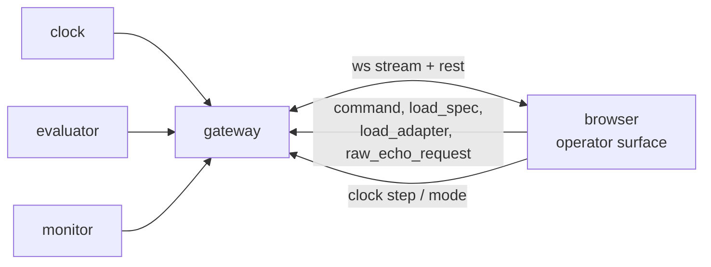

# P7 — operator surface

## Purpose

The window into a running monitor: the data going in, the propositions it is evaluated
against, the automaton it is driving, the clock driving that, and what the whole thing cost
to compute. It renders what it is told exists and imports nothing from the monitor — a
robot with a vocabulary this package has never heard of must render unchanged.

It is a **browser** surface served over the P6 gateway. The retired Tk panel could not show
a point cloud, could not draw a live automaton, and could not be opened from the far side
of a link — all three are requirements now.

## Where it sits

One transport. The direct-DDS client is gone: it existed so the panel could run on the lab
bench, and the gateway now runs there too.

## Services

`skill-surface` — static assets served by the gateway itself, so there is no second
process, no second port and no CORS. **No build step**: hand-written HTML, CSS and ES
modules, loaded directly. A toolchain that has to be installed before the operator can see
a verdict is a toolchain that will be broken on the day it matters.

`--mock` moves to the gateway: `gateway --mock` synthesises the whole wire from a simulated
monitor, so the surface can be developed and demonstrated on a machine with no ROS.

## Inputs

Everything arrives on one WebSocket multiplex, framed exactly as the topic it came from —
see [api.md](../api.md#gateway-api). The panel subscribes; it never polls a sampled
endpoint for anything that must not be missed.

| input | gives the surface | producer |
|---|---|---|
| [`/monitor/tick`](../api.md#monitortick--clock--everyone) | `seq`, `t`, `t0`, effective `tick_hz`, `mode` | P1 |
| [`/monitor/observation`](../api.md#monitorobservation--evaluator--monitor-frontend) | `sensors` (every schema key, every tick), `ap_values`, `unknown_aps`, `confidence`, per-source `data_health` | P3 |
| [`/monitor/verdict`](../api.md#monitorverdict--monitor--supervisor-frontend) | `step`, verdict, per-formula status, failure modes with per-mode confidence, `risk`, `intervention`, `missed_ticks` | P4 |
| [`/monitor/adapter`](../api.md#monitoradapter-latched--evaluator--everyone) *(latched)* | the loaded descriptor: schema, every source's topic, type, `expected_hz`, resolved steps | P3 |
| [`/monitor/manifest`](../api.md#monitormanifest-latched--monitor--everyone) *(latched)* | the spec as authored — description, APs with their rules, formulas, phases, bounds — and `source` | P4 |
| [`/monitor/raw_echo`](../api.md#monitorraw_echo_request--monitorraw_echo) | the actual decoded message from one chosen source | P3 |
| `/monitor/spec_status`, `/monitor/adapter_status` *(latched)* | whether the last pushed document was accepted, and why not | P4, P3 |

## Outputs

| output | consumers |
|---|---|
| `/monitor/command` — arm ｜ reset ｜ pause ｜ resume | P4 |
| `/monitor/load_spec` — the edited spec | P4 |
| `/monitor/load_adapter` — the edited descriptor **(new, see Design)** | P3 |
| `/monitor/raw_echo_request` | P3 |
| `POST /api/clock/step`, `/api/clock/mode` | P1 |

## Design

### The eight panes, and what each is actually reading

**1 — Spec and config, editable, hot-reloaded.** Two editors side by side: the free-language
skill **description** the spec was generated from, and the **adapter descriptor**. Both come
off latched topics, so opening the page shows what is loaded right now rather than what is
on someone's disk. `load_spec` already exists and is validated against the schema last seen
on `/monitor/adapter`; `load_adapter` is new and needs P3.

**Reloading the descriptor ends the episode, and the surface must say so before it sends.**
A descriptor swap can change the schema, and the automaton's APs are compiled against those
keys — a live swap would leave the monitor stepping an automaton whose propositions refer to
fields that no longer exist, silently always-false. Spec reload has the same problem for the
same reason. So both are: validate → confirm → reset → reload → re-arm, and the confirm
dialogue names the episode it is about to end. A hot reload that quietly invalidates the
evidence is worse than a restart, because a restart is visible.

**2 — Raw input, per topic.** One row per source from the adapter's `sources`: topic name,
message type, `expected_hz` against measured `rate_hz`, `age_s`, `samples_this_tick`,
`refreshed`, `dropped`. A source below its expected rate renders as an alert, not as a
number to notice.

Selecting a row opens the **actual decoded message** via `raw_echo`. This stays opt-in and
one source at a time, and the reason is unchanged: a point cloud per frame is not free and
the panel is usually across a link. What *is* new is that this is no longer the only way to
see real data —

**3 — Plots, which cost nothing extra.** Every observation already carries every schema key,
every tick. So the time series are free: an X-Y track with the goal and next waypoint,
`min_range` over time against the collision threshold, velocity traces, `confidence` over
time. Ring buffer in the page, no server-side history, no new topic. This is the pane that
answers "what was the robot actually doing when it said that", and it is built entirely out
of a stream the monitor is already publishing.

**Not a 3D viewport.** A point-cloud renderer is a project, and everything above is a
reading of data that already exists. If depth needs to be *seen* rather than reduced, rviz2
is already installed on the robot and is better at it — the monitor should not grow a second
one to prove it can.

**4 — Which AP is evaluated against which data.** For each AP: its rule, the sensor keys the
rule references, the live value of each of those keys, and the resulting boolean — or its
name in `unknown_aps`, which is the case that matters, because an AP that could not be
evaluated is not an AP that is false.

The mapping is not new work: `spec_contract.sensor_keys_in_rule()`
([spec_contract.py:46](../../skill_monitor/core/spec_contract.py#L46)) already extracts
exactly this, because it is how a pushed spec is validated against the schema. P4 publishes
the map on the manifest rather than making every client re-parse the rules and drift from
the validator.

**5 — The automaton, with the current state lit and the path from the initial state.** Per
formula: states, edges, the accepting and sink sets, the initial state, the current state,
and the sequence of states this episode has actually passed through.

**Structure is published as nodes and edges, not as a rendered image.** A PNG cannot be
highlighted, and it dates the moment the spec is pushed. Spot can emit the graph once, on
the latched manifest; the page lays it out. These automata have single-digit state counts,
so a layered left-to-right layout in a few dozen lines of SVG beats taking a graphviz
dependency into the browser — and the highlight is then just a class attribute.

The traversed path is the honest part of this pane. It needs `state` on each entry of the
verdict's `formulas[]`, and the path is accumulated by the page from the verdict stream,
which means a page opened mid-episode shows the path **from when it connected**, and says
so. It must not draw a line it did not witness.

**6 — Clock.** `seq`, `t`, `t0` as a wall time, effective `tick_hz`, `mode`, and
`missed_ticks` from the verdict. Plus the control: `manual` mode and a step button turn the
whole system into a debugger where one click advances every service by exactly one tick.

The effective rate is the one on the wire, never the descriptor's — a CLI override that the
panel does not reflect makes every seconds-denominated number on the page wrong.

**7 — Cost.** How long the tick took, split by stage: fold, AP evaluation, automaton step,
verdict publication. Shown as the current tick and a rolling distribution, against the tick
budget `1/tick_hz` — the number that matters is not the mean, it is how close the worst tick
came to the budget, because that is the one that will start dropping ticks.

This needs new fields. Nothing times itself today, and a benchmark the operator cannot see
is a benchmark nobody runs.

**8 — Loaded configuration.** What this monitor is actually running: descriptor name and
where it was loaded from, spec name and `source`, every topic subscribed and every topic
published, the clock mode, `step` against the spec's `max_steps` with the remaining budget,
and the declared provenance of the data.

**On "is it real or simulated" — the monitor cannot know, and the surface must not pretend
otherwise.** Hardware agnosticism is the whole claim: `real_g1`, `mujoco` and `isaac_lab`
declare an identical schema over different topics, and the engine is unable to tell them
apart. So the surface reports the descriptor's **declared** provenance and labels it as a
declaration by whoever launched the container — not a verified fact. A badge reading "REAL"
that the monitor inferred would be a lie the first time someone replays a bag through the
real descriptor, which is a thing this project does on purpose.

### What this pane set requires from the backend

Five additions. Each is small, each is owned by the package that already owns the payload,
and each must land in [api.md](../api.md) before it is implemented — package docs do not
carry schemas.

| field | on | owner | why it cannot be derived client-side |
|---|---|---|---|
| `ap_dependencies` — AP name → the sensor keys its rule reads | manifest *(latched)* | P4 | re-parsing rules in the browser forks the validator; one drift and the panel shows a dependency the engine does not agree with |
| `automata` — per formula: nodes, edges, initial, accepting, sink | manifest *(latched)* | P4 | only the monitor has Spot |
| `formulas[].state` — current automaton state | verdict | P4 | the panel cannot infer state from a status |
| `timing` — per-stage nanoseconds for the tick | observation (fold, AP eval) and verdict (step, publish) | P3, P4 | wall-clock at the browser measures the link, not the computation |
| `provenance` — declared `real ｜ sim ｜ replay`, descriptor path, publisher | adapter *(latched)* | P3 | it is a declaration, and declarations belong on the wire beside what they describe |

Plus one new topic pair, `/monitor/load_adapter` → `/monitor/adapter_status`, mirroring
`load_spec`/`spec_status` exactly — same validate-then-answer shape, same latched status.
Owner P3.

**None of these are blocking.** Every pane degrades to "not reported by this build" when its
field is absent, and the surface is usable the day the WebSocket connects. That is
deliberate: P4 is still in review and P3 is not started, and a frontend that cannot be
started until both land is a frontend that gets built last and rushed.

### The rest

**Everything rendered comes from a manifest.** No navigation-specific widget, no spec read
from disk, no schema key named in the source. The gripper-schema test is the guard and it
keeps passing.

**`STATE_TOPIC` is the discovery key, not merely a subscription.** Discovery now goes
through `core/discovery.py` and the gateway's namespace endpoint rather than a client-side
graph scan — the browser has no DDS. The old panel found monitors by scanning for
`<ns>/ltl/state_description`; that name no longer exists.

**Every mutating call carries `X-Skill-Monitor`.** The gateway requires it, so a fetch that
omits it gets a 403 that looks like a bug in the gateway and is not. See
[api.md](../api.md#the-trust-boundary).

## Files owned

- `skill_monitor/frontend/*` — the retired Tk panel is deleted here, not left as a second
  surface to keep honest
- `skill_monitor/frontend/static/*` — the page
- `deploy/Dockerfile.skill_center`
- `tests/test_skill_center.py`

The gateway's static-file serving is one route and belongs to P6; ask for it in the PR
rather than editing `gateway.py`.

## Depends on

P0 for payloads and topic names; **P6 for the transport, which is merged**. The five backend
fields above are wanted, not required — build against their absence first.

## Test plan

No browser and no ROS. The view models are pure functions from recorded frames; the DOM is
thin enough that testing it would test the DOM.

- `test_view_model_from_one_recorded_frame` — every pane's model built from one captured
  tick, asserted field by field
- `test_a_schema_the_panel_has_never_seen_renders` — the gripper vocabulary, unchanged
- `test_a_source_below_expected_rate_is_an_alert`
- `test_ap_dependencies_agree_with_the_validator` — the published map equals
  `sensor_keys_in_rule` for every AP in the shipped spec. This is the drift guard
- `test_an_unevaluated_ap_is_not_a_false_ap` — a name in `unknown_aps` renders as unknown
- `test_automaton_path_starts_where_the_page_connected` — a page joining at step 40 claims
  no knowledge of steps 1–39
- `test_every_pane_degrades_when_its_field_is_absent` — a build with none of the five new
  fields renders, with each gap named
- `test_raw_echo_is_off_by_default_and_single_source`
- `test_reloading_a_document_confirms_before_it_resets` — neither spec nor descriptor reload
  can reach the wire without the episode-ending confirmation
- `test_seconds_come_from_the_effective_tick_hz` — not the descriptor's
- `test_provenance_is_rendered_as_a_declaration` — never as a verified fact
- `test_mock_gateway_frames_validate` — `--mock` frames pass `api.validate_*`, so the mock
  cannot drift from the contract it stands in for
- `test_clock_step_posts_exactly_one_step`
- `test_every_mutating_call_sends_the_csrf_header`

## Done when

The eight panes render from a live gateway and from `--mock`; the AP-dependency map is the
validator's own; the automaton lights the current state and claims only the path it
witnessed; provenance reads as a declaration; and a build missing all five new backend
fields still renders, naming what it cannot show.

## Non-goals

A 3D point-cloud viewport — rviz2 exists and is better at it. Serving the API or adding
routes to `gateway.py` (P6). Deciding verdicts (P4). Generating specs — the surface edits
and pushes the description, the describer generates. The docker-socket root-equivalence
policy (P8).
