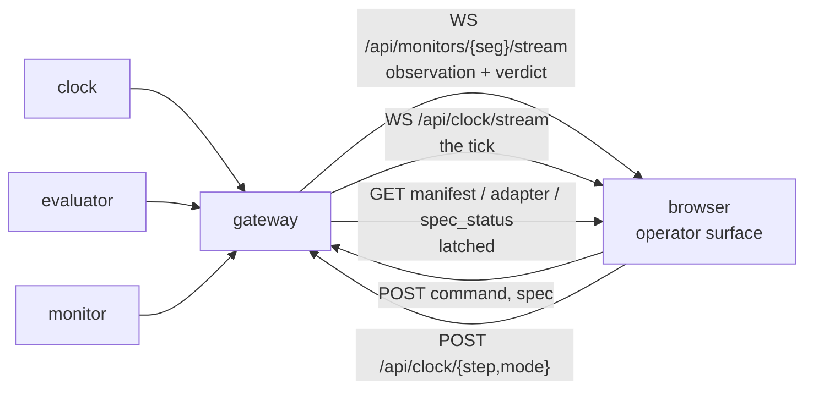

# P7 — operator surface

## Purpose

The window into a running monitor: the data going in, the propositions it is evaluated
against, the automaton it is driving, the clock driving that, and what the whole thing cost
to compute. It renders what it is told exists and imports nothing from the monitor — a
robot with a vocabulary this package has never heard of must render unchanged.

It is a **browser** surface served over the P6 gateway. The Tk panel it replaces — still on
disk at `frontend/skill_center.py`, and deleted by this package rather than by this
document — cannot show a point cloud, cannot draw a live automaton, and cannot be opened
from the far side of a link. All three are requirements now.

## Where it sits

One **host**, not one socket. The direct-DDS client is gone — it existed so the panel could
run on the lab bench, and the gateway now runs there too — but what replaces it is three
shapes on one origin, and the page is simpler if it is honest about which is which up
front. See [Inputs](#inputs) for the row-by-row mapping and for the two topics that have no
route at all today.

## Services

`skill-surface` — static assets served by the gateway itself, so there is no second
process, no second port and no CORS. **No build step**: hand-written HTML, CSS and ES
modules, loaded directly. A toolchain that has to be installed before the operator can see
a verdict is a toolchain that will be broken on the day it matters.

The gateway serves no static files today — it answers `/api/*` and 404s everything else — so
this is a request of P6, not a description. It sits in the
[backend asks](#what-this-pane-set-requires-from-the-backend) with the rest, because
`gateway.py` is P6's file and this package's own non-goals say so.

`--mock` should move to the gateway. `skill_center.py` has one today; `gateway.py` does not
(`--host --port --clock-url --stale-after --queue --spec-timeout --max-streams
--max-requests --allow-origin --allow-host --no-ros --log-level`), and a mock that
synthesises the whole wire is the difference between developing this surface on a laptop
and not developing it at all. Also a P6 ask, and also in that table.

## Inputs

Every payload is byte-identical to the topic it came from — see
[api.md](../api.md#gateway-api) — but the *transports* are three, not one, and the split is
the gateway's deliberate rule rather than an accident: **WS is the stream, REST is the
sample**. Anything that must not miss a tick is subscribed; anything latched is fetched,
because a client that reconnects wants the current value rather than a wait for a change
that may never come. `gateway.py` states it as a design constraint and refuses to grow a
`GET .../latest`. So the page opens two sockets and does three GETs, and the row below says
which is which.

| input | how it reaches the page | gives the surface | producer |
|---|---|---|---|
| [`/monitor/tick`](../api.md#monitortick--clock--everyone) | **`WS /api/clock/stream`** — a *second* socket, proxied verbatim from the clock; the frame is the identical payload | `seq`, `t`, `t0`, effective `tick_hz`, `mode` | P1 |
| [`/monitor/observation`](../api.md#monitorobservation--evaluator--monitor-frontend) | `WS /api/monitors/{seg}/stream` | `sensors` (every schema key, every tick), `ap_values`, `unknown_aps`, `confidence`, per-source `data_health` | P3 |
| [`/monitor/verdict`](../api.md#monitorverdict--monitor--supervisor-frontend) | the same socket — `STREAM_TOPICS` is exactly these two | `step`, verdict, per-formula status, failure modes with `fault_category` and per-mode confidence, `risk`, `intervention`, `missed_ticks` | P4 |
| [`/monitor/adapter`](../api.md#monitoradapter-latched--evaluator--everyone) *(latched)* | `GET /api/monitors/{seg}/adapter` | the loaded descriptor: schema, every source's topic, type, `expected_hz`, resolved steps | P3 |
| [`/monitor/manifest`](../api.md#monitormanifest-latched--monitor--everyone) *(latched)* | `GET .../manifest` | the spec as authored — description, APs with their rules, formulas, phases, bounds — and `source` | P4 |
| `/monitor/spec_status` *(latched)* | `GET .../spec_status`, and also returned inline by the spec POST | whether the last pushed spec was accepted, and why not | P4 |
| [`/monitor/raw_echo`](../api.md#monitorraw_echo_request--monitorraw_echo) | **no route** — it is neither in `STREAM_TOPICS` nor in `api.LATCHED_TOPICS`, so the gateway has no way to hand it to a browser | the actual decoded message from one chosen source | P3, and a P6 route |
| `/monitor/adapter_status` *(latched)* | **no route, and no topic constant** | whether the last pushed descriptor was accepted | P0, then P3 |

The three latched GETs come free: `LATCHED_ROUTES` is *derived* from `api.LATCHED_TOPICS`
rather than listed, so a topic added to that frozenset gains an endpoint with no edit to
`gateway.py`. That is why `adapter_status` is cheap on the read side and not on the write
side — see the asks table.

## Outputs

| output | route today | consumers |
|---|---|---|
| `/monitor/command` — arm ｜ reset ｜ pause ｜ resume | `POST /api/monitors/{seg}/command` | P4 |
| `/monitor/load_spec` — the edited spec | `POST .../spec`, replying with `spec_status` | P4 |
| `/monitor/load_adapter` — the edited descriptor | **none** — `INGRESS_TOPICS` is `{command, spec}` | P0, P6, P3 |
| `/monitor/raw_echo_request` | **none** — same reason | P0 has the constant; P6 has the route |
| `POST /api/clock/step`, `/api/clock/mode` | proxied under the clock's own paths | P1 |

Two of the five have no way onto the wire from a browser. That is not a detail the design
can defer, because the panes that depend on them — descriptor reload and raw echo — are
otherwise specified as if the transport existed.

## Design

### The eight panes, and what each is actually reading

**1 — Spec and config, editable, hot-reloaded.** Two editors side by side: the free-language
skill **description** the spec was generated from, and the **adapter descriptor**. Both come
off latched topics, so opening the page shows what is loaded right now rather than what is
on someone's disk. `load_spec` already exists end to end — constant, ingress route, latched
answer. `load_adapter` exists nowhere: it needs a topic constant from P0, an `INGRESS_TOPICS`
entry from P6, and a handler from P3, in that order. The descriptor editor therefore ships
read-only first, with the push disabled and the reason on the button.

**Reloading the descriptor ends the episode, and the surface must say so before it sends.**
A descriptor swap can change the schema, and the automaton's APs are compiled against those
keys — a live swap would leave the monitor stepping an automaton whose propositions refer to
fields that no longer exist, silently always-false. Spec reload has the same problem for the
same reason. So both are: validate → confirm → reset → reload → re-arm, and the confirm
dialogue names the episode it is about to end. A hot reload that quietly invalidates the
evidence is worse than a restart, because a restart is visible.

**2 — Raw input, per topic.** One row per source from the adapter's `sources`: topic name,
message type, `expected_hz` against measured `rate_hz`, `age_s`, `samples_this_tick`,
`refreshed`, `dropped`. A source below its expected rate renders as an alert, not as a
number to notice.

Selecting a row would open the **actual decoded message** via `raw_echo`, opt-in and one
source at a time, and the reason for that discipline is unchanged: a point cloud per frame
is not free and the panel is usually across a link.

**This pane's echo half cannot be built yet, and the design should not pretend it can.**
`/monitor/raw_echo_request` has no publish route and `/monitor/raw_echo` has no read route;
both live in `gateway.py`, which this package's own non-goals forbid it from editing. So the
row table ships — it is `data_health` off the observation, which already streams — and the
echo is a disabled affordance naming the missing route, until P6 adds it. What matters is
that the row table was never the fallback for the echo: it is the pane, and the echo is the
zoom.

**3 — Plots, most of which cost nothing extra.** Every observation already carries every
schema key, every tick. So these time series are genuinely free: `min_range` over time
against the collision threshold, the `linear_vel` and `angular_vel` traces, and `confidence`
over time. Ring buffer in the page, no server-side history, no new topic. This is the pane
that answers "what was the robot actually doing when it said that", built entirely out of a
stream the monitor is already publishing.

**The X-Y track is not free, and calling it free was the error worth naming.** No shipped
descriptor's schema has position, goal or waypoint coordinates: `nav_schema.json` — the one
schema all three descriptors reference — declares `angular_vel`, `base_height`, `base_pitch`,
`base_roll`, `current_target_idx`, `image_similarity_to_goal`, `linear_vel`, `min_range`,
`mission_finished`, `nav_mode`, `nav_state`, `nav_stuck`, `num_waypoints` and
`upright_flag`. `num_waypoints` is a count, and `current_target_idx` an index into a list the
monitor never receives. There is nothing to plot against nothing.

It is also not a plot P7 may simply request. The monitor is contracted to stay independent of
the navigation algorithm and must not read the planner's internals — that is the agnosticism
claim in its strongest form, and a pane that wants a track is a pane asking for exactly the
data most easily satisfied by subscribing to the planner. The request only survives if the
keys come from the robot and from the goals it was commanded to reach, which is precisely the
line [P12](P12-planner-independent-schema.md) draws. So the track goes in the asks table
against P12's keys, not P3's, and it renders when they exist.

**Not a 3D viewport.** A point-cloud renderer is a project, and everything above is a
reading of data that already exists — the monitor should not grow a renderer to prove it can.
The shipped visualisation stack (`sim/Dockerfile.foxglove`) is where a human looks at depth.

**4 — Which AP is evaluated against which data.** For each AP: its rule, the sensor keys the
rule references, the live value of each of those keys, and the resulting boolean — or its
name in `unknown_aps`, which is the case that matters, because an AP that could not be
evaluated is not an AP that is false.

The mapping is not new work: `spec_contract.sensor_keys_in_rule()`
([spec_contract.py:46](../../skill_monitor/core/spec_contract.py#L46)) already extracts
exactly this, because it is how a pushed spec is validated against the schema. P4 publishes
the map on the manifest rather than making every client re-parse the rules and drift from
the validator.

**5 — The automaton, with the current state lit and the path from the initial state.** Per
formula: states, edges, the accepting and sink sets, the initial state, the current state,
and the sequence of states this episode has actually passed through.

**Structure is published as nodes and edges, not as a rendered image.** A PNG cannot be
highlighted, and it dates the moment the spec is pushed. Spot can emit the graph once, on
the latched manifest; the page lays it out. These automata have single-digit state counts,
so a layered left-to-right layout in a few dozen lines of SVG beats taking a graphviz
dependency into the browser — and the highlight is then just a class attribute.

The traversed path is the honest part of this pane. It needs `state` on each entry of the
verdict's `formulas[]`, and the path is accumulated by the page from the verdict stream,
which means a page opened mid-episode shows the path **from when it connected**, and says
so. It must not draw a line it did not witness.

**And the automaton is not the only fault detector, so this pane must not be read as the
whole story.** `verdict.failure_modes[]` carries the spec's named modes *and* the phase
machine's own faults, synthesised as
`phase:<phase>:<invariant｜timeout｜progress｜precondition>` — a stable name per
(phase, kind) precisely so a consumer can key on it.
Those never appear in `formulas[]` and have no automaton to light up. Each entry carries a
`fault_category` from a closed vocabulary (`SAFETY`, `INVARIANT`, `TIMEOUT`, `PROGRESS`),
and a category the engine could not classify ships as `PROGRESS` rather than as something
alarming. The surface renders the category as given and does not re-rank it: an
unclassifiable fault is not thereby a severe one, and the spec that named it was already
rejected at load if the spelling was unrecognised.

**6 — Clock.** `seq`, `t`, `t0` as a wall time, effective `tick_hz`, `mode`, and
`missed_ticks` from the verdict. `seq`/`t`/`t0`/`tick_hz`/`mode` arrive on
`WS /api/clock/stream`; the page also reads `GET /api/clock` on load so it has values before
the first pulse. Plus the control: `manual` mode and a step button turn the whole system
into a debugger where one click advances every service by exactly one tick.

**That `GET /api/clock` must carry `X-Skill-Monitor` or it is a 403.** The whole proxied
clock surface is gated, reads included — see [The rest](#the-rest). This pane is the reason
the rule has to be stated as "every clock request" rather than "every mutating call": under
the looser rule, the one pane that opens on page load fails first.

The effective rate is the one on the wire, never the descriptor's — a CLI override that the
panel does not reflect makes every seconds-denominated number on the page wrong.

**7 — Cost.** How long the tick took, split by stage: fold, AP evaluation, automaton step,
verdict publication. Shown as the current tick and a rolling distribution, against the tick
budget `1/tick_hz` — the number that matters is not the mean, it is how close the worst tick
came to the budget, because that is the one that will start dropping ticks.

This needs new fields. Nothing times itself today, and a benchmark the operator cannot see
is a benchmark nobody runs.

**The two halves do not arrive at the same rate, and a naive join would misreport the
budget.** The observation is published once per tick *always*, including ticks where nothing
arrived. The verdict is published exactly once per tick **the monitor stepped** — a paused,
halted or idle monitor emits none, and a redelivered `seq` emits none. So splitting `timing`
across the two payloads means the fold and AP-eval halves have strictly more samples than the
step and publish halves, and a "rolling distribution" over both is two distributions with
different cardinality drawn as one. The pane keys both halves on `seq`, charts the stage
totals only for ticks that produced both, and shows the unmatched observation ticks as what
they are: ticks the monitor did not judge. Reconstructing the tick axis from `seq` and
`missed_ticks` rather than from message counts is the same discipline every other consumer
of the verdict owes.

**8 — Loaded configuration.** What this monitor is actually running: descriptor name and
where it was loaded from, spec name and `source`, every topic subscribed and every topic
published, the clock mode, `step` against the spec's `max_steps` with the remaining budget,
and the declared provenance of the data.

**On "is it real or simulated" — the monitor cannot know, and the surface must not pretend
otherwise.** Hardware agnosticism is the whole claim: `real_g1`, `mujoco` and `isaac_lab`
declare an identical schema over different topics, and the engine is unable to tell them
apart. So the surface reports the descriptor's **declared** provenance and labels it as a
declaration by whoever launched the container — not a verified fact. A badge reading "REAL"
that the monitor inferred would be a lie the first time someone replays a bag through the
real descriptor, which is a thing this project does on purpose.

### What this pane set requires from the backend

Six payload fields and six routes or topic constants — and the ownership is not one package
per row, which was the assumption worth correcting. `api.validate_*` is **closed by
default**: `_check_fields` reports every unknown field as a problem unless the caller passes
`closed=False`, and only the manifest does. So a payload field is not a matter of "the
package that owns the payload adds it"; it is P0 opening `core/api.py` first and the
producing package second. A field emitted before P0 opens it does not merely go unrendered —
it makes the payload *invalid*, and the producer's own tests are what break.

Each ask must land in [api.md](../api.md) before it is implemented; package docs do not
carry schemas.

**Payload fields.**

| ask | on | owner | why it cannot be derived client-side |
|---|---|---|---|
| `ap_dependencies` — AP name → the sensor keys its rule reads | manifest *(latched)* | **P4 alone** — the manifest is the one payload validated with `closed=False`, because it is passed through as authored | re-parsing rules in the browser forks the validator; one drift and the panel shows a dependency the engine does not agree with |
| `automata` — per formula: nodes, edges, initial, accepting, sink | manifest *(latched)* | **P4 alone**, same reason — but see the note below on `core/automata.py` | only the monitor has Spot |
| `formulas[].state` — current automaton state | verdict | **P0** (`_FORMULA_FIELDS` is closed too, and entries are checked by `_check_each`), then **P4** — `LTLMonitor.current_state` is already public, so P4 reads it without touching `automata.py` | the panel cannot infer state from a status |
| `timing` — per-stage nanoseconds for the tick | observation (fold, AP eval) and verdict (step, publish) | **P0** (`_OBSERVATION_FIELDS`, `_VERDICT_FIELDS`), then P3 and P4 | wall-clock at the browser measures the link, not the computation |
| `provenance` — declared `real ｜ sim ｜ replay`, descriptor path, publisher | adapter *(latched)* | **P0** (`_ADAPTER_FIELDS`), then P3 | it is a declaration, and declarations belong on the wire beside what they describe |
| position, goal and next-waypoint keys — the X-Y track | the observation's `sensors`, via the schema | **P12** | they exist in no schema today, and they may only come from odometry and the commanded goals, never from the planner's self-report |

P0's edit is small and need not be a wire break: `_check_fields` takes an `optional` tuple
for exactly this, and `_STEP_OPTIONAL` is the precedent — a field added there validates when
sent and is tolerated when absent, so no producer breaks and `SCHEMA_VERSION` stays put.

For the track, the six keys are already specified: [P12](P12-planner-independent-schema.md)
publishes `pos_x`, `pos_y`, `goal_x`, `goal_y`, `next_x`, `next_y` from odometry, `/waypoint`
and `/next_waypoint`. P7 asks for nothing new there — it asks to be sequenced after P12, and
draws no track until then.

**Routes and topics.** These are not payload fields and do not belong to the payload's owner.

| ask | owner | note |
|---|---|---|
| `/monitor/load_adapter` and `/monitor/adapter_status` as constants, each with a `VALIDATORS` entry, and `adapter_status` in `api.LATCHED_TOPICS` | **P0** | api.md is explicit: topic names are "declared once as constants in `core/api.py`. Nothing else in the repo may contain a `/monitor/...` string literal". The gateway's ingress routes call `validate_for_topic`, and an unregistered topic there is itself a problem, not a pass |
| the `load_adapter` ingress route — an `INGRESS_TOPICS` entry | **P6** | `gateway.py` is P6's file. The *GET* for `adapter_status` costs nothing once the constant lands, because `LATCHED_ROUTES` is derived from `api.LATCHED_TOPICS` |
| validate-and-answer for a pushed descriptor | **P3** | mirroring `load_spec`/`spec_status` exactly — same shape, same latched status |
| the `raw_echo_request` ingress route and a way to read `/monitor/raw_echo` | **P6 alone** | pane 2's echo half. Both constants and both validators are already in `core/api.py`, so P0 owes nothing here — only the transport is missing |
| static-file serving | **P6** | one route. Without it there is no page to load, only an API |
| `gateway --mock` | **P6** | without it this surface can only be developed against a live ROS graph, which is the machine nobody building a frontend has |

**A gap in the ownership matrix, not an ask.** The `automata` row is the one that cannot be
satisfied from a payload owner's own files. `skill_monitor/core/automata.py` is the only file
in the repo that imports `spot`, and what it exposes today is `export_dot()` — DOT text — plus
`num_states()`; the sink set is private and there is no nodes-and-edges accessor. Emitting
the graph as JSON is therefore a new method on `LTLMonitor`, in that file. And that file
appears in **no package's "Files owned" list** — not P4's, which owns
`backend/monitor_node.py`, `core/manifest.py`, `tests/test_manifest.py` and
`backend/ablation_runner.py`. Assigning it to P4 here would be this document quietly
allocating a file, which is the thing the matrix exists to prevent. It needs an owner before
that row can be built; naming the gap is P7's whole contribution to it.

**None of the payload fields are blocking.** Every pane degrades to "not reported by this
build" when its field is absent, and the surface is usable the day the WebSocket connects.
That is deliberate: a frontend that cannot be started until P0, P3, P4 and P12 have all
landed is a frontend that gets built last and rushed.

**One of the routes is.** Static-file serving is not a degradation: without it the browser
has nothing to fetch, and there is no surface to run at all. The other two P6 routes are not
blocking but are not degradations either — the descriptor push and the raw echo ship
*visibly disabled*, naming the route they wait on, which is a different thing from a pane
that renders with a field missing. All three are P6's, and P7 asks for them in a PR comment
rather than editing `gateway.py`.

### The rest

**Everything rendered comes from a manifest.** No navigation-specific widget, no spec read
from disk, no schema key named in the source. The gripper-schema test is the guard and it
keeps passing.

**`STATE_TOPIC` is the discovery key, not merely a subscription — and it has not moved
yet.** [skill_center.py:43](../../skill_monitor/frontend/skill_center.py#L43) still reads
`STATE_TOPIC = "ltl/state_description"`, and `parse_namespaces`
([:51-62](../../skill_monitor/frontend/skill_center.py#L51)) still finds monitors by scanning
the graph for that suffix. [api.md § Migration](../api.md#migration-from-ltl) lists it as
**P7's outstanding item**, and it is the one that bites: the panel finds *zero* monitors the
moment the producers rename, because a subscription that goes quiet looks like an idle robot
while a discovery key that goes quiet looks like an empty lab.

Moving it is this package's work, and the landing is already prepared. `core/discovery.py`
holds the one implementation of `parse_namespaces` and `health`; P6 imports from it and
deleted *its* copies rather than editing a file mid-flight that belongs to someone else. That
module's `parse_namespaces` takes a **`key_topic` parameter, and its docstring says the
parameter exists precisely so P7 can share the implementation while its discovery is still
keyed off the pre-migration name.** So P7 deletes its two copies and imports, passing
`key_topic` explicitly, and flips the default to `api.VERDICT` when the rename lands — one
implementation throughout, and never a window in which the gateway and the panel answer "is
this monitor alive" differently. The browser has no DDS in any case: it discovers through
`GET /api/monitors`, and the graph scan is only the desktop client's problem.

**Every mutating call carries `X-Skill-Monitor: 1` — and so does every clock request,
including `GET`.** The gateway's own rule, from its module docstring and enforced in
`_dispatch`, is `method != "GET" or is_clock`. The clock proxy is deliberately path- and
method-transparent, so the gateway cannot know which of the clock's `GET`s have side effects:
`GET /api/clock/step` advances a tick and is reachable from an `` tag, and treating the
whole proxied surface as state-changing is the only policy consistent with not enumerating
it. A page that learns the rule as "mutating calls only" ships a pane 6 that 403s on load, so
the rule the code enforces is the rule this document states.

WebSocket handshakes are exempt, because a browser cannot set a header on one at all; they
are gated on `Origin` instead, which means `--allow-origin` must name the console's origin
before either socket opens. See [api.md](../api.md#the-trust-boundary) — which still states
the narrower rule, and is P9's file to correct.

## Files owned

- `skill_monitor/frontend/*` — the Tk panel is deleted here, not left as a second surface to
  keep honest, and `STATE_TOPIC` goes with it
- `skill_monitor/frontend/static/*` — the page
- `deploy/Dockerfile.skill_center`
- `tests/test_skill_center.py`

`tests/test_gateway.py` is **not** on that list — it is P6's, along with `gateway.py`
itself. Anything that exercises the gateway's own behaviour, `--mock` frames included, is
written there by P6, not here.

## Depends on

P0 for payloads and topic names; **P6 for the transport, which is merged** — though "merged"
means the two stream routes, the three latched GETs and the two ingress POSTs, and not the
static files, the mock, or the raw-echo and `load_adapter` routes this package still needs.
The payload fields above are wanted, not required — build against their absence first. The
X-Y track waits on P12 and is drawn by nothing until then.

## Test plan

No browser and no ROS. The view models are pure functions from recorded frames; the DOM is
thin enough that testing it would test the DOM.

- `test_view_model_from_one_recorded_frame` — every pane's model built from one captured
  tick, asserted field by field
- `test_a_schema_the_panel_has_never_seen_renders` — the gripper vocabulary, unchanged
- `test_a_source_below_expected_rate_is_an_alert`
- `test_ap_dependencies_agree_with_the_validator` — the published map equals
  `sensor_keys_in_rule` for every AP in the shipped spec. This is the drift guard
- `test_an_unevaluated_ap_is_not_a_false_ap` — a name in `unknown_aps` renders as unknown
- `test_automaton_path_starts_where_the_page_connected` — a page joining at step 40 claims
  no knowledge of steps 1–39
- `test_every_pane_degrades_when_its_field_is_absent` — a build with none of the new payload
  fields renders, with each gap named
- `test_a_pane_with_no_route_says_so_rather_than_failing` — descriptor push and raw echo,
  whose transports do not exist, render disabled and name the missing route
- `test_raw_echo_is_off_by_default_and_single_source`
- `test_reloading_a_document_confirms_before_it_resets` — neither spec nor descriptor reload
  can reach the wire without the episode-ending confirmation
- `test_seconds_come_from_the_effective_tick_hz` — not the descriptor's
- `test_provenance_is_rendered_as_a_declaration` — never as a verified fact
- `test_cost_does_not_join_two_streams_of_different_cardinality` — feed a frame sequence with
  paused ticks: the observation half has samples the verdict half does not, and the
  distribution counts only ticks that produced both
- `test_a_phase_fault_is_visible_without_an_automaton` — a `phase:<phase>:<kind>` entry in
  `failure_modes` renders with its `fault_category`, though no formula changed status
- `test_clock_step_posts_exactly_one_step`
- `test_every_clock_request_sends_the_csrf_header` — reads included, because
  `GET /api/clock` is gated. The old name for this test was
  `..._every_mutating_call_...`, which is the wrong rule and would have passed while
  pane 6 403'd on load

**`--mock` is tested by P6, not here.** A `test_mock_gateway_frames_validate` — `--mock`
frames pass `api.validate_*`, so the mock cannot drift from the contract it stands in for —
is the right test and the wrong file: `tests/test_gateway.py` is P6's, and P7 owns only
`tests/test_skill_center.py`. P7 asks for it alongside the flag.

It is also **sequenced after P0.** A mock that emits `timing` or `provenance` before P0 opens
`_OBSERVATION_FIELDS`, `_VERDICT_FIELDS` and `_ADAPTER_FIELDS` fails that test by
construction — the frames are rejected as carrying unknown fields, and the failure looks like
a broken mock rather than a payload the contract has not yet admitted. So the mock emits the
fields it has, and gains the rest when P0 lands.

## Done when

The eight panes render from a live gateway and from `--mock`; the AP-dependency map is the
validator's own; the automaton lights the current state and claims only the path it
witnessed; provenance reads as a declaration; a build missing every new backend field still
renders, naming what it cannot show; and the two panes whose routes do not exist say which
route they are waiting for rather than failing.

## Non-goals

A 3D point-cloud viewport. Serving the API or adding routes to `gateway.py` (P6) — which is
why the static files, the mock, the raw-echo routes and `load_adapter` are asks and not work
items. Deciding verdicts (P4). Generating specs — the surface edits and pushes the
description, the describer generates. The docker-socket root-equivalence policy (P8).
