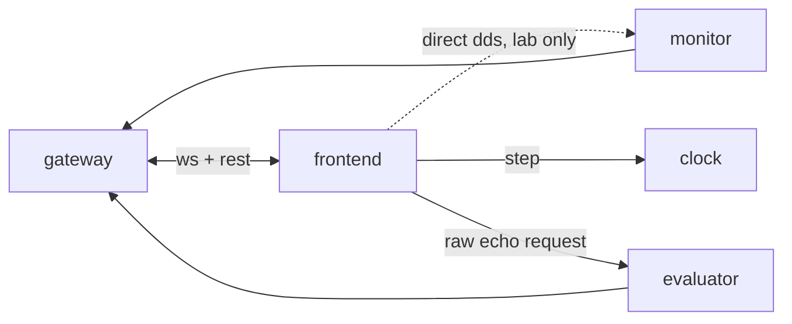

# P7 — frontend

## Purpose

The operator surface: which skills are being monitored, their state, their verdicts, **the
data stream going into the monitor**, and full control — arm, reset, pause, push a spec,
single-step the clock. Fully decoupled: it renders what it is told exists and imports
nothing from the monitor.

## Where it sits

## Services

`skill-center` — runs anywhere. **Standalone**: `--mock` drives the whole UI from a
simulated monitor with no ROS and no gateway, which is the only way to work on it on a
machine that cannot see the robot's DDS graph.

## Inputs

| input | schema | producer |
|---|---|---|
| gateway REST/WS **or** direct ROS topics | [api.md](../api.md) — identical payloads either way | P6, or P1/P3/P4 directly |
| `/monitor/manifest`, `/monitor/adapter` | latched | P4, P3 |
| `/monitor/observation`, `/monitor/verdict` | per tick | P3, P4 |
| `/monitor/spec_status` | latched | P4 |

## Outputs

| output | consumers |
|---|---|
| `/monitor/command` — arm ｜ reset ｜ pause ｜ resume | P4 |
| `/monitor/load_spec` | P4 |
| `/monitor/raw_echo_request` | P3 |
| `POST /api/clock/step`, `/mode` | P1 |

## Design

**One client interface, two implementations.** A `MonitorClient` protocol with a
`GatewayClient` and a `RosClient` behind it; the panel never branches on transport. "Both
transports" must be a swap of one class, not a second UI — the direct path is for the lab
bench and the sim host, the gateway path for anywhere else.

**The observation panel is the answer to "show me what goes in".** Per source: rate vs
`expected_hz`, age, samples this tick, refreshed or not, drops. A source below its expected
rate is the alert — rendered as such, not buried in a number. This is what explains a
verdict; raw topics do not, once folding is in play.

**Raw echo is opt-in, one source at a time.** A point cloud per frame is not free, and the
panel is often on the far side of a link. Default off; selecting a source sends
`raw_echo_request`, deselecting sends `null`.

**`STATE_TOPIC` is the discovery key, not merely a subscription.**
[skill_center.py:43](../../skill_monitor/frontend/skill_center.py#L43) — the panel finds
monitors by scanning for that topic name, so until it moves to `/monitor/verdict` the panel
discovers **zero monitors** and everything else looks broken. Move it first.

**Everything rendered comes from a manifest.** No navigation-specific widget, no spec read
from disk. A manipulation monitor with an entirely different vocabulary must render
unchanged — there is already a test that feeds it a gripper schema, and it must keep
passing.

**`--mock` stays first-class.** It speaks the real protocol, not an approximation, so it is
also the fixture for the panel's tests. If the contract changes and the mock does not, the
tests catch it.

**Clock control belongs here.** `manual` mode plus a step button turns the panel into a
debugger for the whole system: one click advances every service by exactly one tick.

**Layout is sized in text units, not pixels.** On the 120 DPI display this runs on, Tk
scales fonts ~1.66×; a fixed pixel geometry clips half of every table there while looking
right on a laptop.

## Files owned

- `skill_monitor/frontend/*`
- `deploy/Dockerfile.skill_center`
- `tests/test_skill_center.py`

## Depends on

P0 for payloads and topic names; P6 for the remote transport. The direct-ROS path can be
built against P0 alone.

## Test plan

No Tk and no ROS — the logic is pure and the widgets are thin.

- `test_discovery_uses_the_new_topic_name`
- `test_gateway_and_ros_clients_produce_identical_view_models` — one recorded frame, both
  clients, same model
- `test_observation_panel_rows_come_from_the_adapter_schema` — including a robot with a
  vocabulary the panel has never seen
- `test_a_source_below_expected_rate_renders_as_an_alert`
- `test_raw_echo_is_off_by_default_and_single_source`
- `test_timeline_events` — the existing suite, unchanged in spirit: phase transitions,
  failure modes flipping, staleness onset and recovery, warn onset, each logged once
- `test_mock_source_speaks_the_real_contract` — validates its frames with `api.validate_*`
- `test_clock_step_button_posts_exactly_one_step`

## Done when

Discovery works on the new topic name; the observation panel shows per-source health;
`--mock --mock-llm` still runs the entire UI with no ROS, no gateway and no model; and the
gripper-schema test still passes, proving nothing skill-specific crept in.

## Non-goals

Serving the API (P6). Deciding verdicts (P4). Containerising the docker socket policy (P8
documents the root-equivalence caveat).
