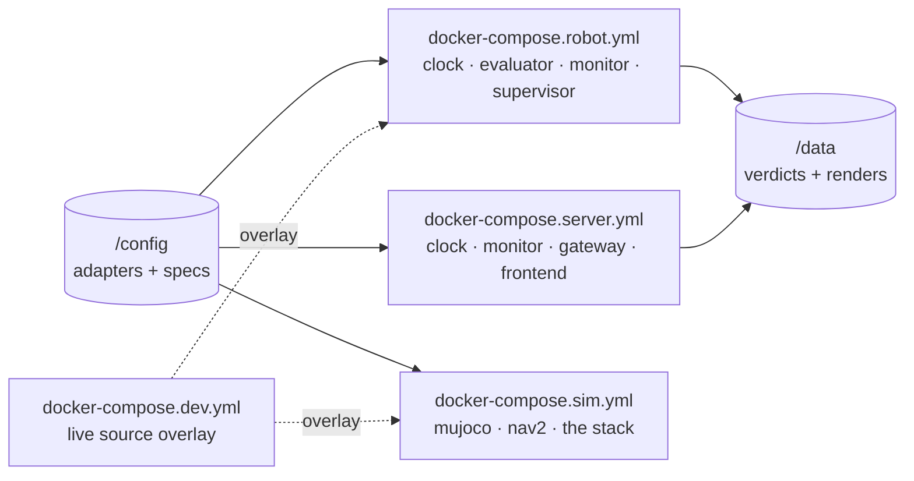

# P8 — config, images, compose

## Purpose

Makes every part a container with its artifacts on a volume rather than baked into the
image, and gives each tier a compose file. It also fixes a build that is currently broken:
the sim stack cannot start.

## Where it sits

## Services

None of its own — it packages everyone else's. Owns the `describer` image, which is a
one-shot job rather than a long-running service.

## Inputs

| input | meaning |
|---|---|
| `SKILL_MONITOR_CONFIG` env, or a CLI flag | where adapters and specs live |
| `/config` volume | `adapters/*.json`, `specs/*.json` — read-only |
| `/data` volume | verdict records, automaton renders — read-write |

## Outputs

- config resolution: **CLI flag > `SKILL_MONITOR_CONFIG` env > packaged defaults**
- `deploy/Dockerfile.describer`
- `deploy/docker-compose.{robot,server,dev}.yml`, and a repaired `sim/docker-compose.sim.yml`

## Design

**Artifacts on a volume, code in the image.** A skill or a robot changes without rebuilding,
and the robot can carry a spec the image never saw. `skill_monitor/__init__.spec_path()` and
`adapter_spec.ADAPTERS_DIR` gain the override
([__init__.py:16](../../skill_monitor/__init__.py#L16),
[adapter_spec.py:43](../../skill_monitor/core/adapter_spec.py#L43)).

**The packaged fallback stays, and that is not a hedge.** `python3 -m pytest` and a bare
`python3 -m skill_monitor…` must work on a machine with nothing mounted — that is how every
test in this repo runs, including in CI and on the dev host. Images still `COPY
skill_monitor/`, so a container with no volume boots with the bundled defaults and says so.

**The sim stack is broken today and this package fixes it.**
`sim/docker-compose.sim.yml:61,87` build `dockerfile: Dockerfile` and `Dockerfile.client`
against `context: ..`, and **neither path has existed since `e550c3b`** moved them to
`deploy/`. The same file then mounts `../skill_monitor:/app/skill_monitor` over the `COPY`
the image performed, so specs and descriptors arrive from two places with no stated rule —
which is how the first breakage went unnoticed.

**Live mounts are an overlay, not a default.** `docker-compose.dev.yml` carries them, applied
over any stack. A deployed image is then a self-contained versioned unit: the monitor's spec
is whatever that image tag plus that config volume says, with no third source.

**Four stacks, one image set.** robot (clock, evaluator, monitor tier-1, supervisor) · server
(clock, monitor tier-2, gateway, frontend) · sim (mujoco, nav2, the stack) · dev overlay.

**Containerising the frontend means mounting `/var/run/docker.sock`**, which is
root-equivalent control of the host daemon. Right for a lab console, wrong anywhere shared.
Write it in the compose file next to the mount, not only in a document.

**Tk in a container needs `DISPLAY` and `/tmp/.X11-unix`**, and fails obscurely without them.

**The describer is a job, not a service**: `docker compose run describer --description "…"`,
no ROS in the image, writes into `/config/specs`.

## Files owned

- `skill_monitor/__init__.py` — config resolution
- `deploy/*` — all Dockerfiles and compose files
- `sim/docker-compose.sim.yml`
- `tests/test_config_resolution.py`

## Depends on

Nothing — it can start immediately, in parallel with P0. It packages images whose entry
points other packages own, so it must not edit their source.

## Test plan

- `test_cli_flag_beats_env_beats_packaged_default`
- `test_missing_config_dir_falls_back_to_packaged_and_reports_it`
- `test_spec_path_and_adapters_dir_honour_the_same_override`
- `test_packaged_defaults_still_resolve_with_no_env_set` — the CI path
- `docker compose -f … config` resolves for all four stacks (a shell check, not pytest)

## Done when

All four stacks resolve with `docker compose config`; `pytest` passes with nothing mounted;
and a container started with `/config` mounted uses the volume's spec rather than the baked
one.

## Non-goals

Writing any service's code. Deciding what goes in `/config` — that is the artifact table in
[../architecture.md](../architecture.md#where-each-artifact-lives). Registry, CI, or image
publishing.
