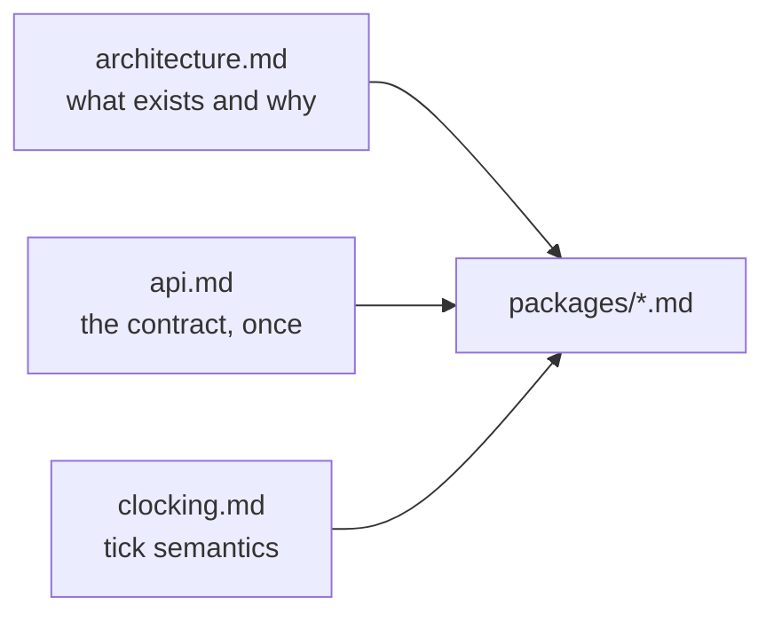

# P9 — documentation

## Purpose

Owns the three system-level documents every package links to, and keeps them true as the
packages land. A map that cites a line number which has moved is worse than no map, so this
package's real job is maintenance, not prose.

## Where it sits



## Services

None.

## Inputs

The other packages' contracts, and the code they cite.

## Outputs

- `docs/architecture.md` — services, tiers, artifact table, hardware agnosticism, deployment
- `docs/api.md` — **the** wire contract: every payload, the clock API, the gateway API, the
  rename map, the async rules
- `docs/clocking.md` — the tick interval, the window and fold, data health, AP→source
  dependency, the three-valued verdict
- `README.md` and `CONTRIBUTING.md` updates

## Design

**Schemas live once.** A payload is defined in `api.md` and nowhere else; package docs link
to a section. A package doc containing a JSON schema is a bug in the doc set, because two
copies drift and the reader cannot tell which is authoritative.

**Every claim is checkable, and the check is in the doc.** The agnosticism section does not
assert schema parity, it ships the one-liner that proves it. The broken sim build is cited
by file and line. A doc that cannot be falsified is marketing.

**The hardware-agnosticism argument is the thesis claim, so it is stated carefully.** The
monitor's only inputs are a spec and an observation stream, and **neither names an
embodiment**; the monitor never reads an adapter descriptor, it receives a schema on
`/monitor/adapter`. `real_g1`, `mujoco` and `isaac_lab` already declare identical 14-key
schemas over completely different topics. Two replay paths — Isaac re-execution and pure
stream replay — must produce the same verdict for the same episode, and that equality is the
acceptance test rather than a claim.

**Name what breaks it, including what is broken now.** An AP over a key only one embodiment
provides (already refused by `spec_contract`); a different `tick_hz` between real and sim;
and a debounce counted in messages rather than ticks — which is live today, and means
`nav_stuck` debounces 10 s on the robot and **never fires** in sim, because the sim
descriptors hang the streak off Nav2's transition-only `GoalStatusArray`. Until P2 lands,
sim and real verdicts are not comparable, and the doc says so plainly rather than describing
an aspiration.

**Record what was rejected, so it is not relitigated.** The watermark and adaptive wait (the
tick never waits for data); extending `MonitorStatus` (its `INCONCLUSIVE` is a different
axis); custom `.msg` types (colcon in every image, breaks `core/`'s no-ROS property, turns
the gateway into a translator).

**Two mermaid diagrams**: the system map in `architecture.md`, the one-tick sequence in
`api.md`. Render each once before committing — an unparsed diagram is invisible, not
obviously broken.

## Files owned

- `docs/architecture.md`, `docs/api.md`, `docs/clocking.md`, `docs/packages/*`
- `README.md`, `CONTRIBUTING.md`

## Depends on

Nothing to start. Reconciles against the other packages before merge.

## Test plan

Documentation, so the checks are mechanical rather than pytest:

- every `file:line` citation re-read before commit
- no package doc contains a payload schema
- the "files owned" lists across all ten packages are disjoint — concatenate and check for
  duplicates
- both mermaid diagrams render
- the agnosticism one-liner runs and prints all-`True`:

```bash
python3 -c "from skill_monitor.core import adapter_spec as a; \
  print({n: sorted(a.load(n).keys()) == sorted(a.load('real_g1').keys()) for n in a.available()})"
```

## Done when

The three system docs are accurate against the code as it stands, every citation resolves,
and `README.md` points a new reader at `architecture.md` first.

## Non-goals

Writing the package specs' *content* — each package owns its own design decisions and this
package only enforces the shared rules. Docstrings inside modules belong to their owners.
