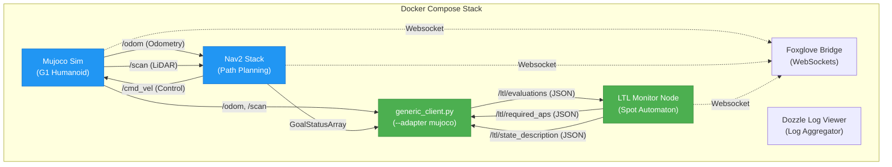
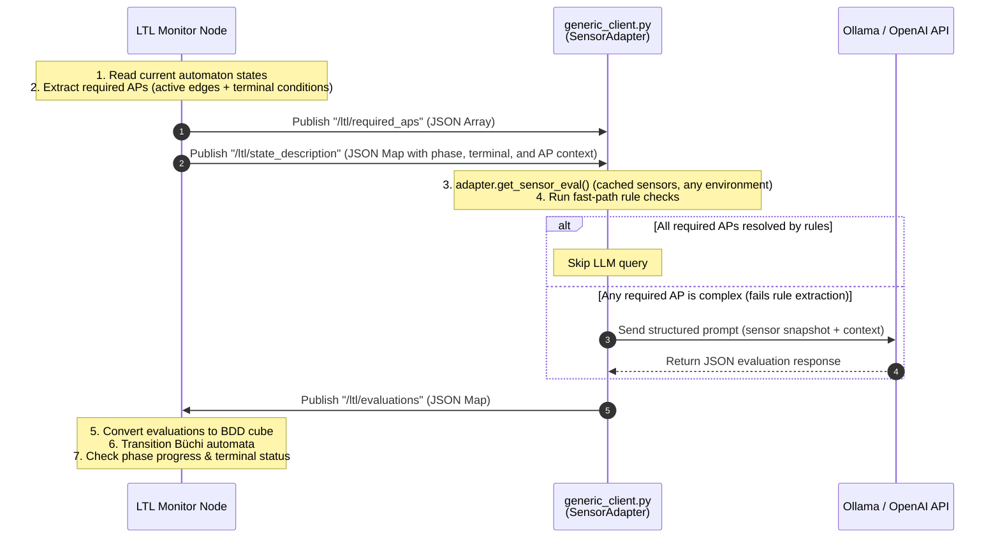
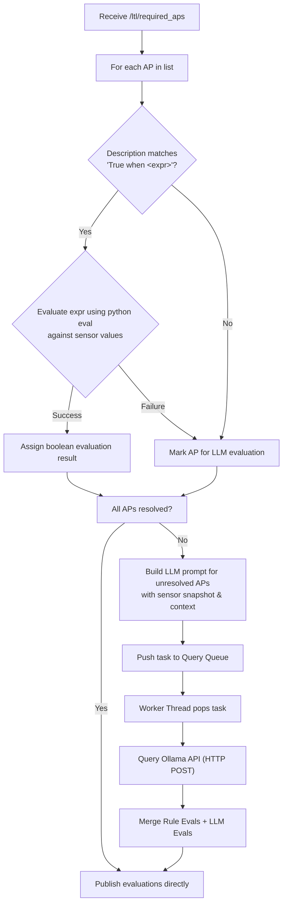

# LTL Runtime Monitoring and Simulation System

This document provides a comprehensive technical overview and operational manual for the **Linear Temporal Logic (LTL) Büchi Monitor and Simulation System**.

The system is designed to verify high-level robot skills and safety properties at runtime by combining formal temporal logic specification with local LLM-based and rule-based observation evaluation.

> **Evaluator note (read this first):** the sections below use a generic hypothetical `GoToTarget` example to explain the *mechanism* — that part is accurate regardless of environment. But the actual evaluator implementation changed: what used to be a single hard-coded `llm_client.py` node is now `generic_client.py` plus a pluggable `SensorAdapter` per environment (real G1 robot / MuJoCo sim / Isaac Lab sim). See `README.md`'s [The Sensor-Adapter System](README.md#the-sensor-adapter-system-sim--real--skill-type-agnostic) for the current, concrete schema and operating instructions — this document has been updated to name the current files/containers, but doesn't duplicate that full reference.

---

## 1. System Architecture

The system is fully containerized using Docker and communicates via ROS 2. It divides the runtime monitoring task into two core responsibilities:
1. **State progression monitoring** (Büchi automaton progression).
2. **Observation evaluation** (mapping sensor telemetry to boolean variables).



Swap `--adapter mujoco` for `--adapter real_g1` (real robot, no Mujoco/Nav2/Foxglove/Dozzle) or `--adapter isaac_lab` — same `Monitor` node, same `/ltl/*` protocol, same `formulas_g1.json`.

### Component Breakdown

| Component | File Path | Docker Container | Role | Dependencies |
| :--- | :--- | :--- | :--- | :--- |
| **Pipeline Manager** | `run_pipeline.py` | Run on Host | Master CLI orchestrator to generate specs, start/stop containers, and stream logs. | Ollama, Docker Compose |
| **Formula Spec Generator** | `generate_formulas.py` | Run on Host | LLM-based translator converting natural language descriptions into formal temporal specs. | Ollama API |
| **LTL Monitor Node** | `main.py` & `monitor.py` | `ltl-monitor` | Formulates Büchi automata using **Spot**, tracks state transitions, evaluates phase logic, and detects termination. Environment-agnostic — never changes between real robot / MuJoCo / Isaac Lab. | ROS 2, `spot` library |
| **Evaluator** | `generic_client.py` | `ltl-client` | Evaluates active Atomic Propositions (APs) against real-time sensors via a Fast-Path (rules) / Slow-Path (LLM) model. Delegates all sensor reading to a `SensorAdapter`, chosen with `--adapter`. | ROS 2, Ollama API |
| **Sensor Adapters** | `adapter_real_g1.py`, `adapter_mujoco.py`, `adapter_isaac_lab.py` | (inside `ltl-client`) | Map ONE environment's native ROS topics to the canonical `sensor_eval` schema. This is the only thing that differs between environments. | `sensor_adapter.py`, `g1_sensors.py` |
| **MuJoCo Simulation Bridge** | `sim/mujoco_ros_bridge.py` | `ltl-mujoco-sim` | Kinematic simulation of Unitree G1 humanoid base, obstacle mapping, and synthetic LiDAR generation. | MuJoCo, `transforms3d` |
| **Navigation Server** | Custom Config | `ltl-nav2` | Standard ROS 2 Navigation stack for planning collision-free paths. | Nav2, Map |
| **Websocket Bridge** | ROS 2 Bridge | `ltl-foxglove-bridge` | Streams simulation state and monitor signals to Foxglove Studio. | `foxglove_bridge` |
| **Log Viewer** | Dozzle | `ltl-dozzle` | Visual web interface for real-time streaming of all system logs. | Docker Socket |

---

## 2. Two-Way ROS 2 Communication Protocol

At each execution step (default: 1.0s interval), the LTL Monitor and evaluator engage in a request-response cycle to evaluate the system state.



### ROS 2 Topic Specifications

#### 1. `/ltl/required_aps`
* **Direction:** Monitor $\rightarrow$ Client
* **Message Type:** `std_msgs/msg/String` (JSON serialized array)
* **Description:** Lists exactly which atomic propositions are required for the current state transitions and terminal checks. This optimizes evaluation by preventing the evaluator from checking irrelevant variables.
* **Payload Example:**
  ```json
  ["collision", "moving", "nav_status_success", "nav_status_failure"]
  ```

#### 2. `/ltl/state_description`
* **Direction:** Monitor $\rightarrow$ Client
* **Message Type:** `std_msgs/msg/String` (JSON serialized object)
* **Description:** Provides state metadata containing descriptions, phase constraints, and terminal success/failure conditions. This serves as prompt context for the LLM.
* **Payload Example:**
  ```json
  {
    "skill_name": "GoToTarget",
    "phase": "Navigation",
    "description": "Autonomous navigation to a target location.",
    "ap_descriptions": {
      "moving": "True when linear_vel > 0.05. Robot is moving.",
      "collision": "True when min_range < 0.25. Robot is colliding."
    },
    "phase_info": {
      "progress_condition": "moving and not collision",
      "exit_condition": "nav_status_success"
    },
    "terminal_success": {
      "condition": "nav_status_success",
      "description": "The robot arrives at the goal pose."
    },
    "terminal_failure": {
      "condition": "collision or nav_status_failure",
      "description": "The robot crashes or navigation aborts."
    }
  }
  ```

#### 3. `/ltl/evaluations`
* **Direction:** Client $\rightarrow$ Monitor
* **Message Type:** `std_msgs/msg/String` (JSON serialized object)
* **Description:** The evaluations for all requested APs. It can also carry meta-commands like `__reset__` (to reset the monitor) or `__done__` (to terminate the process).
* **Payload Example:**
  ```json
  {
    "moving": true,
    "collision": false,
    "nav_status_success": false,
    "nav_status_failure": false
  }
  ```

---

## 3. Core Component Implementation

### 3.1 LTL Monitor Node (`monitor.py`, `main.py`)

The monitor utilizes the **Spot** library, which compiles LTL formulas into deterministic, complete, state-based Büchi automata. 

#### Monitor Status Model
Each monitored formula yields one of three statuses at every step:
* `ACCEPTED` ($ \color{green}\boldsymbol{\checkmark} $): The trace observed so far satisfies the formula (current state is accepting). For safety properties (e.g. $G(\neg \text{collision})$), the state remains accepted as long as no violation occurs.
* `INCONCLUSIVE` ($ \color{orange}\boldsymbol{\bullet} $): The prefix seen so far neither proves nor refutes the property (common for liveness properties like $F(\text{goal})$ where the goal is not yet reached).
* `VIOLATED` ($ \color{red}\boldsymbol{\text{X}} $): The automaton entered a trap/sink state (a non-accepting state with a self-loop on `True`). This status is **permanent**.

#### Execution Phases & Progress Tracking
When a `formulas.json` file contains `execution_phases`, the monitor runs an auxiliary phase tracker:
1. **Enter Condition:** When in `Idle`, if phase 0's enter condition evaluates to `True`, the phase is activated.
2. **Progress Condition:** Once active, the current phase's `progress_condition` must evaluate to `True`. If it evaluates to `False`, the monitor increments a violation counter. If violations reach the `progress_violation_limit` (default: 3) consecutively, the monitor triggers a progress failure and falls back to `IDLE` mode.
3. **Exit Condition:** If the current phase's `exit_condition` evaluates to `True`, the tracker transitions to the next phase in the list.

#### Hot Reloading & State Transitions
If the user edits the `formulas.json` file, the monitor detects the modified timestamp (`mtime`), parses the new specification, recompiles the automata, resets the phase tracker, and regenerates visual DOT, SVG, and PNG graphs to the `output/` directory without stopping the ROS 2 node.

---

### 3.2 Hybrid Predicate Evaluator (`generic_client.py`)

Evaluating physical robot state using LLMs introduces latency (0.5s - 2.0s per query). To make evaluation responsive, `generic_client.py` uses a **hybrid evaluation architecture** combining a fast-path rule evaluator with a slow-path LLM fallback. All environment-specific sensor reading is delegated to a `SensorAdapter` (see `sensor_adapter.py`, and `README.md`'s adapter section) — this node itself never changes between real robot / MuJoCo / Isaac Lab.



#### The Fast-Path (Rule-Based Evaluation)
The evaluator inspects the atomic proposition description using a regular expression: `[Tt]rue when\s+(.+?)(?:\.|$)`.
If the description has a rule matching this pattern (e.g. `"True when min_range < 0.25"`), it maps the fields against the active adapter's `sensor_eval` dict — the exact key set is `sensor_adapter.CANONICAL_SENSOR_EVAL_KEYS` (`min_range`, `base_roll`/`pitch`/`height`, `upright_flag`, `linear_vel`, `angular_vel`, `nav_mode`, `nav_state`, `num_waypoints`, `current_target_idx`, `mission_finished`, `nav_stuck`, `image_similarity_to_goal` — see `README.md`'s adapter section for what each means and which topic it comes from per environment).

It then executes a safe `eval()` call using a restricted environment containing only the sensor values. This executes in under a millisecond, completely bypassing the LLM.

#### The Slow-Path (LLM Fallback)
If an AP's description is descriptive and cannot be evaluated directly by numerical thresholds (e.g. `"The robot is stuck or oscillating in an obstacle field"`), it is designated for LLM evaluation. 
* The node builds a structured prompt containing active sensor metrics, the current phase, and the terminal condition descriptions.
* To prevent blocking the main ROS 2 callback loop, the request is placed on a queue (`self.query_queue`) and handled by a background worker thread.
* If a new set of APs arrives from the monitor before the worker completes the current query, the queue is automatically drained to ensure stale evaluations are discarded.

---

### 3.3 MuJoCo Simulation Bridge (`sim/mujoco_ros_bridge.py`)

This node connects the physics engine to ROS 2:
1. **World Configuration:** Reads `sim_config.json` at startup to determine map dimensions and the agent's start position. It configures the MuJoCo `arena.xml` model dynamically.
2. **Kinematic Updates:** Subscribes to `/cmd_vel` to read linear and angular velocity commands. It integrates these velocities using the simulation time step $dt$ to update the humanoid base coordinate ($q_{pos}$ and $q_{vel}$).
3. **Synthetic LiDAR (`LaserScan`):** Simulates a 2D LiDAR by casting 360 radial rays in a planar sweep using the `mujoco.mj_ray` API. It measures distance hits against external obstacles in the world body (filtering out the robot's own body geoms) and publishes the ranges to `/scan`.

---

## 4. Formal Specification Schema (`formulas.json`)

Formal specifications are written in JSON. The monitor supports two formats: a flat array of temporal formulas, or a structured, rich skill specification.

### Rich Specification Fields

| Field | Type | Description |
| :--- | :--- | :--- |
| `skill_name` | `string` | Human-readable name of the robot skill. |
| `description` | `string` | Description detailing what the skill achieves. |
| `atomic_propositions` | `object` | Key-value pairs mapping proposition variables to descriptive evaluation rules. |
| `ltl_formulas` | `array` | A list of safety and liveness constraints (must compile with Spot). |
| `execution_phases` | `array` | Sequential steps that track progress metrics and transition rules. |
| `terminal_success` | `object` | An condition and description outlining when the task succeeds. |
| `terminal_failure` | `object` | An condition and description outlining when the task fails. |

### LTL Syntax Reference
The temporal formulas in `ltl_formulas` use Spot syntax:
* **Unary Temporal Operators:**
  * `G(p)`: **Globally** (property $p$ must hold for all future steps).
  * `F(p)`: **Finally / Eventually** (property $p$ must hold at some step in the future).
  * `X(p)`: **Next** (property $p$ must hold at the immediate next step).
* **Binary Temporal Operators:**
  * `p U q`: **Until** (property $p$ must hold until property $q$ becomes true).
* **Logical Connectives:**
  * `&&`: AND
  * `||`: OR
  * `!`: NOT
  * `->`: Implication ($p \rightarrow q \equiv \neg p \lor q$)

---

## 5. End-to-End Operational Example

Below is an operational example of a navigation skill: **GoToTarget**.

### 5.1 Formal Specification File (`formulas.json`)

This configuration enforces safety (no collisions) and liveness (eventually reaching the target). It also outlines three sequential phases: `Initialization`, `Navigation`, and `GoalReached`.

```json
{
  "skill_name": "GoToTarget",
  "description": "An autonomous navigation skill where the robot moves to a goal position while avoiding obstacles.",
  "atomic_propositions": {
    "skill_active": "True when nav_status in ['accepted', 'executing', 'succeeded']. The navigation skill is active.",
    "moving": "True when linear_vel > 0.05. The robot is moving.",
    "collision": "True when min_range < 0.25. The robot is in collision with an obstacle.",
    "near_target": "True when distance_to_target < 0.5. The robot is within the target radius.",
    "nav_status_success": "True when nav_status == 'succeeded'. Nav2 reported successful arrival.",
    "nav_status_failure": "True when nav_status in ['aborted', 'canceled']. Nav2 planning failed."
  },
  "ltl_formulas": [
    {
      "name": "collision_avoidance",
      "formula": "G(!collision)"
    },
    {
      "name": "eventually_reach",
      "formula": "G(skill_active -> F(near_target))"
    }
  ],
  "execution_phases": [
    {
      "phase": "Initialization",
      "description": "Robot receives target and initializes plans.",
      "enter_condition": "skill_active",
      "progress_condition": "skill_active",
      "exit_condition": "moving",
      "progress_violation_limit": 3
    },
    {
      "phase": "Navigation",
      "description": "Robot moves toward target position.",
      "enter_condition": "moving",
      "progress_condition": "moving and not collision",
      "exit_condition": "near_target or nav_status_success",
      "progress_violation_limit": 5
    },
    {
      "phase": "GoalReached",
      "description": "Robot arrives at target position and stops.",
      "enter_condition": "near_target or nav_status_success",
      "progress_condition": "not collision",
      "exit_condition": "not skill_active",
      "progress_violation_limit": 3
    }
  ],
  "terminal_success": {
    "condition": "near_target and nav_status_success",
    "description": "Robot successfully reached target destination."
  },
  "terminal_failure": {
    "condition": "collision or nav_status_failure",
    "description": "Robot collided with an obstacle or navigation stack aborted execution."
  }
}
```

---

### 5.2 Step-by-Step Trace Walkthrough

The following trace shows a successful navigation run:

#### Step 1: Initializing
The pipeline starts. The monitor evaluates initial states. No propositions are true yet. The phase is `Idle`.
```
================================================================
  Skill : GoToTarget
  An autonomous navigation skill where the robot moves to a goal position while avoiding obstacles.
================================================================

Formulas & Büchi Automata Structure:
  Büchi Automaton for 'collision_avoidance' (Formula: G(!collision)):
    State 0 [initial, accepting]:
      ──► State 0 on: !collision
      ──► State 1 on: collision
    State 1 [sink/trap]:
      ──► State 1 on: 1

  Büchi Automaton for 'eventually_reach' (Formula: G(skill_active -> F(near_target))):
    State 0 [initial, accepting]:
      ──► State 0 on: !skill_active || near_target
      ──► State 1 on: skill_active && !near_target
    State 1 [accepting]:
      ──► State 0 on: near_target
      ──► State 1 on: !near_target

Combined/Product Büchi Automaton — Whole Skill Specification:
  Büchi Automaton for 'CombinedSkillSpec' (Formula: (G(!collision)) && (G(skill_active -> F(near_target)))):
    State 0 [initial, accepting]:
      ──► State 0 on: !collision && (!skill_active || near_target)
      ──► State 1 on: !collision && skill_active && !near_target
      ──► State 2 on: collision

[INFO] [ltl_monitor_node]: LTL Monitor ROS 2 Node started.

  ┌── Step init  [Idle] ──────────────────────────────
  │ ✔ collision_avoidance            S0 [initial, accepting]
  │ ✔ eventually_reach               S0 [initial, accepting]
  └──────────────────────────────────────────────────
```

#### Step 2: Goal Sent & Phase Entered
A goal pose is sent to Nav2. `skill_active` evaluates to `True`, triggering the transition into the `Initialization` phase.
* **Evaluations:** `skill_active=True`, all others `False`.
* **State Updates:** 
  * `collision_avoidance`: State 0 $\rightarrow$ State 0 (`!collision`) $\rightarrow$ `ACCEPTED`
  * `eventually_reach`: State 0 $\rightarrow$ State 1 (`skill_active && !near_target`) $\rightarrow$ `INCONCLUSIVE` (liveness not yet satisfied).

```
  ┌── Step 0  [Initialization] ──────────────────────
  │ TRUE :  skill_active
  │ FALSE:  moving  collision  near_target  nav_status_success  nav_status_failure
  │ ────────────────────────────────────────────────
  │ ✔ collision_avoidance            S0 [initial, accepting]
  │ ● eventually_reach               S0 [initial, accepting] → S1  ← INCONCLUSIVE
  └──────────────────────────────────────────────────
```

#### Step 3: Robot Begins Moving
The robot starts planning and moving. `moving` becomes `True`, satisfying the exit condition of `Initialization` and entering the `Navigation` phase.
```
  ┌── Step 1  [Navigation] ──────────────────────────
  │ TRUE :  skill_active  moving
  │ FALSE:  collision  near_target  nav_status_success  nav_status_failure
  │ ────────────────────────────────────────────────
  │ ✔ collision_avoidance            S0 [initial, accepting]
  │ ● eventually_reach               S1  ← INCONCLUSIVE
  └──────────────────────────────────────────────────
```

#### Step 4: Obstacle Encountered (Warning State)
The robot gets close to an obstacle. Let's assume it slows down below the moving threshold (`linear_vel` = 0.04 m/s). 
* **Evaluation:** `moving` becomes `False`.
* **Phase Progress check:** The `progress_condition` of the `Navigation` phase is `moving and not collision`. Since `moving` is False, a progress violation is registered.

```
  ┌── Step 4  [Navigation] ──────────────────────────
  │ TRUE :  skill_active
  │ FALSE:  moving  collision  near_target  nav_status_success  nav_status_failure
  │ ────────────────────────────────────────────────
  │ ⚠  Phase progress violations: 1/5
  │ ────────────────────────────────────────────────
  │ ✔ collision_avoidance            S0 [initial, accepting]
  │ ● eventually_reach               S1  ← INCONCLUSIVE
  └──────────────────────────────────────────────────
```
*(Note: If this persisted for 5 consecutive steps, the monitor would have transitioned to `IDLE` with a progress failure status).*

#### Step 5: Target Arrived
The robot moves around the obstacle, speeds back up, and arrives at the goal coordinate.
* **Evaluations:** `near_target=True`, `nav_status_success=True`.
* **State Updates:**
  * `eventually_reach`: State 1 $\rightarrow$ State 0 (`near_target`) $\rightarrow$ `ACCEPTED`.
  * `terminal_success.condition` (`near_target and nav_status_success`) evaluates to `True`.

```
  ┌── Step 15  [GoalReached] ────────────────────────
  │ TRUE :  skill_active  near_target  nav_status_success
  │ FALSE:  moving  collision  nav_status_failure
  │ ────────────────────────────────────────────────
  │ ✔ collision_avoidance            S0 [initial, accepting]
  │ ✔ eventually_reach               S1 → S0 [initial, accepting]  ← ACCEPTED
  └──────────────────────────────────────────────────

[INFO] [ltl_monitor_node]: Terminal SUCCESS: near_target and nav_status_success (Robot successfully reached target destination.)

================================================================
  Final Summary
================================================================

  ✔ ACCEPTED (2):
    ✔ collision_avoidance
      G(!collision)
    ✔ eventually_reach
      G(skill_active -> F(near_target))

────────────────────────────────────────────────────────────────
  ✔  All 2 formulas ACCEPTED.

================================================================
  ■  MONITOR HALTED
  Reason : Terminal state reached (success or failure)
================================================================
```

---

## 6. How to Run the System

### 6.1 Running the G1 Navigation Skill (current, recommended)

```bash
cd sim/
docker compose -f docker-compose.sim.yml up -d --build mujoco-sim nav2
docker compose -f docker-compose.sim.yml run --rm --no-deps ltl-monitor --formulas-file formulas_g1.json
docker compose -f docker-compose.sim.yml up --no-deps ltl-client   # --adapter mujoco by default
```

`--no-deps` matters: `ltl-client` declares `depends_on: [ltl-monitor, nav2]`, so a plain `up ltl-client` would auto-start a *second* `ltl-monitor` on its default (generic, non-G1) command, racing the one started above on the same `/ltl/*` topics. See `README.md`'s Quick Start for the full explanation and the real-robot equivalent (`run_ltl_monitor.sh`/`run_ltl_evaluator.sh`).

### 6.2 Running the Generic Natural-Language Pipeline (generation/validation only)

```bash
# Generate + validate a spec from a plain-English skill description
python3 run_pipeline.py -d "The robot should navigate to the target at (3,2). It must never crash. It should stop when it is close to the target."
```

This still fully works for generating and validating `formulas.json` + `skill_description.md`. Running the generated spec against a live evaluator does not currently work — see `README.md`'s [Known Gaps / What To Do](README.md#known-gaps--what-to-do).

### 6.3 Manual Container Execution

```bash
# 1. Start the simulation stack
cd sim/
docker compose -f docker-compose.sim.yml up -d --build mujoco-sim nav2

# 2. Run the monitor (using a configuration file)
docker run --rm -it \
  -v $(pwd)/../formulas_g1.json:/app/formulas_g1.json \
  -v $(pwd)/../output:/app/output \
  ltl-monitor:latest --formulas-file /app/formulas_g1.json

# 3. Inject a navigation goal from the host (docker execs send_goal.py inside ltl-nav2)
python3 inject_goal.py 4.0 -1.0
```

### 6.3 Checking Visual Diagrams and Telemetry
* **Automata Diagrams:** The monitor exports diagrams automatically. Open `output/CombinedSkillSpec.svg` or `output/collision_avoidance.svg` in any browser to inspect state diagrams.
* **Log Viewer:** Access aggregated container logs at [http://localhost:8080/dozzle](http://localhost:8080/dozzle).
* **Foxglove Studio Visualizer:** Launch Foxglove Studio and connect to `ws://localhost:8765` to view the robot grid, map, LiDAR laser sweeps, transforms, and active trajectories.
